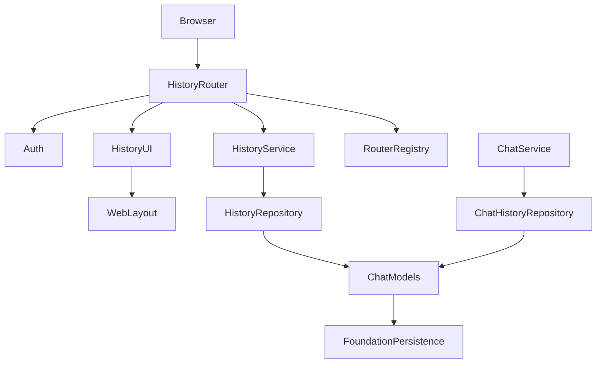
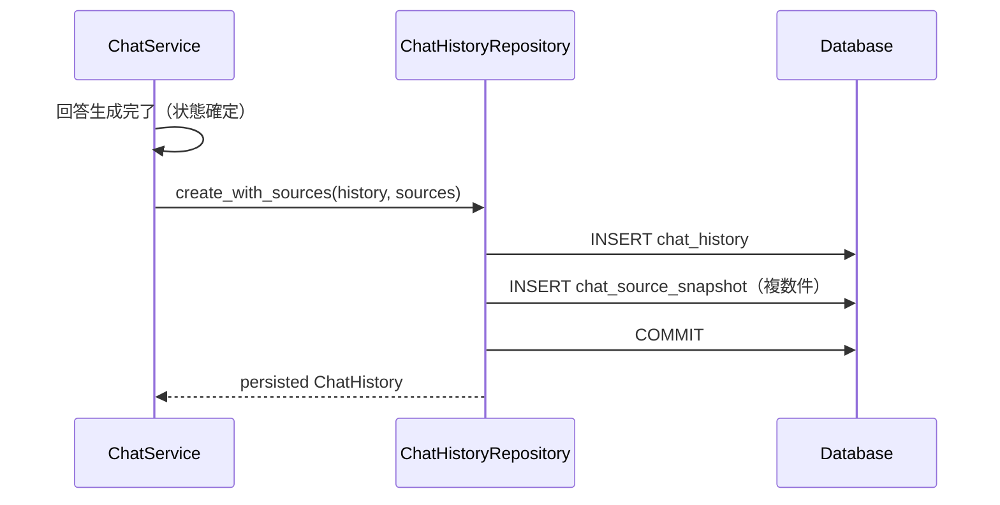
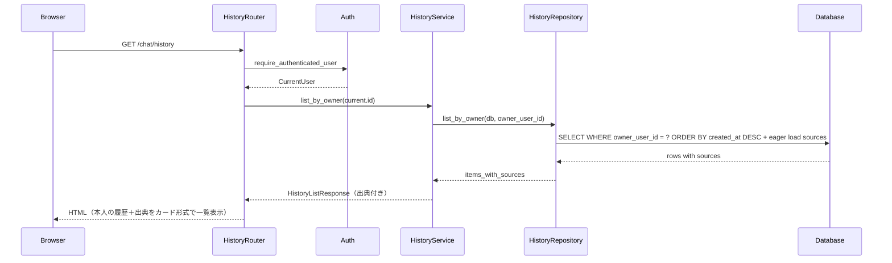
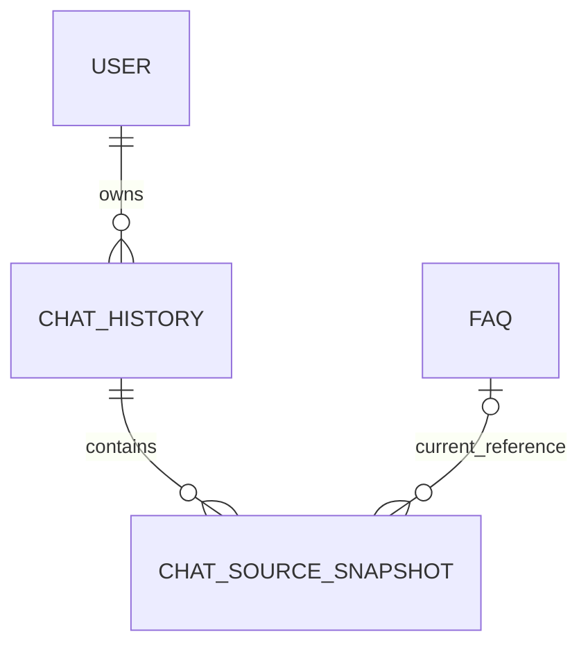

# Design Document

## Overview

chat-historyは、ai-helpdesk-chatが生成した質問・回答・回答状態・根拠FAQを利用者別に永続化し、本人限定の履歴一覧画面で質問日時・質問内容・回答・出典を一画面で確認できる機能を提供する。認証済み社員は自分の過去の質問・回答を新しい順に一覧し、各履歴の回答時点の根拠を一覧内で直接確認できる。

本仕様はai-helpdesk-chatの`ChatService`が原子的に保存する履歴データに対して、読み取り側のサービス・表示・owner隔離を提供するモジュール（`app/history/`）を追加する。データモデルの物理定義はai-helpdesk-chatの`004_ai_helpdesk_chat.sql`が提供し、chat-historyは永続化仕様を定義するとともに表示側の実装を所有する。画面は履歴一覧画面のみで完結し、詳細画面や画面遷移は提供しない。

### Goals
- 認証済み社員が本人所有の履歴のみを新しい順に一覧表示し、各履歴の質問日時・質問内容・回答・出典を一画面で確認できる。
- 回答時点のFAQスナップショットにより、FAQ変更・削除後も根拠を再現できる。
- 他利用者の履歴を管理者ロールであってもアクセスできない本人所有判定を維持する。

### Non-Goals
- チャット画面での質問送信・回答生成・フォールバック処理（ai-helpdesk-chat所有）。
- FAQ CRUD・Embedding・索引（faq-management-and-search所有）。
- ユーザー認証・セッション管理（local-user-authentication所有）。
- 管理者による全社員履歴閲覧、履歴共有、CSV出力、利用分析。
- 履歴の編集・削除機能。
- 詳細画面への遷移や別画面への画面遷移。

## Boundary Commitments

### This Spec Owns
- 履歴の読み取り側リポジトリ（owner-scoped一覧取得、出典のeager load）。
- 履歴表示サービス（owner検証付き一覧取得ロジック）。
- 履歴一覧のHTTP/HTMLエンドポイント（`/chat/history`、`/api/chat/history`）。
- 履歴一覧テンプレート（`list.html`）— 各履歴に質問日時・質問内容・回答・出典をカード形式で表示する単一画面。
- 永続化仕様の定義（保存項目、回答状態の区別、スナップショット内容、不変性、データ非外部送信）。
- FAQ削除済み判定（`faq_id IS NULL`からの`is_deleted`算出）と削除済みラベル表示。

### Out of Boundary
- 履歴の書き込み（`ChatService.ask()`内でai-helpdesk-chatの`ChatHistoryRepository`が実行する）。
- 冪等キー制御（`(owner_user_id, request_id)`のUNIQUE制約とprocess-local lockはai-helpdesk-chatが実装する）。
- チャット画面のUI・質問受付・回答生成・フォールバック処理。
- FAQのCRUD・Embedding・検索・適合判定。
- ユーザー認証・セッション・パスワード管理。
- foundationが所有するDB接続、トランザクション、共通500応答、ログ基盤、基本テンプレートブロック。
- 管理者による全社員履歴閲覧、履歴共有・エクスポート・分析。
- 詳細画面・画面遷移（履歴一覧画面単体で完結する）。

### Allowed Dependencies
- **Foundation**: `BaseEntity`、`BaseRepository`、`Session`/`get_db`、`MigrationRunner`、`ErrorHandler`、`WebLayout`、`RouterRegistry`。
- **Auth**: `CurrentUser(id: int, username: str, role: Literal["user", "admin"])`、`require_authenticated_user`。
- **ai-helpdesk-chat**: `ChatHistory`・`ChatSourceSnapshot` ORMモデル（`app/chat/models.py`）、`ChatStatus`型（`app/chat/schemas.py`）。テーブル物理定義（`004_ai_helpdesk_chat.sql`）。
- **faq-management-and-search**: `faq.id`への外部キー参照（`chat_source_snapshot.faq_id`）。
- Python 3.10+、FastAPI 0.115+、SQLAlchemy 2.x、Pydantic v2、Jinja2。
- 依存方向: upstream contracts（auth/chat/faq models） → history schemas → history repository → history service → history router/UI。上流からhistoryへのimportは禁止する。

### Revalidation Triggers
- ai-helpdesk-chatの`ChatHistory`・`ChatSourceSnapshot`モデル定義の変更。
- `ChatStatus`の値または意味の変更。
- `CurrentUser`、`require_authenticated_user`の型・失敗ステータスの変更。
- `BaseEntity`、`BaseRepository`、`Session`、`MigrationRunner`契約の変更。
- FAQ IDの型・削除方式（`ON DELETE SET NULL`）の変更。
- `base.html`の`content`ブロックまたはテンプレートコンテキスト規約の変更。
- レスポンススキーマの変更。

## Architecture

### Existing Architecture Analysis
- feature-based FastAPI monolithの既存構成を維持する。`app/auth/`、`app/faq/`、`app/chat/`に続き、`app/history/`を追加する。
- ai-helpdesk-chatの`ChatHistoryRepository`がトランザクション内で原子的に`ChatHistory`+`ChatSourceSnapshot`を保存する設計をそのまま利用する。
- 認証は`require_authenticated_user`を呼び出し側ルーターで適用する。一覧はSQL WHERE句で`owner_user_id`を条件にし、他利用者の履歴をクエリ結果に含めない。
- テンプレートはfoundationの`base.html`を継承し、既存の`content`ブロックを上書きする。
- 未知例外はfoundation `ErrorHandler`の汎用500応答へ委譲する。

### Architecture Pattern & Boundary Map



**Architecture Integration**:
- Selected pattern: ai-helpdesk-chatのデータ構造に対する読み取り専用モジュール。書き込みはai-helpdesk-chatの`ChatService`フロー内で実行される。
- Domain boundaries: `HistoryService`は読み取り側ビジネスロジック（owner-scoped一覧取得）、`HistoryRepository`はowner-scopedクエリ＋出典eager load、`HistoryRouter`はHTTP/HTML表示を担当する。
- Existing patterns preserved: foundationの層構造、feature-localルーター登録、Jinja2テンプレート継承、`require_authenticated_user`による認証。
- Simplification: 書き込み側の重複実装を避け、ai-helpdesk-chatの既存永続化フローを利用する。詳細画面を提供せず、一覧画面のみで完結する。検索・フィルタ・ソート機能は追加しない。

### Technology Stack

| Layer | Choice / Version | Role in Feature | Notes |
|-------|------------------|-----------------|-------|
| Backend | Python 3.10+ / FastAPI 0.115+ | ルーティング、依存注入 | foundationと同一 |
| Data | SQLAlchemy 2.x / SQLite | 履歴読み取り（出典eager load含む） | ai-helpdesk-chatのEngine/Sessionを共有 |
| UI | Jinja2 | 履歴一覧画面（単一画面で完結） | foundationのbase.htmlを継承 |

## File Structure Plan

### Directory Structure

```text
helpo/
├── app/
│   ├── chat/
│   │   ├── models.py                   # ai-helpdesk-chat所有: ChatHistory, ChatSourceSnapshot ORM
│   │   ├── schemas.py                  # ai-helpdesk-chat所有: ChatStatus型
│   │   ├── repositories.py            # ai-helpdesk-chat所有: ChatHistoryRepository（書き込み側）
│   │   └── ...                         # ai-helpdesk-chat所有: その他チャット関連
│   ├── history/                        # chat-history所有
│   │   ├── __init__.py
│   │   ├── schemas.py                  # 履歴表示用レスポンスDTO
│   │   ├── repository.py              # HistoryRepository（読み取り側、出典eager load）
│   │   ├── service.py                  # HistoryService
│   │   ├── dependencies.py            # FastAPI依存関数
│   │   └── router.py                  # HistoryRouter（一覧エンドポイントのみ）
│   └── templates/history/
│       └── list.html                   # 履歴一覧画面（カード形式、出典インライン表示）
└── tests/
    ├── history/
    │   ├── test_history_repository.py  # リポジトリ単体テスト
    │   ├── test_history_service.py     # サービス単体テスト
    │   └── test_history_api.py         # API結合テスト
    └── ...
```

### Modified Files
- `app/history/*` — chat-history所有の新規モジュール。
- `app/templates/history/list.html` — 履歴一覧画面テンプレート（単一画面で完結）。
- `tests/history/*` — 履歴テストスイート。
- foundation の `app/router_registry.py` — `HistoryRouter` が登録される。

## System Flows

### 履歴保存フロー（ai-helpdesk-chat側で実行、chat-historyが仕様を定義）



- 履歴と全スナップショットを1トランザクションで保存する。保存失敗時はrollbackし部分履歴を残さない（1.1）。
- 回答状態は`ai_answer`、`direct_faq`、`no_match`、`ai_unavailable`、`server_error`のいずれか（1.2）。
- スナップショットには`faq_id_at_answer`、`question_snapshot`、`answer_snapshot`、`confidence_snapshot`を保存する（1.4）。

### 履歴一覧表示フロー



- SQLクエリに`owner_user_id`を条件として含み、他利用者の履歴をクエリ結果に含めない（2.1, 2.3）。
- 各履歴に出典スナップショットをeager loadし、一覧内でインライン表示する（2.2）。
- 未認証は`/login`へ303リダイレクト（2.4）。
- 画面遷移や詳細画面は提供せず、一覧画面単体で完結する（2.5）。

## Requirements Traceability

| Requirement | Summary | Components | Interfaces | Flows |
|-------------|---------|------------|------------|-------|
| 1.1 | 履歴の原子的永続化 | ChatHistoryRepository, ChatService | Service, State | 保存フロー |
| 1.2 | 回答状態の区別可能な記録 | HistorySchemas, ChatModels | State | 保存フロー |
| 1.3 | ログアウト・再起動後の保持 | SQLite, ChatModels | State | - |
| 1.4 | FAQ IDとスナップショットの保存 | ChatModels, ChatHistoryRepository | State | 保存フロー |
| 1.5 | 外部送信の禁止 | 全コンポーネント | - | - |
| 2.1 | 本人所有の新しい順一覧（質問日時・質問内容・回答・出典） | HistoryRepository, HistoryService, HistoryRouter, HistoryUI | Service, API | 一覧フロー |
| 2.2 | 根拠スナップショットを一覧内に表示 | HistoryRepository, HistoryService, HistoryUI | Service, API | 一覧フロー |
| 2.3 | 他利用者の履歴拒否（admin含む） | HistoryRepository, HistoryService | Service | 一覧フロー |
| 2.4 | 未認証の拒否 | HistoryRouter, Auth | API | 一覧フロー |
| 2.5 | 詳細画面・画面遷移の非提供（一覧画面で完結） | HistoryRouter, HistoryUI | API | - |
| 2.6 | 共有・出力・分析の非提供 | HistoryRouter | API | - |
| 2.7 | 他利用者履歴のログ非出力 | HistoryService, HistoryRepository | Service | - |
| 3.1 | FAQ更新後のスナップショット不変 | ChatModels, HistoryUI | State | 一覧フロー |
| 3.2 | FAQ削除後のスナップショット保持と削除済み表示 | ChatModels, HistoryUI | State, API | 一覧フロー |
| 3.3 | FAQライフサイクル非所有 | ChatModels | State | - |

## Components and Interfaces

| Component | Domain/Layer | Intent | Req Coverage | Key Dependencies | Contracts |
|-----------|--------------|--------|--------------|------------------|-----------|
| HistorySchemas | Types | 履歴一覧表示用レスポンスDTO | 1.2, 2.1, 2.2, 3.2 | ChatStatus (Inbound P0) | - |
| HistoryRepository | Data Access | owner-scoped読み取りクエリ（出典eager load） | 2.1, 2.2, 2.3, 2.7 | ChatModels (Inbound P0), Session (Outbound P0) | Service, State |
| HistoryService | Domain Service | owner-scoped一覧取得ロジック | 2.1, 2.2, 2.3, 2.7 | HistoryRepository (Outbound P0), Auth (Outbound P0) | Service |
| HistoryRouter | API/Web | 履歴一覧HTTP/HTML | 2.1, 2.2, 2.4, 2.5, 2.6 | HistoryService (Outbound P0), Auth (Outbound P0), HistoryUI (Outbound P0) | API |
| HistoryUI | Presentation | 履歴一覧テンプレート（カード形式、出典インライン表示） | 2.1, 2.2, 3.1, 3.2 | WebLayout (Outbound P0) | State |
| PersistenceSpec | Specification | 永続化仕様（ai-helpdesk-chatが実装） | 1.1, 1.2, 1.3, 1.4, 1.5, 3.1, 3.2, 3.3 | ChatHistoryRepository (External P0) | State |

### Types

#### HistorySchemas

```python
from typing import Literal

AnswerStatus = Literal[
    "ai_answer", "direct_faq", "no_match", "ai_unavailable", "server_error"
]

ANSWER_STATUS_LABELS: dict[AnswerStatus, str] = {
    "ai_answer": "AI回答",
    "direct_faq": "FAQ直接回答",
    "no_match": "該当FAQなし",
    "ai_unavailable": "AI利用不可",
    "server_error": "サーバエラー",
}

class ChatSourceResponse(BaseModel):
    faq_id_at_answer: int
    current_faq_id: int | None
    question: str
    answer: str
    confidence: float
    is_deleted: bool

class HistoryListItemResponse(BaseModel):
    history_id: int
    question: str
    answer: str
    status: AnswerStatus
    created_at: datetime
    sources: list[ChatSourceResponse]

class HistoryListResponse(BaseModel):
    items: list[HistoryListItemResponse]
```

- `is_deleted`はDB列ではなく、`current_faq_id is None`（= `faq_id IS NULL`）から算出する。
- `confidence`は0.00〜1.00の範囲で、回答時点のスナップショット値を返す。
- `question`・`answer`・`sources`内のテキストはHTML表示時にautoescapeする。
- 各履歴アイテムが`sources`を持つことで、一覧画面内で出典をインライン表示できる（2.2, 2.5）。

### Data Access

#### HistoryRepository

| Field | Detail |
|-------|--------|
| Intent | 認証済み利用者の履歴を出典付きで読み取るowner-scopedクエリを提供する |
| Requirements | 2.1, 2.2, 2.3, 2.7 |

**Responsibilities & Constraints**
- 全クエリに`owner_user_id`をSQLの`WHERE`条件として含み、他利用者の履歴をクエリ結果に含めない。
- `list_by_owner`は`created_at DESC, id DESC`で安定ソートし、本人所有の全履歴を返す。
- `list_by_owner`は`ChatSourceSnapshot`をeager load（`selectinload`または`subqueryload`）し、一覧内で出典を表示するためのデータを含む。
- 他利用者の履歴内容を通常ログへ出力しない（2.7）。foundationのSessionを引数で受け、repository内でcommitしない。

**Dependencies**
- Inbound: ChatHistory, ChatSourceSnapshot models — ORM models (P0)
- Outbound: foundation Session — DB session (P0)

**Contracts**: Service [x] / State [x]

##### Service Interface

```python
class HistoryRepository:
    def list_by_owner(
        self, db: Session, owner_user_id: int
    ) -> list[ChatHistory]:
        """本人所有の全履歴を出典付きで新しい順に返す。
        ChatSourceSnapshotはeager loadされる。"""
        ...
```

- Preconditions: `db`は有効なSession。
- Postconditions: `list_by_owner`は`owner_user_id`に一致する履歴のみ返す。各`ChatHistory`のsourcesリレーションはeager loadされている。

### Domain Service

#### HistoryService

| Field | Detail |
|-------|--------|
| Intent | owner-scopedの履歴一覧取得ロジックを提供する |
| Requirements | 2.1, 2.2, 2.3, 2.7 |

**Responsibilities & Constraints**
- 一覧取得は`current_user.id`を`owner_user_id`として渡し、SQL条件で他利用者を除外する。
- スナップショットの`faq_id`がNULLの場合、`is_deleted=True`を算出する。
- 出典データを含む`HistoryListResponse`を返す。

**Dependencies**
- Outbound: HistoryRepository — data access (P0)

**Contracts**: Service [x]

##### Service Interface

```python
class HistoryService:
    def __init__(self, repository: HistoryRepository) -> None: ...

    def list_by_owner(
        self, db: Session, current: CurrentUser
    ) -> HistoryListResponse:
        """本人所有の全履歴一覧を出典付きで返す。"""
        ...
```

- Preconditions: `current`は認証済み`CurrentUser`。
- Postconditions: 返却データは本人所有の履歴のみ。スナップショット値は回答時点の不変値。各アイテムにsourcesが含まれる。

### API/Web

#### HistoryRouter

| Field | Detail |
|-------|--------|
| Intent | 履歴一覧のHTTP/HTMLエンドポイントを提供する |
| Requirements | 2.1, 2.2, 2.4, 2.5, 2.6 |

**Responsibilities & Constraints**
- 全routeに`require_authenticated_user`を適用する。
- HTML未認証は`/login`へ303、API未認証はJSON 401で本文を返さない。
- 共有、エクスポート、分析、全利用者横断閲覧のエンドポイントを提供しない（2.6）。
- 詳細画面や画面遷移のエンドポイントを提供しない（2.5）。
- foundationの`RouterRegistry`を通じてルーターを登録する。

**Dependencies**
- Inbound: HTTP requests — user access (P0)
- Outbound: HistoryService — business logic (P0)
- Outbound: Auth — authentication (P0)
- Outbound: HistoryUI — templates (P0)

**Contracts**: API [x]

##### API Contract

| Method | Endpoint | Request | Response | Errors |
|--------|----------|---------|----------|--------|
| GET | `/chat/history` | - | HTML | unauthenticated 303, 500 |
| GET | `/api/chat/history` | - | `HistoryListResponse` 200 | 401, 500 |

- 本人所有の全履歴を返す。ページネーションは提供しない。
- 予期しない例外は独自レスポンスへ変換せずfoundation ErrorHandlerへ委譲する。
- `/chat/history/{id}`や`/api/chat/history/{id}`は提供しない（2.5）。

### Presentation

#### HistoryUI

| Field | Detail |
|-------|--------|
| Intent | 履歴一覧のHTMLテンプレートを提供する（単一画面で完結） |
| Requirements | 2.1, 2.2, 2.5, 3.1, 3.2 |

**Responsibilities & Constraints**
- `list.html`はfoundation `base.html`を継承し、`content`ブロックを上書きする。
- 全テキストはJinja2 autoescapeでHTMLエスケープ済みとする。
- ORM Userやセッションをテンプレートへ渡さない（`current_user: CurrentUser | None`のみ）。
- 詳細画面を提供しない。一覧画面のみで質問日時・質問内容・回答・出典を完結表示する（2.5）。

##### 画面: 履歴一覧画面（`/chat/history` — `list.html`）

**画面構成**

```
┌──────────────────────────────────────┐
│ ヘッダー（共通レイアウト）              │
├──────────────────────────────────────┤
│ ■ ページタイトル「質問履歴」            │
├──────────────────────────────────────┤
│ ■ 履歴カードリスト                     │
│                                      │
│  ┌────────────────────────────────┐  │
│  │ 2026/08/27 10:30  [AI回答]     │  │
│  │                                │  │
│  │ 質問:                          │  │
│  │ 有給休暇の申請方法を教えて...     │  │
│  │                                │  │
│  │ 回答:                          │  │
│  │ 有給休暇の申請は、社内ポータル... │  │
│  │                                │  │
│  │ 出典FAQ:                       │  │
│  │ ┌──────┬──────┬────┐          │  │
│  │ │質問文  │回答文  │類似度│          │  │
│  │ ├──────┼──────┼────┤          │  │
│  │ │...    │...    │0.92│          │  │
│  │ └──────┴──────┴────┘          │  │
│  └────────────────────────────────┘  │
│                                      │
│  ┌────────────────────────────────┐  │
│  │ 2026/08/27 11:00  [FAQ直接回答] │  │
│  │ 質問: ...                      │  │
│  │ 回答: ...                      │  │
│  │ 出典FAQ: ...                   │  │
│  └────────────────────────────────┘  │
│                                      │
│  ┌────────────────────────────────┐  │
│  │ 2026/08/27 12:00  [該当FAQなし] │  │
│  │ 質問: ...                      │  │
│  │ 回答: ...                      │  │
│  │ 出典なし                       │  │
│  └────────────────────────────────┘  │
│                                      │
└──────────────────────────────────────┘
```

**画面項目**

| No | 項目名 | 項目ID | 種別 | フォーマット / 備考 | 表示条件 |
|----|--------|--------|------|-------------------|---------|
| 1 | ページタイトル | `page_title` | テキスト | 「質問履歴」 | 常時 |
| 2 | 履歴カードリスト | `history_cards` | カードリスト | 新しい順（`created_at DESC`） | 1件以上 |
| 2-1 | 作成日時 | - | テキスト | `YYYY/MM/DD HH:mm` | 各カード |
| 2-2 | 回答状態 | - | バッジ | 状態ラベル対応表参照 | 各カード |
| 2-3 | 質問文 | - | テキスト | HTMLエスケープ済み全文表示 | 各カード |
| 2-4 | 回答文 | - | テキスト | HTMLエスケープ済み全文表示 | 各カード |
| 2-5 | 出典FAQ一覧 | - | テーブル | スナップショット値を表示 | 出典1件以上 |
| 2-5-1 | FAQ質問文 | - | テキスト | スナップショット値 | 各出典 |
| 2-5-2 | FAQ回答文 | - | テキスト | スナップショット値 | 各出典 |
| 2-5-3 | 類似度 | - | テキスト | 小数2桁表示（0.00〜1.00） | 各出典 |
| 2-6 | 出典なしメッセージ | - | テキスト | 「出典が見つかりません」 | `no_match`/`ai_unavailable`/`server_error`時 |
| 3 | 履歴なしメッセージ | `empty_msg` | テキスト | 「質問履歴はありません」 | 0件 |

**状態ラベル対応表**

| status値 | 表示ラベル |
|----------|-----------|
| `ai_answer` | AI回答 |
| `direct_faq` | FAQ直接回答 |
| `no_match` | 該当FAQなし |
| `ai_unavailable` | AI利用不可 |
| `server_error` | サーバエラー |

**アクション・イベント**

| No | トリガー | 動作 |
|----|---------|------|
| A1 | 画面表示時 | `GET /chat/history`で本人の全履歴を出典付きで取得し、カード形式で表示 |

### Persistence Specification

#### PersistenceSpec

このコンポーネントはコードモジュールではなく、ai-helpdesk-chatの`ChatService`・`ChatHistoryRepository`が実装すべき永続化仕様である。

| Field | Detail |
|-------|--------|
| Intent | 履歴永続化の仕様を定義し、ai-helpdesk-chatの実装が満たすべき要件を明示する |
| Requirements | 1.1, 1.2, 1.3, 1.4, 1.5, 3.1, 3.2, 3.3 |

**永続化仕様**

1. **原子的保存**（1.1）: `ChatHistory`と全`ChatSourceSnapshot`を1トランザクションで保存する。保存失敗時はrollbackし部分履歴を残さない。
2. **回答状態の記録**（1.2）: `status`列は`ai_answer`（AI回答）、`direct_faq`（FAQ直接回答）、`no_match`（該当FAQなし）、`ai_unavailable`（AI利用不可）、`server_error`（サーバエラー）の5値CHECK制約を持つ。
3. **ログアウト・再起動後の保持**（1.3）: SQLiteファイル永続化により、アプリケーション再起動後もデータが保持される。
4. **スナップショット保存**（1.4）: `chat_source_snapshot`に`faq_id_at_answer`（NOT NULL）、`question_snapshot`、`answer_snapshot`、`confidence_snapshot`を保存する。
5. **外部送信禁止**（1.5）: 履歴データを外部サービスへ送信するコード・設定を持たない。
6. **FAQ更新後の不変性**（3.1）: スナップショット行は保存後にUPDATE操作を提供しない。FAQ更新時もスナップショット値は変化しない。
7. **FAQ削除後の保持**（3.2）: `faq_id`は`FK faq.id ON DELETE SET NULL`であり、FAQ削除時にNULLになる。`faq_id_at_answer`とスナップショットフィールドは不変で残る。
8. **FAQライフサイクル非所有**（3.3）: 履歴テーブルのFK制約がFAQ更新・削除を妨げない（SET NULLで参照のみ解消）。

## Data Models

### Domain Model
- **ChatHistory**: 一問一答のaggregate rootで、owner/requestの冪等keyと最終状態を持つ。ai-helpdesk-chatの`app/chat/models.py`で定義される。
- **ChatSourceSnapshot**: 回答時点のimmutable value record。`faq_id`はFK SET NULLで削除に対応し、`faq_id_at_answer`は元のFAQ IDを不変に保持する。ai-helpdesk-chatの`app/chat/models.py`で定義される。



### Physical Data Model

テーブル物理定義はai-helpdesk-chatの`004_ai_helpdesk_chat.sql`で作成される。chat-historyは新規マイグレーションを作成しない。以下はchat-historyの永続化仕様として参照する構造である。

**chat_history**

| Column | Type | Constraints |
|--------|------|-------------|
| id | INTEGER | PK、BaseEntity |
| owner_user_id | INTEGER | NOT NULL、FK users.id、index |
| request_id | CHAR(36) | NOT NULL |
| question | TEXT | NOT NULL |
| answer | TEXT | NOT NULL |
| status | VARCHAR(32) | NOT NULL、5値CHECK |
| created_at | DATETIME | NOT NULL、BaseEntity |
| updated_at | DATETIME | NOT NULL、BaseEntity |

- `UNIQUE(owner_user_id, request_id)`。
- index: `(owner_user_id, created_at DESC, id DESC)`。

**chat_source_snapshot**

| Column | Type | Constraints |
|--------|------|-------------|
| id | INTEGER | PK、BaseEntity |
| chat_history_id | INTEGER | NOT NULL、FK chat_history.id ON DELETE CASCADE |
| faq_id | INTEGER | NULL、FK faq.id ON DELETE SET NULL |
| faq_id_at_answer | INTEGER | NOT NULL |
| question_snapshot | TEXT | NOT NULL |
| answer_snapshot | TEXT | NOT NULL |
| confidence_snapshot | FLOAT | NOT NULL、CHECK 0..1 |
| ordinal | INTEGER | NOT NULL |
| created_at | DATETIME | NOT NULL、BaseEntity |
| updated_at | DATETIME | NOT NULL、BaseEntity |

- `UNIQUE(chat_history_id, ordinal)`。
- FAQ削除時: `faq_id` → NULL、`faq_id_at_answer`とスナップショットは不変。
- FAQ更新時: スナップショット値は変化しない。

### Data Contracts & Integration

**API Data Transfer**

一覧レスポンス（出典付き）:
```json
{
  "items": [
    {
      "history_id": 1,
      "question": "有給休暇の申請方法を教えてください",
      "answer": "社内ポータルの「勤怠管理」メニューから...",
      "status": "ai_answer",
      "created_at": "2026-08-27T10:30:00Z",
      "sources": [
        {
          "faq_id_at_answer": 12,
          "current_faq_id": 12,
          "question": "有給休暇はどのように申請しますか？",
          "answer": "社内ポータルの「勤怠管理」→...",
          "confidence": 0.92,
          "is_deleted": false
        }
      ]
    },
    {
      "history_id": 2,
      "question": "近くのおすすめのランチスポットを教えて",
      "answer": "お探しの情報が見つかりませんでした。...",
      "status": "no_match",
      "created_at": "2026-08-27T11:30:00Z",
      "sources": []
    }
  ]
}
```

- `sources=[]`は根拠なし（`no_match`/`ai_unavailable`/`server_error`時）を表す。
- `current_faq_id=null`かつ`is_deleted=true`はFAQ削除済みを表す。
- `password_hash`、`token_digest`、Cookie値をレスポンスに含めない。

## Error Handling

### Error Strategy
- 未認証: HTML画面は`/login`へ303リダイレクト、APIはJSON 401（本文なし）。
- DB・未知例外: rollback後にfoundationの汎用500応答へ委譲する。内部詳細をレスポンスに含めない。

### Error Categories and Responses
- **401 Authentication required**: セッションなし、失効、期限切れ（auth所有の挙動）。
- **500 Internal server error**: foundation契約の汎用JSON。秘密値をログに含めない。

### Monitoring
- 成功ログは`owner_user_id`だけを記録する。
- 他利用者の質問・回答・根拠テキストをログに出力しない（2.7）。

## Testing Strategy

### Unit Tests
- **HistoryRepository**: owner-scoped一覧が他利用者を含まないこと、`created_at DESC, id DESC`ソート、出典のeager load（2.1, 2.2, 2.3）。
- **HistoryService**: `is_deleted`算出（`faq_id IS NULL`→true）、出典付き一覧の構築（2.2, 3.2）。
- **HistorySchemas**: AnswerStatusの5値検証、HistoryListItemResponseのsources付きシリアライズ（1.2, 2.1, 2.2）。

### Integration Tests
- 一般userとadminのowner isolation: admin自身の履歴のみ取得可能で、他利用者の履歴が一覧に含まれないこと（2.3）。
- 一覧SQLに他利用者が混入しないこと（2.1）。
- 一覧レスポンスに出典スナップショットが含まれること（2.2）。
- FAQ更新後にスナップショット値が不変であること（3.1）。
- FAQ削除後に`faq_id=NULL`かつ`faq_id_at_answer`・スナップショット保持（3.2）。
- FAQ削除がFK制約で妨げられないこと（3.3）。
- アプリ再起動後に履歴が保持されること（1.3）。
- 未認証アクセスでHTML 303/API 401（2.4）。
- 詳細エンドポイント（`/chat/history/{id}`）が存在しないこと（2.5）。

### E2E Tests
- ログイン→チャット→回答取得→履歴一覧で質問・回答・出典がカード形式で表示される一連フロー（2.1, 2.2）。
- FAQ削除後の一覧表示で「削除済み」ラベルが表示されスナップショット内容が保持されること（3.1, 3.2）。
- 共有・エクスポート・分析のエンドポイントが存在しないこと（2.6）。
- 詳細画面への遷移リンクが存在しないこと（2.5）。

## Security Considerations
- owner_user_idはrequestから受けず`CurrentUser.id`から決定する。一覧はSQLクエリ条件で本人所有を保証する。
- テンプレートはJinja2 autoescapeを使い、質問・回答・スナップショットテキストを安全に表示する。
- 他利用者の履歴テキストをHTTPレスポンス、ログ、エラーメッセージに含めない。
- 履歴データを外部サービスへ送信するコード・設定を持たない。
