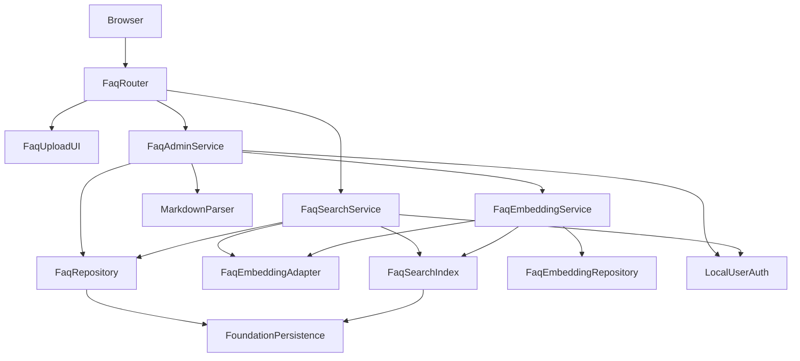
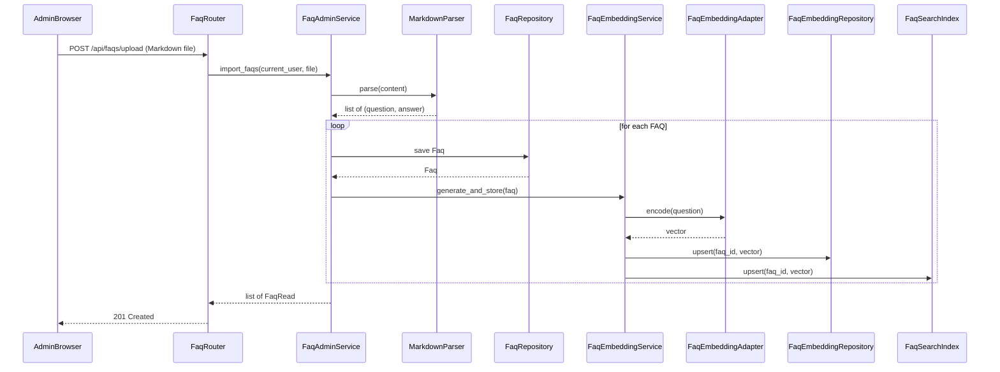

# 設計書

## 概要

`faq-management-and-search` は、`helpo-foundation` と `local-user-authentication` を前提に、FAQ の登録（Markdown ファイルアップロード）、管理者認可、ローカル CPU での質問文 Embedding 生成、検索用索引の整合性維持、類似検索、適合判定を行う仕様です。

FAQ データとそのベクトル表現を一貫して管理し、社員が自然な問い合わせから登録済み FAQ を見つけられるインターフェースを提供します。後続の `ai-helpdesk-chat` などは、本仕様の検索 API と適合判定を利用しますが、回答文の生成や履歴管理は本仕様の責務ではありません。

### 目的

- 管理者のみが Markdown ファイルをアップロードして FAQ を一括登録できる機能を実現する。
- `local-user-authentication` の `require_admin` を使って、FAQ 登録エンドポイントに管理者認可を適用する。
- FAQ の質問文からローカル環境で Embedding を生成し、FAQ のライフサイクルに応じて検索索引を最新に保つ。
- 認証済みの利用者が自然な問い合わせから類似 FAQ を取得し、実装内の固定適合基準に基づいて回答提示の可否を判定する。
- Windows の GPU なし PC 上で、FAQ や Embedding を外部 AI サービスに送信せずに動作する。

### 対象外

- FAQ の一覧表示、更新、削除。
- 一般文書の取り込み・分割・索引化、PDF/Office RAG。
- 大規模言語モデル（LLM）による回答文生成、社員向けチャット UI、質問・回答履歴、利用分析。
- GPU 分散推論、大規模ベクトルデータベース、外部ベクトル検索サービスの導入。
- 未検証の Embedding モデルの自動選択。モデル選定は、ライセンス・動作確認後の再検証ポイントとして設計に残す。

## 境界（担当範囲）

### この仕様が担当すること

- FAQ エンティティ（`faq` テーブル）の登録。
- FAQ 登録に対する管理者認可の適用。
- Markdown ファイルからの質問文・回答文抽出。
- `faq_embedding` テーブルへのベクトル永続化と、FAQ 登録に応じた索引更新。
- ローカル CPU で動作する Embedding アダプターの接続口。実際のモデル選定は本仕様では行わず、再検証ゲートを通す。
- 類似検索サービス、正規化類似度計算、固定適合基準による適合判定、検索 API。
- FAQ アップロード用の最小 Web 画面または API エンドポイント。

### 担当外

- FAQ の一覧表示、更新、削除。
- ユーザー、パスワード、セッション、基本ロールの管理（`local-user-authentication`）。
- アプリケーション起動、SQLite エンジン、ベースマイグレーション、共通エラー処理、基本画面レイアウト（`helpo-foundation`）。
- LLM 回答生成、チャット履歴、一般文書 RAG、分析（`ai-helpdesk-chat` など）。
- モデルのライセンス確認作業そのもの（運用・法務プロセスとして分離）。

### 依存関係

- `helpo-foundation` の `Settings`、`DatabaseEngine.get_session()`、`BaseEntity`、`BaseRepository`、`MigrationRunner`、`ErrorHandler`、`WebLayout`。
- `local-user-authentication` の `CurrentUser`、`require_authenticated_user`、`require_admin`、`AuthorizationPolicy`。
- Python 3.10+、FastAPI 0.115+、SQLAlchemy 2.x、Pydantic v2、Jinja2、NumPy。
- Markdown パースライブラリは、簡易構文に絞れば `re` 標準モジュールで対応可能。複雑な Markdown 対応が必要になった場合は `mistletoe` 等を候補とする。
- Embedding 推論ライブラリは、ライセンス・Windows CPU 動作を確認後に採用する候補（例：`sentence-transformers`、`onnxruntime` など）。本設計では未確定とする。

### 再検証のトリガー

- `CurrentUser`、`require_authenticated_user`、`require_admin` の型・ステータス変更。
- foundation の `Settings`、`BaseEntity`、`Session`、`MigrationRunner`、`ErrorHandler` 契約変更。
- `faq` または `faq_embedding` テーブル構造・ベクトル保存形式の変更。
- Markdown ファイルの Q&A 抽出構文ルールの変更。
- 採用する Embedding モデル・ライブラリ・ライセンスの変更。
- 固定適合基準値または適合判定ロジックの変更。
- 検索 API のレスポンススキーマ変更（`ai-helpdesk-chat` などの下流に影響）。

## アーキテクチャ

### 既存アーキテクチャの分析

- foundation の単体 FastAPI monolith、SQLAlchemy 2.x、SQLite、Pydantic Settings、Jinja2、`base.html` をそのまま利用する。
- `local-user-authentication` の `require_admin` を FAQ 登録エンドポイントに適用し、`require_authenticated_user` を検索エンドポイントに適用する。
- FAQ マイグレーションは foundation の `MigrationRunner` または Alembic フローで、`002_local_user_authentication.sql` の後に `003_faq_management_and_search.sql` として追加する。

### アーキテクチャパターンと境界図



**アーキテクチャ統合**

- 採用パターン: foundation の層構造を拡張するモノリシ内ドメインパッケージ。`FaqRouter` が Web/API の入り口、`Service` が業務ロジック、`Repository`/`Adapter`/`Index` がデータ/推論の責務を分離する。
- ドメイン境界: `FaqAdminService` は FAQ 登録と Markdown パース、`FaqEmbeddingService` はベクトル生成/保存、`FaqSearchIndex` は検索用データ構造、`FaqSearchService` は検索フローと適合判定を担当する。
- 既存パターンの維持: foundation の `BaseEntity`/`BaseRepository`、Pydantic Settings、`get_db` Session 注入、エラーハンドラ、`base.html` ブロックを維持する。
- 新規コンポーネントの意図: `MarkdownParser` で FAQ 固有のファイル構造を隔離し、`FaqEmbeddingAdapter` でモデル依存を隔離する。`FaqSearchIndex` では FAQ 件数が少ない MVP においてインメモリ全探索を採用し、FAQ 変更時の整合性を容易にする。

### 技術スタック

| 層 | 選択/バージョン | 役割 | 備考 |
|---|---|---|---|
| バックエンド ランタイム | Python 3.10+ | 実行基盤 | Windows CPU で動作 |
| Web フレームワーク | FastAPI 0.115+ | HTTP ルーティング・依存注入 | foundation と同一 |
| データ/ストレージ | SQLAlchemy 2.x + SQLite | FAQ・Embedding 永続化 | foundation の Engine/Session を共有 |
| 設定 | Pydantic v2 Settings | FAQ 固有設定追加 | foundation の Settings を拡張 |
| Markdown パース | 標準 `re`（簡易構文）または mistletoe | Q&A 抽出 | 簡易構文に絞れば軽量 |
| Embedding ランタイム | 未選定（再検証ゲート） | 質問文ベクトル化 | `sentence-transformers`/`onnxruntime` などの候補をライセンス確認後に選定 |
| ベクトル演算 | NumPy 1.24+ | コサイン類似度計算・インメモリ索引 | FAQ 件数が少ない MVP 向け |
| UI テンプレート | Jinja2 | アップロード画面 | foundation の `base.html` を継承 |

## ファイル構成

### ディレクトリ構成

```text
helpo/
├── app/
│   ├── config.py                         # foundation 所有: core 設定
│   ├── dependencies.py                   # foundation 所有: 共通依存
│   ├── router_registry.py                # foundation 所有: ルーター登録拡張
│   ├── faq/                              # faq-management-and-search 所有
│   │   ├── __init__.py
│   │   ├── settings.py                   # FaqSettings
│   │   ├── models.py                     # Faq, FaqEmbedding ORM モデル
│   │   ├── schemas.py                    # FaqRead, FaqUploadForm, FaqSearchQuery, FaqCandidate, FaqSearchResult
│   │   ├── repositories.py               # FaqRepository, FaqEmbeddingRepository
│   │   ├── markdown_parser.py            # MarkdownParser + 簡易構文ルール
│   │   ├── embedding.py                  # FaqEmbeddingAdapter + モデルゲート
│   │   ├── search_index.py               # FaqSearchIndex（インメモリ全探索）
│   │   ├── dependencies.py               # FAQ 固有 FastAPI 依存（SearchIndex 生存期間など）
│   │   ├── services.py                   # FaqAdminService, FaqEmbeddingService, FaqSearchService
│   │   └── router.py                     # FaqRouter（API + HTML）
│   └── templates/faq/
│       └── upload.html                   # FAQ Markdown アップロード画面
├── migrations/
│   └── 003_faq_management_and_search.sql # FaqMigration
└── tests/
    └── test_faq.py                       # FaqTestSuite（単体/結合）
```

### 修正対象ファイル

- `app/faq/settings.py` — 機能固有の `FaqSettings` を定義し、foundation の `ConfigManager` 拡張ポイントを通じて読み込み・検証する。
- `app/faq/markdown_parser.py` — Markdown ファイルから質問文・回答文を抽出する `MarkdownParser` を定義する。
- `app/faq/router.py` — `FaqRouter` を実装し、foundation の `RouterRegistry` 拡張インターフェースを通じて登録する。
- foundation の `app/router_registry.py` — `FaqRouter` が登録される。
- `app/templates/faq/upload.html` — 機能固有のテンプレート。

## 処理フロー

### FAQ 登録と Embedding 生成



### 類似検索フロー


## 要件追跡

| 要件 | 概要 | コンポーネント | インターフェース | フロー |
|---|---|---|---|---|
| 1.1-1.5 | FAQ の Markdown アップロード登録 | FaqRepository, MarkdownParser, FaqAdminService, FaqRouter | Service, API | FAQ 登録フロー |
| 2.1-2.5 | 管理者認可 | FaqRouter, LocalUserAuth | API | FAQ 登録フロー |
| 3.1-3.5 | ローカル Embedding と索引整合性 | FaqEmbeddingAdapter, FaqEmbeddingService, FaqSearchIndex, FaqRepository | Service, State | FAQ 登録フロー |
| 4.1-4.6 | 類似検索と適合判定 | FaqSearchService, FaqSearchIndex, FaqEmbeddingAdapter, FaqRepository | API, Service | 類似検索フロー |
| 5.1-5.3 | ローカル MVP 制約 | FaqSettings, FaqEmbeddingAdapter, FaqSearchService | Service, API | FAQ 登録フロー、類似検索フロー |

## コンポーネントとインターフェース

| コンポーネント | 領域/層 | 目的 | 対応要件 | 主な依存 | 契約 |
|---|---|---|---|---|---|
| FaqSettings | 設定 | FAQ 用設定の追加 | 5.1 | foundation Settings P0 | Service |
| FaqMigration | 永続化 | FAQ・Embedding テーブル追加 | 1.1, 3.1, 5.2 | MigrationRunner P0 | Batch, State |
| FaqRepository | データアクセス | FAQ 永続化 | 1.1-1.5 | foundation Session P0 | Service, State |
| FaqEmbeddingRepository | データアクセス | ベクトル永続化 | 3.1, 3.4 | foundation Session P0 | Service, State |
| MarkdownParser | ドメイン | Markdown ファイルから Q&A 抽出 | 1.1, 1.4 | なし（標準ライブラリ） | Service |
| FaqEmbeddingAdapter | AI/推論 | ローカル CPU 推論 | 3.1, 3.3, 3.4, 5.1, 5.3 | candidate library P0 | Service |
| FaqEmbeddingService | ドメインサービス | FAQ 登録時のベクトル生成・保存・索引更新 | 3.1, 3.4 | FaqEmbeddingAdapter P0, FaqRepository P0, FaqSearchIndex P0 | Service |
| FaqSearchIndex | 検索索引 | インメモリ類似度探索 | 3.4, 4.1, 4.2 | FaqEmbeddingRepository P0 | Service, State |
| FaqSearchService | ドメインサービス | 検索フロー・適合判定 | 4.1-4.6 | FaqSearchIndex P0, FaqEmbeddingAdapter P0, FaqRepository P0 | Service |
| FaqAdminService | ドメインサービス | 管理者向け登録 | 1.1-1.5, 2.1-2.5 | FaqRepository P0, MarkdownParser P0, FaqEmbeddingService P0 | Service |
| FaqRouter | API | FAQ 登録・検索の HTTP/UI | 1.1-1.5, 2.1-2.5, 4.1-4.6 | FaqAdminService P0, FaqSearchService P0, LocalUserAuth P0 | API, State |
| FaqUploadUI | UI | FAQ アップロード画面 | 1.1-1.5, 2.1-2.5 | WebLayout P0 | State |

### FaqSettings

- `app/faq/settings.py` に `FaqSettings` を機能固有に定義し、foundation の `ConfigManager` 拡張ポイントを通じて読み込み・検証する。
- `local_embedding_path: str | None` は foundation の `Settings` に既存のため再利用する。新たな Embedding モデル固有設定は、選定後に本コンポーネントへ追加する。
- 適合基準は実装が所有する固定値とし、運用者向けの設定項目としては提供しない。MVP の実用検証で基準値の調整が必要になった場合は、コード変更として対応する。
- 最大アップロードファイルサイズは 10MB を要件に基づき固定する。必要に応じて `FaqSettings` で上書き可能にしてもよい。
- foundation の `app/config.py` は直接変更しない。

### FaqMigration

- `migrations/003_faq_management_and_search.sql` で `faq` テーブルと `faq_embedding` テーブルを追加する。
- `faq` テーブルは `id`、`question`（TEXT NOT NULL）、`answer`（TEXT NOT NULL）、`created_at`、`updated_at` を含む。
- `faq_embedding` テーブルは `id`、`faq_id`（FK `faq.id`、UNIQUE、CASCADE DELETE）、`dimension`（INTEGER NOT NULL）、`vector`（BLOB NOT NULL）、`created_at`、`updated_at` を含む。
- `faq_embedding.faq_id` に一意索引を張り、`faq.id` への外部キーを有効化する。

### FaqRepository

```python
class FaqRepository:
    def create(self, db: Session, question: str, answer: str) -> Faq: ...
    def list_all(self, db: Session) -> list[Faq]: ...
    def get_by_id(self, db: Session, faq_id: int) -> Faq | None: ...
```

- `BaseRepository` または同等の共通トランザクション規約を利用する。Repository 内で `commit()` は行わず、呼び出し元の Service がトランザクション境界を制御する。
- 更新・削除は要件にないため、提供しない。
- `question` の重複は一意制約ではなくアプリケーション層で検証する（同じ質問文を異なる回答に許容しない）。

### FaqEmbeddingRepository

```python
class FaqEmbeddingRepository:
    def upsert(self, db: Session, faq_id: int, dimension: int, vector: bytes) -> FaqEmbedding: ...
    def load_all(self, db: Session) -> list[FaqEmbedding]: ...
```

- `vector` は `numpy.float32` 配列のバイト列を保存する。`dimension` は再構築時の形状復元に必要。
- `BaseEntity` を継承し、`faq_id` に `faq.id` への外部キーと CASCADE を設定する。

### MarkdownParser

```python
class MarkdownParser:
    def parse(self, content: str) -> list[tuple[str, str]]: ...
```

- H2 見出し（`## `）を質問文、その直後の段落を回答文として解釈する。
- 回答文が次の H2 見出しまで複数段落にわたる場合、段落を連結して 1 つの回答文とする。
- 空の質問文・回答文、または H2 見出しのみで回答がないセクションは検出してエラーを返す。
- 同じ質問文がファイル内で重複する場合はエラーを返す。
- Markdown ファイル内に有効な Q&A セクションが 1 つもない場合はエラーを返す。

### FaqEmbeddingAdapter

```python
class FaqEmbeddingAdapter:
    def __init__(self, model_path: str | None): ...
    def is_ready(self) -> bool: ...
    def encode(self, text: str) -> np.ndarray: ...
```

- 初期化時に `model_path` が設定されていればロードし、未設定の場合は `is_ready() == False` とする。未検証のモデルを勝手にダウンロード・選択しない。
- `encode` は `numpy.ndarray`（`float32`）を返す。モデル未ロード時は `RuntimeError`（または専用例外）を発生させ、呼び出し元でサービス不可用を表現する。
- Windows CPU で動作し、GPU を要求しない。実際のモデル・ライブラリは選定・ライセンス確認後にアダプターの内部実装へ差し替える。

### FaqEmbeddingService

```python
class FaqEmbeddingService:
    def __init__(self, adapter: FaqEmbeddingAdapter, repo: FaqEmbeddingRepository, index: FaqSearchIndex): ...
    def generate_and_store(self, db: Session, faq: Faq) -> FaqEmbedding | None: ...
```

- FAQ 登録時に `adapter.encode(faq.question)` を呼び出し、Repository へ upsert、SearchIndex へ upsert する。
- `adapter.is_ready() == False` の場合、保存処理はベクトルを生成せず、Repository には何も書き込まない。ただし `FaqSearchService` はこの状態を検知して検索不可を表現する。
- トランザクションは呼び出し元の Service/ルーター境界で制御する。

### FaqSearchIndex

```python
class FaqSearchIndex:
    def build(self, db: Session) -> None: ...
    def upsert(self, faq_id: int, vector: np.ndarray) -> None: ...
    def search(self, query_vector: np.ndarray, top_k: int) -> list[tuple[int, float]]: ...
    def is_consistent_with_db(self, db: Session) -> bool: ...
```

- `FaqSearchIndex` はインメモリデータ構造であり、検索時に DB 接続を必要としない。
- 起動時または不整合検知時に `build(db)` で `faq_embedding` から全ベクトルを読み出し、インメモリ索引を構築する。
- `search(query_vector, top_k)` は NumPy によるコサイン類似度で全件比較し、上位 `top_k` 件の `(faq_id, raw_score)` を返す。`raw_score` は -1 から 1 の範囲の生のコサイン類似度である。
- `is_consistent_with_db()` は DB 内の FAQ 数と索引エントリ数を比較する。不整合があれば次回検索前に `build()` を呼び出して再構築する。

### FaqSearchService

```python
@dataclass(frozen=True)
class FaqCandidate:
    faq_id: int
    question: str
    answer: str
    confidence: float
    is_match: bool

@dataclass(frozen=True)
class FaqSearchResult:
    query: str
    candidates: list[FaqCandidate]
    has_match: bool

class FaqSearchService:
    def __init__(self, adapter: FaqEmbeddingAdapter, index: FaqSearchIndex, repo: FaqRepository): ...
    def search(self, db: Session, query: str, top_k: int = 5) -> FaqSearchResult: ...
```

- `adapter.is_ready()` が False の場合、`FaqEmbeddingError`（または 503 にマップされる専用例外）を発生させる。
- `index.search` は DB に依存しないインメモリ類似度探索である。`FaqSearchService.search` は `db: Session` を受け、索引から得た `faq_id` に対して `FaqRepository` で現在の FAQ レコードを読み出す。
- `index.search` が返す生のコサイン類似度 `raw_score` は、公開・保存前に `confidence = max(0.0, min(1.0, (raw_score + 1.0) / 2.0))` のように 0 から 1 に変換・クランプする。
- 各候補の `confidence` が実装所有の固定適合基準以上であれば `is_match=True` とし、`has_match` は `candidates` 内に `is_match=True` が存在するかで決定する。適合基準は運用者向け設定としては提供せず、MVP では実装内の定数とする。
- `candidates` には上位 `top_k` 件すべてを含め、`is_match` で適合基準以上かを識別する。適合基準未満の候補は後続の LLM 回答文生成には利用できない。

### FaqAdminService

```python
class FaqAdminService:
    def __init__(self, repo: FaqRepository, parser: MarkdownParser, embedding_service: FaqEmbeddingService): ...
    def import_faqs(self, db: Session, content: str) -> list[Faq]: ...
```

- 管理者認可は `FaqRouter` の `Depends` で行い、本 Service はデータ操作のみを担当する。
- `import_faqs` は Markdown コンテンツを `MarkdownParser` でパースし、各 FAQ を `FaqRepository.create` で保存した後、`FaqEmbeddingService.generate_and_store` を呼び出す。
- パースエラー、重複、または 1 件も保存できない場合は、トランザクションをロールバックして例外を送出する。

### FaqRouter

| HTTPメソッド | エンドポイント | リクエスト | レスポンス | エラー |
|---|---|---|---|---|
| POST | /api/faqs/upload | Markdown file (multipart/form-data) | list[FaqRead] | 400, 401, 403, 413, 415, 422, 500 |
| POST | /api/faqs/search | FaqSearchQuery | FaqSearchResult | 400, 401, 422, 503, 500 |
| GET/POST | /faqs/upload | form | HTML upload | 401, 403, 500 |

- `POST /api/faqs/upload` と `/faqs/upload` は `require_admin` を `Depends` に指定する。
- `POST /api/faqs/search` は `require_authenticated_user` を指定する（機械向け検証用）。
- 社員向けメイン検索入口は `/chat`（`ai-helpdesk-chat`）とする。
- `FaqSearchService` が `FaqEmbeddingError` を送出した場合、HTTP 503（Service Unavailable）として応答する。
- アップロードファイルのサイズ制限は 10MB とする。形式は `.md`、MIME type は `text/markdown` を受け入れる。

### FaqUploadUI

- `upload.html` は foundation の `base.html` を継承し、`header`/`main`/`footer`/`content` ブロックを維持する。
- ファイル選択（Markdown のみ）、アップロードボタン、エラーメッセージ領域を持つ。
- 未ログイン時は `/login` へ 303 リダイレクトし、一般ユーザーは 403 応答または専用エラー画面を表示する。

## データモデル

### ドメインモデル

- **Faq**: 下位機能も参照する FAQ 集約ルート。`id`、`question`、`answer`、`created_at`、`updated_at` を含む。更新・削除は要件にないため、変更操作は提供しない。
- **FaqEmbedding**: Faq に 1 対 1 で対応するベクトル表現。生トークンや元モデルパスは含まず、正規化されたベクトルバイト列のみを保持する。
- **FaqCandidate / FaqSearchResult**: 検索 API の読み取り専用データ転送用オブジェクト（DTO）。`confidence` は生のコサイン類似度を 0 から 1 に正規化・クランプした値、`is_match` は実装所有の固定適合基準による判定結果を表す。

### 物理データモデル

**faq**

| カラム | 型 | 制約 |
|---|---|---|
| id | INTEGER | 主キー（PK）、BaseEntity |
| question | TEXT | NOT NULL |
| answer | TEXT | NOT NULL |
| created_at | DATETIME | NOT NULL、BaseEntity |
| updated_at | DATETIME | NOT NULL、BaseEntity |

**faq_embedding**

| カラム | 型 | 制約 |
|---|---|---|
| id | INTEGER | 主キー（PK）、BaseEntity |
| faq_id | INTEGER | NOT NULL、UNIQUE、外部キー（FK） faq.id ON DELETE CASCADE |
| dimension | INTEGER | NOT NULL |
| vector | BLOB | NOT NULL |
| created_at | DATETIME | NOT NULL、BaseEntity |
| updated_at | DATETIME | NOT NULL、BaseEntity |

- `vector` は `numpy.float32` 配列を `tobytes()` で保存する。読み出し時に `dimension` を使って `np.frombuffer(...).reshape(dimension)` する。
- SQLite の外部キー制約は foundation の Engine 設定で有効にする。

### API データ転送

**FaqUploadRequest**

```json
{
  "file": "<Markdown file>"
}
```

**FaqRead**

```json
{
  "id": 1,
  "question": "有給休暇は何日前に申請すればよいですか",
  "answer": "原則として3営業日前までに申請してください。",
  "created_at": "2026-08-27T12:00:00",
  "updated_at": "2026-08-27T12:00:00"
}
```

**FaqSearchQuery**

```json
{
  "query": "休暇 何日前",
  "top_k": 5
}
```

**FaqSearchResult**

```json
{
  "query": "休暇 何日前",
  "candidates": [
    {
      "faq_id": 1,
      "question": "有給休暇は何日前に申請すればよいですか",
      "answer": "原則として3営業日前までに申請してください。",
      "confidence": 0.82,
      "is_match": true
    }
  ],
  "has_match": true
}
```

- レスポンスにはベクトルバイト列、モデルパス、ライセンス情報は含めない。

## エラー処理

### エラー戦略

- Markdown ファイルのパースエラー、形式不正、サイズ超過は 400/413/415 として早期に返す。
- 入力検証エラーは Pydantic の 422 をそのまま利用する。
- 未認証/権限不足は `local-user-authentication` の 401/403 応答を利用する。
- 未処理の予期せぬ例外は foundation の `ErrorHandler` へ委譲し、汎用 500 応答を維持する。
- Embedding モデル未準備/未ロードの場合は 503 Service Unavailable を返し、詳細なモデルパスや内部エラーはログに記録する。

### エラーの種類と応答

- **利用者エラー（4xx）**: 415 Markdown 形式外、413 ファイルサイズ超過、422 入力検証/Markdown 内容不正、401 未認証、403 権限不足。
- **システムエラー（5xx）**: 予期せぬ処理失敗は foundation 汎用 500 応答、Embedding 未ロードは 503 応答。
- **業務ロジックエラー（422）**: Markdown 内の Q&A 形式違反、質問文重複、空の質問・回答。

### 監視

- FAQ の登録はイベント種別と FAQ ID をログに残す。
- Embedding モデルのロード失敗、検索実行回数、適合基準未満件数は運用確認用にログに残す。
- ベクトルバイト列やモデルの重みファイルパスはログに出力しない。
- アップロードファイル名はログに含めず、ファイルサイズのみ記録する。

## テスト方針

### 単体テスト

- FaqRepository: FAQ 作成、一覧、取得、トランザクションロールバック（1.1-1.5）。
- FaqEmbeddingRepository: vector のバイト列保存・読み出し、`faq_id` 一意制約（3.1, 3.4）。
- MarkdownParser: 正しい Markdown、空セクション、重複質問文、複数段落回答、H2 以外の見出しを含むケース（1.1, 1.4）。
- FaqEmbeddingAdapter: モックモデルまたは固定モデルパスでの encode と is_ready 切替、外部送信なし（3.1, 3.3, 3.4）。
- FaqSearchIndex: upsert/build、コサイン類似度順序、不整合再構築（3.4, 4.1, 4.2）。
- FaqSearchService: 適合基準以上/未満の `is_match` と `has_match` 判定（4.3-4.6）。
- FaqAdminService: パース失敗時のロールバック、重複時のエラー、複数 FAQ の一括登録（1.1-1.5）。

### 結合テスト

- 管理者での FAQ アップロード API（認可、ファイル形式、サイズ超過、内容エラー、重複）（1.1-2.5）。
- FAQ 登録後に `faq_embedding` にレコードが作成され、検索結果に反映される（3.1, 3.4, 4.1, 4.2）。
- 検索 API で適合判定、`has_match`、適合基準未満の除外を検証（4.3-4.6）。
- Embedding 未設定時の検索 API 503 応答（5.3）。
- Windows CPU ローカル環境で pytest を実行可能であること（5.1, 5.2）。

### E2E/UI テスト

- ブラウザまたは HTTP クライアントで `/faqs/upload` にアクセスし、Markdown ファイルアップロードが管理者で動作する（1.1-2.5）。
- 未認証でアップロード画面にアクセスすると認証導線へ誘導される（2.3）。

## セキュリティ考慮事項

- FAQ 登録操作は管理者のみ可能とし、一般利用者の書き換えを防ぐ。
- ベクトルバイト列、Embedding モデル内部情報、設定ファイルの機密値を API/テンプレート/ログに出力しない。
- FAQ と Embedding を外部サービスへ送信せず、すべて同一 PC 内で処理する。
- 管理者認可は `local-user-authentication` の `require_admin` に委ね、再実装しない。
- CSRF 対策として SameSite=Lax を維持し、FAQ の登録は POST に限定する。
- アップロードファイル名は保存・ログに利用せず、拡張子と MIME type のみ検証する。

## 性能とスケーラビリティ

- FAQ 件数は研修用 MVP で数十〜数百件を想定し、インメモリ全探索を採用する。
- 件数増加で推論・全探索がボトルネックになった場合、ベクトル索引ライブラリの導入を再検証する。
- SQLite はシングルファイルで、同時書き込みは 1 接続までを想定する。
- Embedding 推論は CPU で実行し、GPU を必須としない。
- アップロードファイルサイズは 10MB に制限し、大容量ファイルのメモリ消費を防ぐ。

## マイグレーション方針

- foundation ベースラインおよび `002_local_user_authentication.sql` の後に `003_faq_management_and_search.sql` を適用する。
- マイグレーションは新規テーブル・索引のみを追加し、既存テーブルを変更しない。
- 適用失敗時は foundation の fail-fast 起動エラー契約に従い、サーバーを起動しない。

## 参考資料（任意）

- Embedding モデル選定とライセンス確認は本設計の未確定項目である。モデル候補、ベンチマーク、ライセンス条項を `research.md` に記録し、未検証のモデルはコード・設定に組み込まない。
