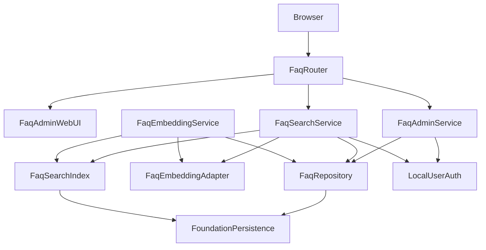
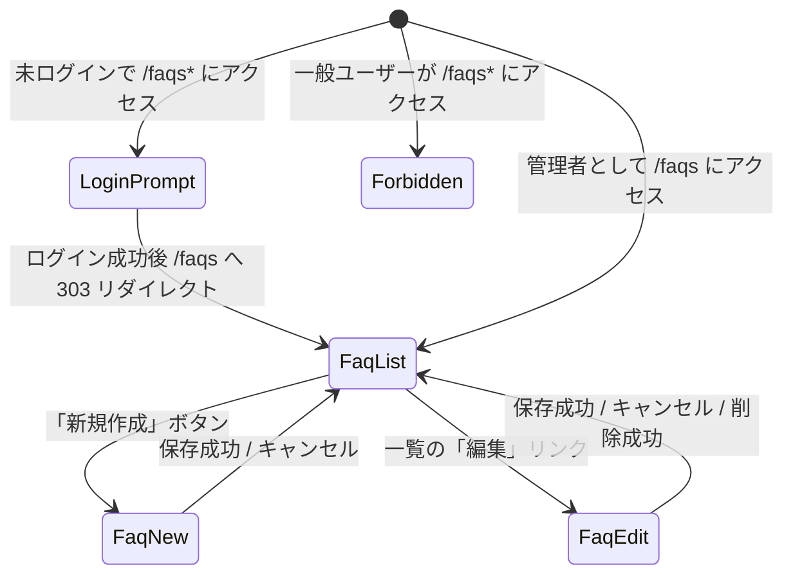
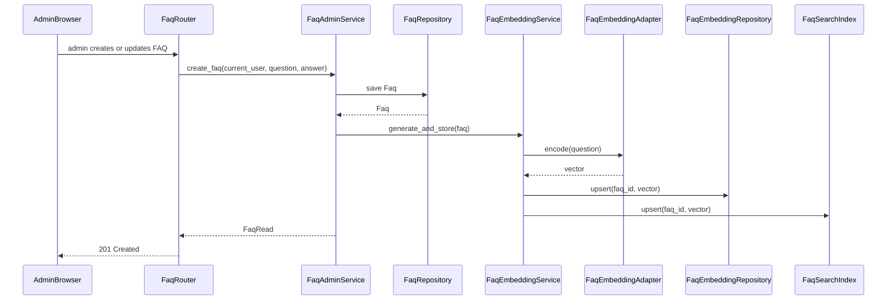
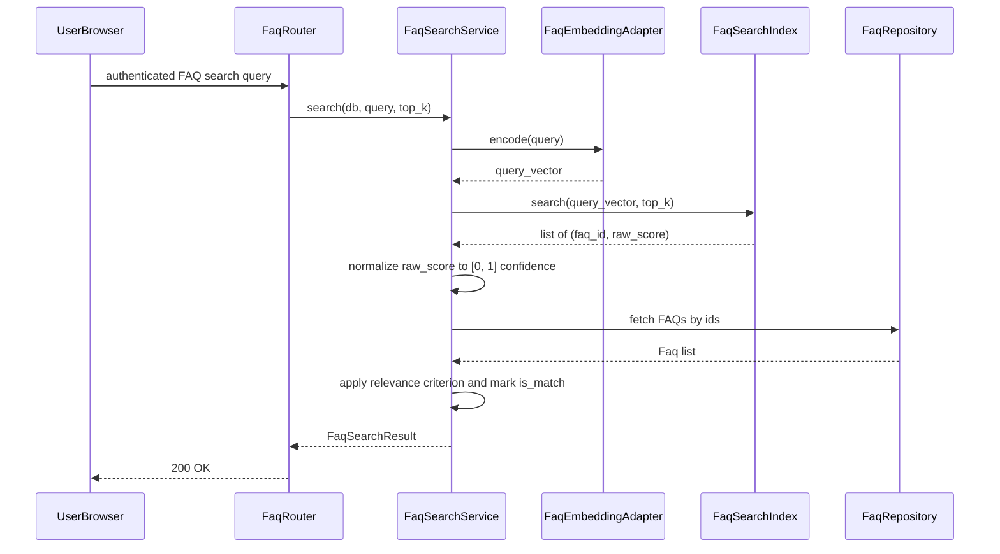

# 設計書

## 概要

`faq-management-and-search` は、`helpo-foundation` と `local-user-authentication` を前提に、FAQ の登録・参照・更新・削除（CRUD）、管理者認可、ローカル CPU での質問文 Embedding 生成、検索用索引の整合性維持、類似検索、適合判定を行う仕様です。

FAQ データとそのベクトル表現を一貫して管理し、社員が自然な問い合わせから登録済み FAQ を見つけられるインターフェースを提供します。後続の `ai-helpdesk-chat` などは、本仕様の検索 API と適合判定を利用しますが、回答文の生成や履歴管理は本仕様の責務ではありません。

### 目的

- 管理者のみが FAQ を登録・一覧・更新・削除できる管理機能を実現する。
- `local-user-authentication` の `require_admin` を使って、FAQ 管理エンドポイントに管理者認可を適用する。
- FAQ の質問文からローカル環境で Embedding を生成し、FAQ のライフサイクルに応じて検索索引を最新に保つ。
- 認証済みの利用者が自然な問い合わせから類似 FAQ を取得し、実装内の固定適合基準に基づいて回答提示の可否を判定する。
- Windows の GPU なし PC 上で、FAQ や Embedding を外部 AI サービスに送信せずに動作する。

### 対象外

- 一般文書の取込み・分割・索引化、PDF/Office RAG。
- 大規模言語モデル（LLM）による回答文生成、社員向けチャット UI、質問・回答履歴、利用分析。
- GPU 分散推論、大規模ベクトルデータベース、外部ベクトル検索サービスの導入。
- 未検証の Embedding モデルの自動選択。モデル選定は、ライセンス・動作確認後の再検証ポイントとして設計に残す。

## 境界（担当範囲）

### この仕様が担当すること

- FAQ エンティティ（`faq` テーブル）のライフサイクルと CRUD。
- FAQ 作成・更新・削除に対する管理者認可の適用。
- `faq_embedding` テーブルへのベクトル永続化と、FAQ 変更に応じた索引更新。
- ローカル CPU で動作する Embedding アダプターの接続口。実際のモデル選定は本仕様では行わず、再検証ゲートを通す。
- 類似検索サービス、正規化類似度計算、固定適合基準による適合判定、検索 API。
- FAQ 管理画面（foundation の `base.html` を継承）。

### 担当外

- ユーザー、パスワード、セッション、基本ロールの管理（`local-user-authentication`）。
- アプリケーション起動、SQLite エンジン、ベースマイグレーション、共通エラー処理、基本画面レイアウト（`helpo-foundation`）。
- LLM 回答生成、チャット履歴、一般文書 RAG、分析（`ai-helpdesk-chat` など）。
- モデルのライセンス確認作業そのもの（運用・法務プロセスとして分離）。

### 依存関係

- `helpo-foundation` の `Settings`、`DatabaseEngine.get_session()`、`BaseEntity`、`BaseRepository`、`MigrationRunner`、`ErrorHandler`、`WebLayout`。
- `local-user-authentication` の `CurrentUser`、`require_authenticated_user`、`require_admin`、`AuthorizationPolicy`。
- Python 3.10+、FastAPI 0.115+、SQLAlchemy 2.x、Pydantic v2、Jinja2、NumPy。
- Embedding 推論ライブラリは、ライセンス・Windows CPU 動作を確認後に採用する候補（例：`sentence-transformers`、`onnxruntime` など）。本設計では未確定とする。

### 再検証のトリガー

- `CurrentUser`、`require_authenticated_user`、`require_admin` の型・ステータス変更。
- foundation の `Settings`、`BaseEntity`、`Session`、`MigrationRunner`、`ErrorHandler` 契約変更。
- `faq` または `faq_embedding` テーブル構造・ベクトル保存形式の変更。
- 採用する Embedding モデル・ライブラリ・ライセンスの変更。
- 固定適合基準値または適合判定ロジックの変更。
- 検索 API のレスポンススキーマ変更（`ai-helpdesk-chat` などの下流に影響）。

## アーキテクチャ

### 既存アーキテクチャの分析

- foundation の単体 FastAPI monolith、SQLAlchemy 2.x、SQLite、Pydantic Settings、Jinja2、`base.html` をそのまま利用する。
- `local-user-authentication` の `require_admin` を FAQ 管理エンドポイントに適用し、`require_authenticated_user` を検索エンドポイントに適用する。
- FAQ マイグレーションは foundation の `MigrationRunner` または Alembic フローで、`002_local_user_authentication.sql` の後に `003_faq_management_and_search.sql` として追加する。

### アーキテクチャパターンと境界図



**アーキテクチャ統合**

- 採用パターン: foundation の層構造を拡張するモノリシ内ドメインパッケージ。`FaqRouter` が Web/API の入り口、`Service` が業務ロジック、`Repository`/`Adapter`/`Index` がデータ/推論の責務を分離する。
- ドメイン境界: `FaqAdminService` は FAQ ライフサイクル、`FaqEmbeddingService` はベクトル生成/保存、`FaqSearchIndex` は検索用データ構造、`FaqSearchService` は検索フローと適合判定を担当する。
- 既存パターンの維持: foundation の `BaseEntity`/`BaseRepository`、Pydantic Settings、`get_db` Session 注入、エラーハンドラ、`base.html` ブロックを維持する。
- 新規コンポーネントの意図: `FaqEmbeddingAdapter` でモデル依存を隔離し、未検証モデルを自動採用しない。`FaqSearchIndex` では FAQ 件数が少ない MVP においてインメモリ全探索を採用し、FAQ 変更時の整合性を容易にする。

### 技術スタック

| 層 | 選択/バージョン | 役割 | 備考 |
|---|---|---|---|
| バックエンド ランタイム | Python 3.10+ | 実行基盤 | Windows CPU で動作 |
| Web フレームワーク | FastAPI 0.115+ | HTTP ルーティング・依存注入 | foundation と同一 |
| データ/ストレージ | SQLAlchemy 2.x + SQLite | FAQ・Embedding 永続化 | foundation の Engine/Session を共有 |
| 設定 | Pydantic v2 Settings | FAQ 固有設定追加 | foundation の Settings を拡張 |
| Embedding ランタイム | 未選定（再検証ゲート） | 質問文ベクトル化 | `sentence-transformers`/`onnxruntime` などの候補をライセンス確認後に選定 |
| ベクトル演算 | NumPy 1.24+ | コサイン類似度計算・インメモリ索引 | FAQ 件数が少ない MVP 向け |
| UI テンプレート | Jinja2 | FAQ 管理画面 | foundation の `base.html` を継承 |

## ファイル構成

### ディレクトリ構成

```text
helpo/
├── app/
│   ├── config.py                         # foundation 所有: core 設定
│   ├── dependencies.py                   # foundation 所有: 共通依存
│   ├── router_registry.py                # foundation 所有: ルーター登録拡張
│   ├── faq/                              # faq-management-and-search 所有
│   │   ├── __init__.py
│   │   ├── settings.py                   # FaqSettings
│   │   ├── models.py                     # Faq, FaqEmbedding ORM モデル
│   │   ├── schemas.py                    # FaqCreate, FaqUpdate, FaqRead, FaqSearchQuery, FaqCandidate, FaqSearchResult
│   │   ├── repositories.py               # FaqRepository, FaqEmbeddingRepository
│   │   ├── embedding.py                  # FaqEmbeddingAdapter + モデルゲート
│   │   ├── search_index.py               # FaqSearchIndex（インメモリ全探索）
│   │   ├── dependencies.py               # FAQ 固有 FastAPI 依存（SearchIndex 生存期間など）
│   │   ├── services.py                   # FaqAdminService, FaqEmbeddingService, FaqSearchService
│   │   └── router.py                     # FaqRouter（API + HTML）
│   └── templates/faq/
│       ├── list.html                     # FAQ 管理一覧
│       └── form.html                     # FAQ 作成・編集フォーム
├── migrations/
│   └── 003_faq_management_and_search.sql # FaqMigration
└── tests/
    └── test_faq.py                       # FaqTestSuite（単体/結合）
```

### 修正対象ファイル

- `app/faq/settings.py` — 機能固有の `FaqSettings` を定義し、foundation の `ConfigManager` 拡張ポイントを通じて読み込み・検証する。
- `app/faq/dependencies.py` — `get_search_index()` など、FAQ 固有の FastAPI 依存を機能固有に定義する。
- `app/faq/router.py` — `FaqRouter` を実装し、foundation の `RouterRegistry` 拡張インターフェースを通じて登録する。
- foundation の `app/router_registry.py` — `FaqRouter` が登録される。
- `app/templates/faq/*.html` — 機能固有のテンプレート。

## 画面設計（UI/UX）

### 提供する画面と役割

本仕様が提供する画面は **FAQ 管理画面** のみです。社員が自然な問い合わせから FAQ を探すメインの入口は、後続の `ai-helpdesk-chat` 仕様が提供する `/chat` 画面とし、本仕様では管理目的の画面に限定します。

| 画面 | URL | 役割 | 対象利用者 | 対応要件 |
|---|---|---|---|---|
| FAQ 一覧 | `/faqs` | 登録済み FAQ の閲覧、新規作成・編集・削除の導線を提供する | 管理者 | 1.1, 1.2, 1.3, 1.5, 2.1, 2.2 |
| FAQ 作成 | `/faqs/new` | 新しい FAQ の質問文と回答文を入力し登録する | 管理者 | 1.1, 1.4, 2.1, 2.2 |
| FAQ 編集 | `/faqs/{id}/edit` | 既存 FAQ の質問文・回答文を更新、または削除する | 管理者 | 1.2, 1.3, 1.4, 2.1, 2.2 |

### 画面遷移図



### FAQ 一覧画面（`/faqs`）

#### 表示要素

- ページタイトル: 「FAQ 管理」
- 新規作成ボタン: `/faqs/new` へのリンク
- FAQ 一覧テーブル
  - 列: 質問文（先頭から 80 文字）、最終更新日時、操作
  - 操作列: 編集リンク、削除ボタン
- 登録済み FAQ が 0 件の場合:「まだ FAQ が登録されていません」の空状態メッセージと新規作成ボタン
- フラッシュメッセージ領域: 作成・更新・削除成功時のメッセージを表示
- エラーメッセージ領域: 権限不足やシステムエラーのメッセージを表示

#### 操作とイベント

| 操作 | イベント | 結果 |
|---|---|---|
| 「新規作成」ボタンをクリック | ブラウザが `/faqs/new` へ遷移 | 作成フォームが表示される |
| 一覧の「編集」リンクをクリック | ブラウザが `/faqs/{id}/edit` へ遷移 | 編集フォームが表示される |
| 一覧の「削除」ボタンをクリック | 確認ダイアログを表示 | OK の場合のみ DELETE リクエストを送信 |
| 削除成功 | 一覧画面へリダイレクト | 「FAQ を削除しました」フラッシュメッセージ |
| 削除対象が不存在 | 一覧画面へリダイレクト | エラーメッセージを表示 |

### FAQ 作成・編集画面（`/faqs/new`、`/faqs/{id}/edit`）

#### 表示要素

- ページタイトル: 「FAQ を登録」（作成時）/ 「FAQ を編集」（編集時）
- 質問文入力欄: テキストエリア、必須、プレースホルダー「例: 有給休暇は何日前に申請すればよいですか」
- 回答文入力欄: テキストエリア、必須、プレースホルダー「例: 原則として3営業日前までに申請してください。」
- バリデーションエラー表示: 未入力時や重複質問文時に各フィールド近くにメッセージを表示
- 保存ボタン: フォームを POST/PUT 送信
- キャンセルリンク: `/faqs` へ戻る
- 編集時のみ削除ボタン: 確認ダイアログ後に DELETE 送信

#### 操作とイベント

| 操作 | イベント | 結果 |
|---|---|---|
| 必須項目を入力し保存 | サーバー側で検証・保存、Embedding 生成 | 一覧画面へリダイレクトし「FAQ を登録しました」または「FAQ を更新しました」 |
| 未入力で保存 | サーバー側で 422 エラー | フォームに戻り、未入力フィールドにエラーメッセージ |
| 既存と重複する質問文で保存 | サーバー側で 409 エラー | フォームに戻り、質問文フィールドに重複エラー |
| キャンセルをクリック | 何も保存せず | `/faqs` へ戻る |
| 編集画面で削除 | 確認ダイアログ後 DELETE | 一覧画面へリダイレクトし「FAQ を削除しました」 |

### アクセス制御とエラー表示

| 状態 | 挙動 | 表示 | 対応要件 |
|---|---|---|---|
| 未ログインで `/faqs*` にアクセス | `/login` へ 303 リダイレクト | ログイン画面へ誘導 | 2.3 |
| 一般ユーザーで `/faqs*` にアクセス | 403 応答または専用エラー画面 | 「アクセス権限がありません」 | 2.2 |
| 保存中に予期せぬサーバーエラー | 500 応答 | foundation の汎用エラー画面またはメッセージ | - |

### 入力仕様とバリデーション

#### フォーム項目

| 項目 | 画面 | データ型 | 形式 | 必須/任意 | 最大長 | 備考 | 対応要件 |
|---|---|---|---|---|---|---|---|
| 質問文 | 作成・編集 | テキスト | 複数行 | 必須 | 1,000 文字 | FAQ の質問として表示される本文。先頭・末尾の空白は保存前にトリムする | 1.1, 1.4 |
| 回答文 | 作成・編集 | テキスト | 複数行 | 必須 | 10,000 文字 | FAQ の回答として表示される本文。先頭・末尾の空白は保存前にトリムする | 1.1, 1.4 |

#### チェック仕様

| チェック対象 | チェックタイミング | ルール | エラー表示位置 | エラーメッセージ例 | 対応要件 |
|---|---|---|---|---|---|
| 質問文 | クライアント側（HTML5） | `required` 属性で空送信を阻止 | ブラウザ標準 | このフィールドを入力してください | 1.4 |
| 回答文 | クライアント側（HTML5） | `required` 属性で空送信を阻止 | ブラウザ標準 | このフィールドを入力してください | 1.4 |
| 質問文 | サーバー側（Pydantic + Service） | 空文字・空白のみ不可 | 質問文フィールド近く | 質問文を入力してください | 1.1, 1.4 |
| 質問文 | サーバー側（Service） | 既存 FAQ と重複不可（大文字小文字・全半角は正規化後に比較） | 質問文フィールド近く | 同じ質問文の FAQ が既に存在します | 1.1 |
| 回答文 | サーバー側（Pydantic + Service） | 空文字・空白のみ不可 | 回答文フィールド近く | 回答文を入力してください | 1.1, 1.4 |
| 質問文・回答文 | サーバー側 | 最大長を超える入力を拒否 | 該当フィールド近く | 質問文は 1,000 文字以下、回答文は 10,000 文字以下で入力してください | 1.4 |

#### バリデーションの責務分担

- クライアント側（HTML5）: 未入力阻止、文字数超過の事前ブロック。利便性のための補助であり、最終的な検証はサーバー側で行う。
- サーバー側（Pydantic + `FaqAdminService`）: 必須チェック、最大長チェック、重複チェック、サニタイズ（前後空白トリム）。

### 画面活性制御

| 条件 | 画面/要素 | 活性状態 | 理由 | 対応要件 |
|---|---|---|---|---|
| 管理者 | 新規作成ボタン（`/faqs`） | 活性 | FAQ 管理が許可されている | 2.1, 2.2 |
| 管理者 | 編集リンク（`/faqs`） | 活性 | FAQ 管理が許可されている | 2.1, 2.2 |
| 管理者 | 削除ボタン（`/faqs`、`/faqs/{id}/edit`） | 活性 | FAQ 管理が許可されている。誤操作防止のため `confirm()` を挟む | 1.3, 2.1, 2.2 |
| 作成画面 | 保存ボタン | 必須項目未入力時はブラウザが送信を阻止（`required` 属性） | 必須項目の入力を促す。追加で JavaScript により disabled にしてもよい | 1.4 |
| 編集画面 | 保存ボタン | 必須項目未入力時はブラウザが送信を阻止（`required` 属性） | 必須項目の入力を促す。追加で JavaScript により disabled にしてもよい | 1.4 |
| 編集画面 | 削除ボタン | 常に活性 | 既存 FAQ の削除を許可。誤操作防止のため `confirm()` を挟む | 1.3 |

### フォーム送信方式

| 操作 | HTTP メソッド | HTML form の対応 | 送信方法 | 対応要件 |
|---|---|---|---|---|
| FAQ 作成 | POST | 直接送信可能 | `<form method="post" action="/faqs/new">` | 1.1, 1.4 |
| FAQ 更新 | PUT | HTML form 非対応 | `<form method="post" action="/faqs/{id}/edit">` とし、サーバー側で更新処理を実行する | 1.2, 1.4 |
| FAQ 削除 | DELETE | HTML form 非対応 | 削除ボタンに JavaScript `confirm()` を挟み、`fetch()` で DELETE 送信。JavaScript 無効時のフォールバックとして `<form method="post" action="/faqs/{id}/delete">` を併設してもよい | 1.3 |

- HTML form の method 制約により、更新・削除は REST メソッドとは異なる送信方式を採用する。
- CSRF 対策として SameSite=Lax を維持し、状態変更は POST/PUT/DELETE に限定する。

### レイアウト制約

- `list.html`、`form.html` は foundation の `base.html` を継承する。
- `content` ブロックを上書きし、管理画面専用のマークアップを配置する。
- `local-user-authentication` の `_nav.html` が提供する認証状態ナビを流用し、管理者に対して「FAQ 管理」リンクを表示する。
- レスポンシブ対応は MVP では最低限とし、主要な操作が Windows デスクトップブラウザで利用可能であることを前提とする。

## 処理フロー

### FAQ 作成・更新と Embedding 生成



### 類似検索フロー



## 要件追跡

| 要件 | 概要 | コンポーネント | インターフェース | フロー |
|---|---|---|---|---|
| 1.1-1.5 | FAQ の CRUD | FaqRepository, FaqAdminService, FaqRouter | Service, API, State | FAQ 作成/更新フロー |
| 2.1-2.5 | 管理者認可 | FaqRouter, LocalUserAuth | API | FAQ 作成/更新フロー |
| 3.1-3.6 | ローカル Embedding と索引整合性 | FaqEmbeddingAdapter, FaqEmbeddingService, FaqSearchIndex, FaqRepository | Service, State | FAQ 作成/更新フロー |
| 4.1-4.5 | 類似検索と適合判定 | FaqSearchService, FaqSearchIndex, FaqEmbeddingAdapter, FaqRepository | API, Service | 類似検索フロー |
| 5.1-5.4 | ローカル MVP 制約 | FaqSettings, FaqEmbeddingAdapter, FaqSearchService | Service, API | FAQ 作成/更新フロー、類似検索フロー |

## コンポーネントとインターフェース

| コンポーネント | 領域/層 | 目的 | 対応要件 | 主な依存 | 契約 |
|---|---|---|---|---|---|
| FaqSettings | 設定 | FAQ 用設定の追加 | 5.1 | foundation Settings P0 | Service |
| FaqMigration | 永続化 | FAQ・Embedding テーブル追加 | 1.1, 3.1, 3.6, 5.2 | MigrationRunner P0 | Batch, State |
| FaqRepository | データアクセス | FAQ 永続化 | 1.1-1.5 | foundation Session P0 | Service, State |
| FaqEmbeddingRepository | データアクセス | ベクトル永続化 | 3.1, 3.2, 3.3 | foundation Session P0 | Service, State |
| FaqEmbeddingAdapter | AI/推論 | ローカル CPU 推論 | 3.1, 3.5, 3.6, 5.1, 5.3 | candidate library P0 | Service |
| FaqEmbeddingService | ドメインサービス | FAQ 変更時のベクトル生成・保存・索引更新 | 3.1, 3.2, 3.3 | FaqEmbeddingAdapter P0, FaqRepository P0, FaqSearchIndex P0 | Service |
| FaqSearchIndex | 検索索引 | インメモリ類似度探索 | 3.3, 3.4, 4.1, 4.2 | FaqEmbeddingRepository P0 | Service, State |
| FaqSearchService | ドメインサービス | 検索フロー・適合判定 | 4.1-4.5 | FaqSearchIndex P0, FaqEmbeddingAdapter P0, FaqRepository P0 | Service |
| FaqAdminService | ドメインサービス | 管理者向け CRUD | 1.1-1.5 | FaqRepository P0 | Service |
| FaqRouter | API | FAQ 管理の HTTP/UI | 1.1-1.5, 2.1-2.5, 4.1-4.5 | FaqAdminService P0, FaqSearchService P0, LocalUserAuth P0 | API, State |
| FaqAdminWebUI | UI | FAQ 管理画面 | 1.1-1.5, 2.1-2.5 | WebLayout P0 | State |

### FaqSettings

- `app/faq/settings.py` に `FaqSettings` を機能固有に定義し、foundation の `ConfigManager` 拡張ポイントを通じて読み込み・検証する。
- `local_embedding_path: str | None` は foundation の `Settings` に既存のため再利用する。新たな Embedding モデル固有設定は、選定後に本コンポーネントへ追加する。
- 適合基準は実装が所有する固定値とし、運用者向けの設定項目としては提供しない。MVP の実用検証で基準値の調整が必要になった場合は、コード変更として対応する。
- foundation の `app/config.py` は直接変更しない。

### FaqMigration

- `migrations/003_faq_management_and_search.sql` で `faq` テーブルと `faq_embedding` テーブルを追加する。
- `faq` テーブルは `id`、`question`（TEXT NOT NULL）、`answer`（TEXT NOT NULL）、`created_at`、`updated_at` を含む。
- `faq_embedding` テーブルは `id`、`faq_id`（FK `faq.id`、UNIQUE、CASCADE DELETE）、`dimension`（INTEGER NOT NULL）、`vector`（BLOB NOT NULL）、`created_at`、`updated_at` を含む。
- `faq_embedding.faq_id` に一意索引を張り、`faq.id` への外部キーを有効化する。

### FaqRepository

```python
class FaqRepository:
    def create(self, db: Session, question: str, answer: str) -> Faq: ...
    def list_all(self, db: Session) -> list[Faq]: ...
    def get_by_id(self, db: Session, faq_id: int) -> Faq | None: ...
    def update(self, db: Session, faq_id: int, question: str | None, answer: str | None) -> Faq | None: ...
    def delete(self, db: Session, faq_id: int) -> bool: ...
```

- `BaseRepository` または同等の共通トランザクション規約を利用する。Repository 内で `commit()` は行わず、呼び出し元の Service がトランザクション境界を制御する。
- `question` の重複は一意制約ではなくアプリケーション層で検証する（同じ質問文を異なる回答に許容しない）。

### FaqEmbeddingRepository

```python
class FaqEmbeddingRepository:
    def upsert(self, db: Session, faq_id: int, dimension: int, vector: bytes) -> FaqEmbedding: ...
    def delete_by_faq_id(self, db: Session, faq_id: int) -> bool: ...
    def load_all(self, db: Session) -> list[FaqEmbedding]: ...
```

- `vector` は `numpy.float32` 配列のバイト列を保存する。`dimension` は再構築時の形状復元に必要。
- `BaseEntity` を継承し、`faq_id` に `faq.id` への外部キーと CASCADE を設定する。

### FaqEmbeddingAdapter

```python
class FaqEmbeddingAdapter:
    def __init__(self, model_path: str | None): ...
    def is_ready(self) -> bool: ...
    def encode(self, text: str) -> np.ndarray: ...
```

- 初期化時に `model_path` が設定されていればロードし、未設定の場合は `is_ready() == False` とする。未検証のモデルを勝手にダウンロード・選択しない。
- `encode` は `numpy.ndarray`（`float32`）を返す。モデル未ロード時は `RuntimeError`（または専用例外）を発生させ、呼び出し元でサービス不可用を表現する。
- Windows CPU で動作し、GPU を要求しない。実際のモデル・ライブラリは選定・ライセンス確認後にアダプターの内部実装へ差し替える。

### FaqEmbeddingService

```python
class FaqEmbeddingService:
    def __init__(self, adapter: FaqEmbeddingAdapter, repo: FaqEmbeddingRepository, index: FaqSearchIndex): ...
    def generate_and_store(self, db: Session, faq: Faq) -> FaqEmbedding | None: ...
    def refresh_for_update(self, db: Session, faq: Faq) -> FaqEmbedding | None: ...
    def remove(self, db: Session, faq_id: int) -> None: ...
```

- FAQ 作成/更新時に `adapter.encode(faq.question)` を呼び出し、Repository へ upsert、SearchIndex へ upsert する。
- `adapter.is_ready() == False` の場合、保存処理はベクトルを生成せず、Repository には何も書き込まない。ただし `FaqSearchService` はこの状態を検知して検索不可を表現する。
- トランザクションは呼び出し元の Service/ルーター境界で制御する。

### FaqSearchIndex

```python
class FaqSearchIndex:
    def build(self, db: Session) -> None: ...
    def upsert(self, faq_id: int, vector: np.ndarray) -> None: ...
    def remove(self, faq_id: int) -> None: ...
    def search(self, query_vector: np.ndarray, top_k: int) -> list[tuple[int, float]]: ...
    def is_consistent_with_db(self, db: Session) -> bool: ...
```

- `FaqSearchIndex` はインメモリデータ構造であり、検索時に DB 接続を必要としない。
- 起動時または不整合検知時に `build(db)` で `faq_embedding` から全ベクトルを読み出し、インメモリ索引を構築する。
- `search(query_vector, top_k)` は NumPy によるコサイン類似度で全件比較し、上位 `top_k` 件の `(faq_id, raw_score)` を返す。`raw_score` は -1 から 1 の範囲の生のコサイン類似度である。
- `is_consistent_with_db()` は DB 内の FAQ 数と索引エントリ数を比較する。不整合があれば次回検索前に `build()` を呼び出して再構築する。

### FaqSearchService

```python
@dataclass(frozen=True)
class FaqCandidate:
    faq_id: int
    question: str
    answer: str
    confidence: float
    is_match: bool

@dataclass(frozen=True)
class FaqSearchResult:
    query: str
    candidates: list[FaqCandidate]
    has_match: bool

class FaqSearchService:
    def __init__(self, adapter: FaqEmbeddingAdapter, index: FaqSearchIndex, repo: FaqRepository): ...
    def search(self, db: Session, query: str, top_k: int = 5) -> FaqSearchResult: ...
```

- `adapter.is_ready()` が False の場合、`FaqEmbeddingError`（または 503 にマップされる専用例外）を発生させる。
- `index.search` は DB に依存しないインメモリ類似度探索である。`FaqSearchService.search` は `db: Session` を受け、索引から得た `faq_id` に対して `FaqRepository` で現在の FAQ レコードを読み出す。
- `index.search` が返す生のコサイン類似度 `raw_score` は、公開・保存前に `confidence = max(0.0, min(1.0, (raw_score + 1.0) / 2.0))` のように 0 から 1 に変換・クランプする。
- 各候補の `confidence` が実装所有の固定適合基準以上であれば `is_match=True` とし、`has_match` は `candidates` 内に `is_match=True` が存在するかで決定する。適合基準は運用者向け設定としては提供せず、MVP では実装内の定数とする。
- `candidates` には上位 `top_k` 件すべてを含め、`is_match` で適合基準以上かを識別する。適合基準未満の候補は後続の LLM 回答文生成には利用できない。

### FaqAdminService

```python
class FaqAdminService:
    def __init__(self, repo: FaqRepository, embedding_service: FaqEmbeddingService): ...
    def create_faq(self, db: Session, question: str, answer: str) -> Faq: ...
    def update_faq(self, db: Session, faq_id: int, question: str | None, answer: str | None) -> Faq: ...
    def delete_faq(self, db: Session, faq_id: int) -> None: ...
```

- 管理者認可は `FaqRouter` の `Depends` で行い、本 Service はデータ操作のみを担当する。
- 更新で `question` が変わった場合、`FaqEmbeddingService.refresh_for_update` を呼び出してベクトルを更新する。
- `delete_faq` は `Faq` を削除する前に `FaqEmbeddingService.remove` を呼び出して、ベクトルと索引エントリを破棄する。

### FaqRouter

| HTTPメソッド | エンドポイント | リクエスト | レスポンス | エラー |
|---|---|---|---|---|
| GET | /api/faqs | - | list[FaqRead] | 401, 403, 500 |
| POST | /api/faqs | FaqCreate | FaqRead | 400, 401, 403, 409, 422, 500 |
| PUT | /api/faqs/{faq_id} | FaqUpdate | FaqRead | 400, 401, 403, 404, 409, 422, 500 |
| DELETE | /api/faqs/{faq_id} | - | 204 | 401, 403, 404, 500 |
| POST | /api/faqs/search | FaqSearchQuery | FaqSearchResult | 400, 401, 422, 503, 500 |
| GET | /faqs | - | HTML list | 401, 403, 500 |
| GET/POST | /faqs/new, /faqs/{id}/edit | form | HTML form | 401, 403, 404, 500 |

- `GET /api/faqs`、作成・更新・削除は `require_admin` を `Depends` に指定する。
- `POST /api/faqs/search` は `require_authenticated_user` を指定する（機械向け検証用）。
- 社員向けメイン検索入口は `/chat`（`ai-helpdesk-chat`）とする。
- `FaqSearchService` が `FaqEmbeddingError` を送出した場合、HTTP 503（Service Unavailable）として応答する。

### FaqAdminWebUI

- `list.html`、`form.html` は foundation の `base.html` を継承し、`header`/`main`/`footer`/`content` ブロックを維持する。
- テンプレートには `FaqRead` のみを渡し、Embedding バイト列やモデル内部情報を渡さない。
- 管理画面は `current_user.role == "admin"` の条件で編集ボタンを出すが、サーバー側でも `require_admin` を強制する。
- 一覧画面は新規作成ボタン、FAQ 一覧テーブル（質問文、最終更新日時、操作列）、空状態メッセージ、フラッシュメッセージ領域を持つ。
- 作成・編集画面は質問文・回答文のテキストエリア、保存ボタン、キャンセルリンク、バリデーションエラー表示を持つ。編集時のみ削除ボタンを表示する。
- 削除操作は確認ダイアログを挟み、OK の場合のみ DELETE リクエストを送信する。
- 未ログイン時は `/login` へ 303 リダイレクトし、一般ユーザーは 403 応答または専用エラー画面を表示する。

## データモデル

### ドメインモデル

- **Faq**: 下位機能も参照する FAQ 集約ルート。`id`、`question`、`answer`、`created_at`、`updated_at` を含む。
- **FaqEmbedding**: Faq に 1 対 1 で対応するベクトル表現。生トークンや元モデルパスは含まず、正規化されたベクトルバイト列のみを保持する。
- **FaqCandidate / FaqSearchResult**: 検索 API の読み取り専用データ転送用オブジェクト（DTO）。`confidence` は生のコサイン類似度を 0 から 1 に正規化・クランプした値、`is_match` は実装所有の固定適合基準による判定結果を表す。

### 物理データモデル

**faq**

| カラム | 型 | 制約 |
|---|---|---|
| id | INTEGER | 主キー（PK）、BaseEntity |
| question | TEXT | NOT NULL |
| answer | TEXT | NOT NULL |
| created_at | DATETIME | NOT NULL、BaseEntity |
| updated_at | DATETIME | NOT NULL、BaseEntity |

**faq_embedding**

| カラム | 型 | 制約 |
|---|---|---|
| id | INTEGER | 主キー（PK）、BaseEntity |
| faq_id | INTEGER | NOT NULL、UNIQUE、外部キー（FK） faq.id ON DELETE CASCADE |
| dimension | INTEGER | NOT NULL |
| vector | BLOB | NOT NULL |
| created_at | DATETIME | NOT NULL、BaseEntity |
| updated_at | DATETIME | NOT NULL、BaseEntity |

- `vector` は `numpy.float32` 配列を `tobytes()` で保存する。読み出し時に `dimension` を使って `np.frombuffer(...).reshape(dimension)` する。
- SQLite の外部キー制約は foundation の Engine 設定で有効にする。

### API データ転送

**FaqCreate**

```json
{
  "question": "有給休暇は何日前に申請すればよいですか",
  "answer": "原則として3営業日前までに申請してください。"
}
```

**FaqRead**

```json
{
  "id": 1,
  "question": "有給休暇は何日前に申請すればよいですか",
  "answer": "原則として3営業日前までに申請してください。",
  "created_at": "2026-08-27T12:00:00",
  "updated_at": "2026-08-27T12:00:00"
}
```

**FaqSearchQuery**

```json
{
  "query": "休暇 何日前",
  "top_k": 5
}
```

**FaqSearchResult**

```json
{
  "query": "休暇 何日前",
  "candidates": [
    {
      "faq_id": 1,
      "question": "有給休暇は何日前に申請すればよいですか",
      "answer": "原則として3営業日前までに申請してください。",
      "confidence": 0.82,
      "is_match": true
    }
  ],
  "has_match": true
}
```

- レスポンスにはベクトルバイト列、モデルパス、ライセンス情報は含めない。

## エラー処理

### エラー戦略

- 入力検証エラーは Pydantic の 422 をそのまま利用する。
- 未認証/権限不足は `local-user-authentication` の 401/403 応答を利用する。
- FAQ 未存在は 404 を返し、重複質問文は 409 を返す。
- 未処理の予期せぬ例外は foundation の `ErrorHandler` へ委譲し、汎用 500 応答を維持する。
- Embedding モデル未準備/未ロードの場合は 503 Service Unavailable を返し、詳細なモデルパスや内部エラーはログに記録する。

### エラーの種類と応答

- **利用者エラー（4xx）**: 422 入力検証、401 未認証、403 権限不足、404 FAQ 未存在、409 重複質問文。
- **システムエラー（5xx）**: 予期せぬ処理失敗は foundation 汎用 500 応答、Embedding 未ロードは 503 応答。
- **業務ロジックエラー（422/409）**: 必須項目欠落、質問文重複。

### 監視

- FAQ の作成・更新・削除はイベント種別と FAQ ID をログに残す。
- Embedding モデルのロード失敗、検索実行回数、適合基準未満件数は運用確認用にログに残す。
- ベクトルバイト列やモデルの重みファイルパスはログに出力しない。

## テスト方針

### 単体テスト

- FaqRepository: FAQ 作成、一覧、取得、更新、削除、トランザクションロールバック（1.1-1.5）。
- FaqEmbeddingRepository: vector のバイト列保存・読み出し、`faq_id` 一意制約（3.1-3.3）。
- FaqEmbeddingAdapter: モックモデルまたは固定モデルパスでの encode と is_ready 切替、外部送信なし（3.1, 3.5, 3.6）。
- FaqSearchIndex: upsert/remove/build、コサイン類似度順序、不整合再構築（3.3, 3.4, 4.1, 4.2）。
- FaqSearchService: 適合基準以上/未満の `is_match` と `has_match` 判定（4.3-4.5）。
- FaqAdminService: 更新時の Embedding 再生成トリガー、削除時のベクトル破棄（1.2, 1.3, 3.2, 3.3）。

### 結合テスト

- 管理者での FAQ CRUD API（認可、入力エラー、重複、404）（1.1-2.5）。
- FAQ 作成/更新後に `faq_embedding` にレコードが作成・更新され、検索結果に反映される（3.1-3.4, 4.1, 4.2）。
- 検索 API で適合判定、`has_match`、適合基準未満の除外を検証（4.3-4.5）。
- Embedding 未設定時の検索 API 503 応答（5.3）。
- Windows CPU ローカル環境で pytest を実行可能であること（5.1, 5.2）。

### E2E/UI テスト

- ブラウザまたは HTTP クライアントで `/faqs` にアクセスし、FAQ 一覧/作成/編集/削除が管理者で動作する（1.1-2.5）。
- 未認証で管理画面にアクセスすると認証導線へ誘導される（2.3）。

## セキュリティ考慮事項

- FAQ 管理操作は管理者のみ可能とし、一般利用者の書き換えを防ぐ。
- ベクトルバイト列、Embedding モデル内部情報、設定ファイルの機密値を API/テンプレート/ログに出力しない。
- FAQ と Embedding を外部サービスへ送信せず、すべて同一 PC 内で処理する。
- 管理者認可は `local-user-authentication` の `require_admin` に委ね、再実装しない。
- CSRF 対策として SameSite=Lax を維持し、FAQ の作成・更新・削除は POST/PUT/DELETE に限定する。

## 性能とスケーラビリティ

- FAQ 件数は研修用 MVP で数十〜数百件を想定し、インメモリ全探索を採用する。
- 件数増加で推論・全探索がボトルネックになった場合、ベクトル索引ライブラリの導入を再検証する。
- SQLite はシングルファイルで、同時書き込みは 1 接続までを想定する。
- Embedding 推論は CPU で実行し、GPU を必須としない。

## マイグレーション方針

- foundation ベースラインおよび `002_local_user_authentication.sql` の後に `003_faq_management_and_search.sql` を適用する。
- マイグレーションは新規テーブル・索引のみを追加し、既存テーブルを変更しない。
- 適用失敗時は foundation の fail-fast 起動エラー契約に従い、サーバーを起動しない。

## 参考資料（任意）

- Embedding モデル選定とライセンス確認は本設計の未確定項目である。モデル候補、ベンチマーク、ライセンス条項を `research.md` または別途管理する課題として残す。未検証のモデルはコード・設定に組み込まない。
