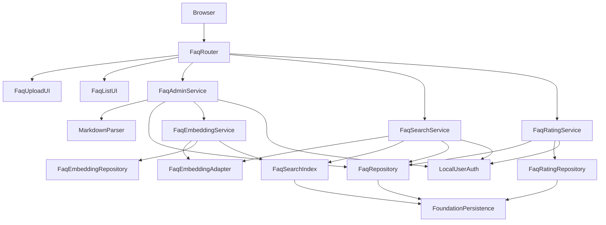
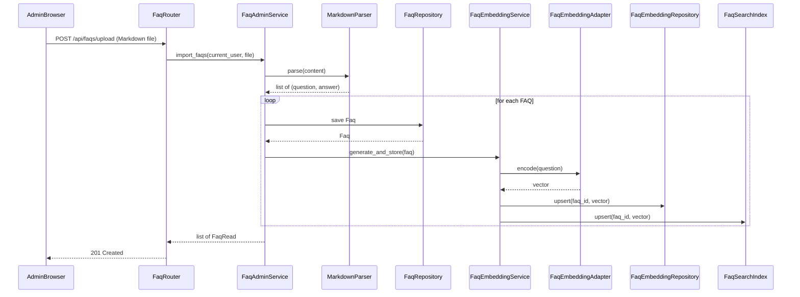
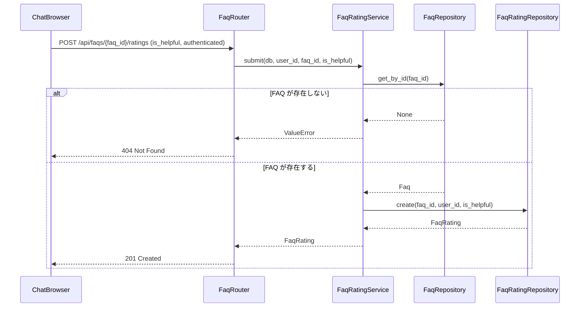
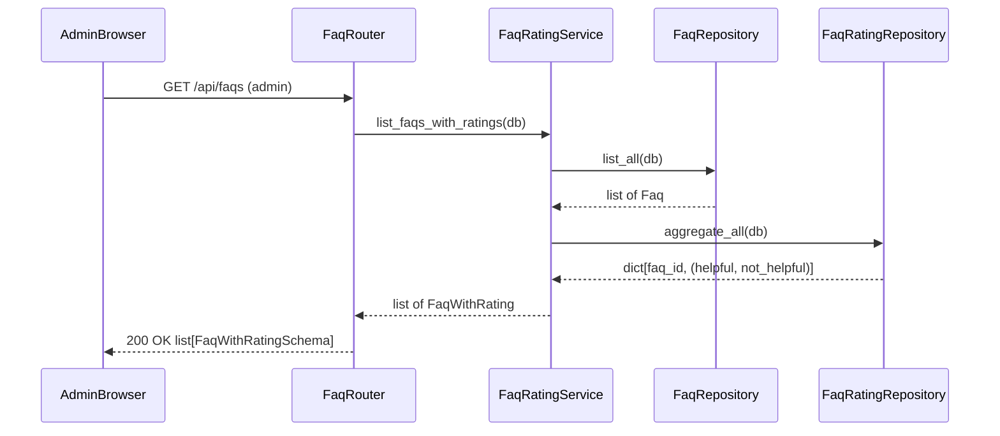

# 設計書

## 概要

`faq-management-and-search` は、`helpo-foundation` と `local-user-authentication` を前提に、FAQ の登録（Markdown ファイルアップロード）、管理者認可、ローカル CPU での質問文 Embedding 生成、検索用索引の整合性維持、類似検索、適合判定、管理者向け FAQ 一覧表示（役立ち度評価集計含む）、認証済みユーザーからの役立ち度評価収集を行う仕様です。

FAQ データとそのベクトル表現を一貫して管理し、社員が自然な問い合わせから登録済み FAQ を見つけられるインターフェースを提供します。後続の `ai-helpdesk-chat` などは、本仕様の検索 API と適合判定を利用しますが、回答文の生成や履歴管理は本仕様の責務ではありません。

### 目的

- 管理者のみが Markdown ファイルをアップロードして FAQ を一括登録できる機能を実現する。
- `local-user-authentication` の `require_admin` を使って、FAQ 登録エンドポイントに管理者認可を適用する。
- FAQ の質問文からローカル環境で Embedding を生成し、FAQ のライフサイクルに応じて検索索引を最新に保つ。
- 認証済みの利用者が自然な問い合わせから類似 FAQ を取得し、実装内の固定適合基準に基づいて回答提示の可否を判定する。
- 管理者が登録済み全 FAQ を役立ち度評価の集計とともに一覧で確認できる画面と API を提供する。
- 認証済みの社員が「役立った」または「役立たなかった」の評価を送信し、根拠 FAQ に紐付けて保存する。
- Windows の GPU なし PC 上で、FAQ や Embedding を外部 AI サービスに送信せずに動作する。

### 対象外

- FAQ の更新、削除。
- 一般文書の取り込み・分割・索引化、PDF/Office RAG。
- 大規模言語モデル（LLM）による回答文生成、社員向けチャット UI、質問・回答履歴、利用分析。
- GPU 分散推論、大規模ベクトルデータベース、外部ベクトル検索サービスの導入。
- 未検証の Embedding モデルの自動選択。モデル選定は、ライセンス・動作確認後の再検証ポイントとして設計に残す。

## 境界（担当範囲）

### この仕様が担当すること

- FAQ エンティティ（`faq` テーブル）の登録。
- FAQ 登録に対する管理者認可の適用。
- Markdown ファイルからの質問文・回答文抽出。
- `faq_embedding` テーブルへのベクトル永続化と、FAQ 登録に応じた索引更新。
- ローカル CPU で動作する Embedding アダプターの接続口。実際のモデル選定は本仕様では行わず、再検証ゲートを通す。
- 類似検索サービス、正規化類似度計算、固定適合基準による適合判定、検索 API。
- FAQ アップロード用の最小 Web 画面または API エンドポイント。
- 管理者向け FAQ 一覧画面（`/faqs`）および一覧 API（`GET /api/faqs`）：登録済み全 FAQ と各 FAQ の役立ち度評価集計（「役立った」件数・「役立たなかった」件数）を提供する。
- 役立ち度評価（`faq_rating` テーブル）の受付・保存。評価の集計・提供は一覧 API を通じて行う。

### 担当外

- FAQ の更新、削除。
- ユーザー、パスワード、セッション、基本ロールの管理（`local-user-authentication`）。
- アプリケーション起動、SQLite エンジン、ベースマイグレーション、共通エラー処理、基本画面レイアウト（`helpo-foundation`）。
- LLM 回答生成、チャット履歴、一般文書 RAG、分析（`ai-helpdesk-chat` など）。
- モデルのライセンス確認作業そのもの（運用・法務プロセスとして分離）。
- チャット回答後の評価送信 UI（`ai-helpdesk-chat` が本仕様の評価 API を呼び出す形で提供する）。

### 依存関係

- `helpo-foundation` の `Settings`、`DatabaseEngine.get_session()`、`BaseEntity`、`BaseRepository`、`MigrationRunner`、`ErrorHandler`、`WebLayout`。
- `local-user-authentication` の `CurrentUser`、`require_authenticated_user`、`require_admin`、`AuthorizationPolicy`。
- Python 3.10+、FastAPI 0.115+、SQLAlchemy 2.x、Pydantic v2、Jinja2、NumPy。
- Markdown パースライブラリは、簡易構文に絞れば `re` 標準モジュールで対応可能。
- Embedding 推論ライブラリは、ライセンス・Windows CPU 動作を確認後に採用する候補（例：`sentence-transformers`、`onnxruntime` など）。本設計では未確定とする。

### 再検証のトリガー

- `CurrentUser`、`require_authenticated_user`、`require_admin` の型・ステータス変更。
- foundation の `Settings`、`BaseEntity`、`Session`、`MigrationRunner`、`ErrorHandler` 契約変更。
- `faq` または `faq_embedding` テーブル構造・ベクトル保存形式の変更。
- `faq_rating` テーブル構造または評価 API スキーマの変更（`ai-helpdesk-chat` などの下流に影響）。
- Markdown ファイルの Q&A 抽出構文ルールの変更。
- 採用する Embedding モデル・ライブラリ・ライセンスの変更。
- 固定適合基準値または適合判定ロジックの変更。
- 検索 API のレスポンススキーマ変更（`ai-helpdesk-chat` などの下流に影響）。

## アーキテクチャ

### 既存アーキテクチャの分析

- foundation の単体 FastAPI monolith、SQLAlchemy 2.x、SQLite、Pydantic Settings、Jinja2、`base.html` をそのまま利用する。
- `local-user-authentication` の `require_admin` を FAQ 登録・一覧エンドポイントに適用し、`require_authenticated_user` を検索・評価エンドポイントに適用する。
- FAQ マイグレーションは foundation の `MigrationRunner` または Alembic フローで、`002_local_user_authentication.sql` の後に `003_faq_management_and_search.sql`、さらに `004_faq_rating.sql` として追加する。

### アーキテクチャパターンと境界図



**アーキテクチャ統合**

- 採用パターン: foundation の層構造を拡張するモノリシ内ドメインパッケージ。`FaqRouter` が Web/API の入り口、`Service` が業務ロジック、`Repository`/`Adapter`/`Index` がデータ/推論の責務を分離する。
- ドメイン境界: `FaqAdminService` は FAQ 登録と Markdown パース、`FaqEmbeddingService` はベクトル生成/保存、`FaqSearchIndex` は検索用データ構造、`FaqSearchService` は検索フローと適合判定、`FaqRatingService` は評価収集と FAQ 一覧集計を担当する。
- 既存パターンの維持: foundation の `BaseEntity`/`BaseRepository`、Pydantic Settings、`get_db` Session 注入、エラーハンドラ、`base.html` ブロックを維持する。

### 技術スタック

| 層 | 選択/バージョン | 役割 | 備考 |
|---|---|---|---|
| バックエンド ランタイム | Python 3.10+ | 実行基盤 | Windows CPU で動作 |
| Web フレームワーク | FastAPI 0.115+ | HTTP ルーティング・依存注入 | foundation と同一 |
| データ/ストレージ | SQLAlchemy 2.x + SQLite | FAQ・Embedding・評価の永続化 | foundation の Engine/Session を共有 |
| 設定 | Pydantic v2 Settings | FAQ 固有設定追加 | foundation の Settings を拡張 |
| Markdown パース | 標準 `re`（簡易構文）または mistletoe | Q&A 抽出 | 簡易構文に絞れば軽量 |
| Embedding ランタイム | 未選定（再検証ゲート） | 質問文ベクトル化 | `sentence-transformers`/`onnxruntime` などの候補をライセンス確認後に選定 |
| ベクトル演算 | NumPy 1.24+ | コサイン類似度計算・インメモリ索引 | FAQ 件数が少ない MVP 向け |
| UI テンプレート | Jinja2 | アップロード画面・一覧画面 | foundation の `base.html` を継承 |

## ファイル構成

### ディレクトリ構成

```text
helpo/
├── app/
│   ├── config.py                         # foundation 所有: core 設定
│   ├── dependencies.py                   # foundation 所有: 共通依存
│   ├── router_registry.py                # foundation 所有: ルーター登録拡張
│   ├── faq/                              # faq-management-and-search 所有
│   │   ├── __init__.py
│   │   ├── settings.py                   # FaqSettings
│   │   ├── models.py                     # Faq, FaqEmbedding, FaqRating ORM モデル
│   │   ├── schemas.py                    # FaqRead, FaqUploadForm, FaqSearchQuery,
│   │   │                                 # FaqCandidate, FaqSearchResult,
│   │   │                                 # FaqRatingCreate, FaqRatingRead,
│   │   │                                 # FaqRatingSummarySchema, FaqWithRatingSchema
│   │   ├── repositories.py               # FaqRepository, FaqEmbeddingRepository,
│   │   │                                 # FaqRatingRepository
│   │   ├── markdown_parser.py            # MarkdownParser + 簡易構文ルール
│   │   ├── embedding.py                  # FaqEmbeddingAdapter + モデルゲート
│   │   ├── search_index.py               # FaqSearchIndex（インメモリ全探索）
│   │   ├── dependencies.py               # FAQ 固有 FastAPI 依存（SearchIndex 生存期間など）
│   │   ├── services.py                   # FaqAdminService, FaqEmbeddingService,
│   │   │                                 # FaqSearchService, FaqRatingService
│   │   └── router.py                     # FaqRouter（API + HTML）
│   └── templates/faq/
│       ├── upload.html                   # FAQ Markdown アップロード画面
│       └── list.html                     # FAQ 一覧画面（管理者向け、評価集計表示）
├── migrations/
│   ├── 003_faq_management_and_search.sql # FaqMigration (faq, faq_embedding)
│   └── 004_faq_rating.sql                # FaqRatingMigration (faq_rating)
└── tests/
    └── test_faq.py                       # FaqTestSuite（単体/結合）
```

### 修正対象ファイル

- `app/faq/models.py` — `FaqRating` エンティティを追加する。
- `app/faq/schemas.py` — `FaqRatingCreate`、`FaqRatingRead`、`FaqRatingSummarySchema`、`FaqWithRatingSchema` を追加する。
- `app/faq/repositories.py` — `FaqRatingRepository` を追加する。
- `app/faq/services.py` — `FaqRatingService`（`FaqRatingSummary`、`FaqWithRating` DTO 含む）を追加する。
- `app/faq/dependencies.py` — `get_faq_rating_service()` を追加する。
- `app/faq/router.py` — `GET /api/faqs`、`POST /api/faqs/{faq_id}/ratings`、`GET /faqs` を追加する。

## 処理フロー

### FAQ 登録と Embedding 生成



### 類似検索フロー


### 役立ち度評価の送信フロー



### FAQ 一覧表示フロー（管理者）



## 要件追跡

| 要件 | 概要 | コンポーネント | インターフェース | フロー |
|---|---|---|---|---|
| 1.1-1.5 | FAQ の Markdown アップロード登録 | FaqRepository, MarkdownParser, FaqAdminService, FaqRouter | Service, API | FAQ 登録フロー |
| 2.1-2.5 | 管理者認可 | FaqRouter, LocalUserAuth | API | FAQ 登録フロー |
| 3.1-3.5 | ローカル Embedding と索引整合性 | FaqEmbeddingAdapter, FaqEmbeddingService, FaqSearchIndex, FaqRepository | Service, State | FAQ 登録フロー |
| 4.1-4.6 | 類似検索と適合判定 | FaqSearchService, FaqSearchIndex, FaqEmbeddingAdapter, FaqRepository | API, Service | 類似検索フロー |
| 5.1-5.3 | ローカル MVP 制約 | FaqSettings, FaqEmbeddingAdapter, FaqSearchService | Service, API | FAQ 登録フロー、類似検索フロー |
| 6.1-6.6 | 管理者向け FAQ 一覧表示と評価集計 | FaqRatingService, FaqRepository, FaqRatingRepository, FaqRouter, FaqListUI | API, State, Service | FAQ 一覧表示フロー |
| 7.1-7.4 | 役立ち度評価の収集と保存 | FaqRatingService, FaqRatingRepository, FaqRouter | API, Service | 評価送信フロー |

## コンポーネントとインターフェース

| コンポーネント | 領域/層 | 目的 | 対応要件 | 主な依存 | 契約 |
|---|---|---|---|---|---|
| FaqSettings | 設定 | FAQ 用設定の追加 | 5.1 | foundation Settings P0 | Service |
| FaqMigration | 永続化 | FAQ・Embedding テーブル追加 | 1.1, 3.1, 5.2 | MigrationRunner P0 | Batch, State |
| FaqRatingMigration | 永続化 | 評価テーブル追加 | 7.2 | MigrationRunner P0 | Batch, State |
| FaqRepository | データアクセス | FAQ 永続化 | 1.1-1.5, 6.1, 7.4 | foundation Session P0 | Service, State |
| FaqEmbeddingRepository | データアクセス | ベクトル永続化 | 3.1, 3.4 | foundation Session P0 | Service, State |
| FaqRatingRepository | データアクセス | 評価の永続化と集計 | 7.2, 6.2, 6.3 | foundation Session P0 | Service, State |
| MarkdownParser | ドメイン | Markdown ファイルから Q&A 抽出 | 1.1, 1.4 | なし（標準ライブラリ） | Service |
| FaqEmbeddingAdapter | AI/推論 | ローカル CPU 推論 | 3.1, 3.3, 3.4, 5.1, 5.3 | candidate library P0 | Service |
| FaqEmbeddingService | ドメインサービス | FAQ 登録時のベクトル生成・保存・索引更新 | 3.1, 3.4 | FaqEmbeddingAdapter P0, FaqRepository P0, FaqSearchIndex P0 | Service |
| FaqSearchIndex | 検索索引 | インメモリ類似度探索 | 3.4, 4.1, 4.2 | FaqEmbeddingRepository P0 | Service, State |
| FaqSearchService | ドメインサービス | 検索フロー・適合判定 | 4.1-4.6 | FaqSearchIndex P0, FaqEmbeddingAdapter P0, FaqRepository P0 | Service |
| FaqAdminService | ドメインサービス | 管理者向け登録 | 1.1-1.5, 2.1-2.5 | FaqRepository P0, MarkdownParser P0, FaqEmbeddingService P0 | Service |
| FaqRatingService | ドメインサービス | 評価収集・FAQ一覧集計 | 6.1-6.6, 7.1-7.4 | FaqRepository P0, FaqRatingRepository P0 | Service |
| FaqRouter | API | FAQ 登録・検索・一覧・評価の HTTP/UI | 1.1-1.5, 2.1-2.5, 4.1-4.6, 6.1-6.6, 7.1-7.4 | FaqAdminService P0, FaqSearchService P0, FaqRatingService P0, LocalUserAuth P0 | API, State |
| FaqUploadUI | UI | FAQ アップロード画面 | 1.1-1.5, 2.1-2.5 | WebLayout P0 | State |
| FaqListUI | UI | FAQ 一覧画面（評価集計付き） | 6.1-6.6 | WebLayout P0 | State |

### FaqSettings

- `app/faq/settings.py` に `FaqSettings` を機能固有に定義し、foundation の `ConfigManager` 拡張ポイントを通じて読み込み・検証する。
- `local_embedding_path: str | None` は foundation の `Settings` に既存のため再利用する。
- 適合基準は実装が所有する固定値とし、運用者向けの設定項目としては提供しない。

### FaqMigration

- `migrations/003_faq_management_and_search.sql` で `faq` テーブルと `faq_embedding` テーブルを追加する。（既存）

### FaqRatingMigration

- `migrations/004_faq_rating.sql` で `faq_rating` テーブルと索引を追加する。
- `003_faq_management_and_search.sql` の適用後に適用する。

### FaqRepository

```python
class FaqRepository:
    def create(self, db: Session, question: str, answer: str) -> Faq: ...
    def list_all(self, db: Session) -> list[Faq]: ...
    def get_by_id(self, db: Session, faq_id: int) -> Faq | None: ...
```

- `BaseRepository` の共通トランザクション規約を利用する。Repository 内で `commit()` は行わない。
- 更新・削除は要件にないため、提供しない。

### FaqEmbeddingRepository

```python
class FaqEmbeddingRepository:
    def upsert(self, db: Session, faq_id: int, dimension: int, vector: bytes) -> FaqEmbedding: ...
    def load_all(self, db: Session) -> list[FaqEmbedding]: ...
```

### FaqRatingRepository

```python
class FaqRatingRepository:
    def create(self, db: Session, faq_id: int, user_id: int, is_helpful: bool) -> FaqRating: ...
    def aggregate_all(self, db: Session) -> dict[int, tuple[int, int]]: ...
    # 返り値: {faq_id: (helpful_count, not_helpful_count)}
```

- `BaseRepository` を継承し、トランザクション境界は呼び出し元が管理する。
- `aggregate_all` は SQLAlchemy の `func.count` と `GROUP BY faq_id` で集計クエリを実行し、全 FAQ の評価集計を一度のクエリで返す。

**契約**: Service [ x ] / API [ ] / Event [ ] / Batch [ ] / State [ ]

**実装メモ**:
- `aggregate_all` は `func.count(FaqRating.id).filter(FaqRating.is_helpful == True)` などの条件付き集計で実装する。
- `is_helpful` は Boolean カラム（SQLite では 0/1 INTEGER）として保存する。

### MarkdownParser

```python
class MarkdownParser:
    def parse(self, content: str) -> list[tuple[str, str]]: ...
```

- H2 見出し（`## `）を質問文、その直後の段落を回答文として解釈する。（既存、変更なし）

### FaqEmbeddingAdapter

```python
class FaqEmbeddingAdapter:
    def __init__(self, model_path: str | None): ...
    def is_ready(self) -> bool: ...
    def encode(self, text: str) -> np.ndarray: ...
```

### FaqEmbeddingService

```python
class FaqEmbeddingService:
    def __init__(self, adapter: FaqEmbeddingAdapter, repo: FaqEmbeddingRepository, index: FaqSearchIndex): ...
    def generate_and_store(self, db: Session, faq: Faq) -> FaqEmbedding | None: ...
```

### FaqSearchIndex

```python
class FaqSearchIndex:
    def build(self, db: Session) -> None: ...
    def upsert(self, faq_id: int, vector: np.ndarray) -> None: ...
    def search(self, query_vector: np.ndarray, top_k: int) -> list[tuple[int, float]]: ...
    def is_consistent_with_db(self, db: Session) -> bool: ...
```

### FaqSearchService

```python
@dataclass(frozen=True)
class FaqCandidate:
    faq_id: int
    question: str
    answer: str
    confidence: float
    is_match: bool

@dataclass(frozen=True)
class FaqSearchResult:
    query: str
    candidates: list[FaqCandidate]
    has_match: bool

class FaqSearchService:
    def __init__(self, adapter: FaqEmbeddingAdapter, index: FaqSearchIndex, repo: FaqRepository): ...
    def search(self, db: Session, query: str, top_k: int = 5) -> FaqSearchResult: ...
```

### FaqAdminService

```python
class FaqAdminService:
    def __init__(self, repo: FaqRepository, parser: MarkdownParser, embedding_service: FaqEmbeddingService): ...
    def import_faqs(self, db: Session, content: str) -> list[Faq]: ...
```

### FaqRatingService

```python
@dataclass(frozen=True)
class FaqRatingSummary:
    helpful_count: int
    not_helpful_count: int

@dataclass(frozen=True)
class FaqWithRating:
    faq_id: int
    question: str
    answer: str
    created_at: datetime
    updated_at: datetime
    rating_summary: FaqRatingSummary

class FaqRatingService:
    def __init__(self, faq_repo: FaqRepository, rating_repo: FaqRatingRepository): ...

    def submit(self, db: Session, user_id: int, faq_id: int, is_helpful: bool) -> FaqRating:
        """評価を保存して返す。
        
        Raises:
            ValueError: faq_id に対応する FAQ が存在しない場合（→ HTTP 404）。
        """
        ...

    def list_faqs_with_ratings(self, db: Session) -> list[FaqWithRating]:
        """全 FAQ と各 FAQ の評価集計を返す。FAQ が 0 件のときは空リストを返す。"""
        ...
```

- 管理者認可は `FaqRouter` の `Depends` で行い、本 Service はデータ操作のみを担当する。
- `submit` は `FaqRepository.get_by_id` で FAQ の存在を確認し、存在しない場合は `ValueError` を送出する（ルーターが 404 にマップ）。これにより要件 7.4「FAQが根拠として使われなかった回答への評価を受け付けない」のサーバー側ガードを実現する。
- `list_faqs_with_ratings` は `FaqRepository.list_all()` と `FaqRatingRepository.aggregate_all()` を組み合わせ、評価がない FAQ には `helpful_count=0, not_helpful_count=0` の `FaqRatingSummary` を設定する。

**契約**: Service [ x ] / API [ ] / Event [ ] / Batch [ ] / State [ ]

### FaqRouter

| HTTPメソッド | エンドポイント | リクエスト | レスポンス | エラー |
|---|---|---|---|---|
| POST | /api/faqs/upload | Markdown file (multipart/form-data) | list[FaqRead] | 400, 401, 403, 413, 415, 422, 500 |
| POST | /api/faqs/search | FaqSearchQuery | FaqSearchResult | 400, 401, 422, 503, 500 |
| GET | /api/faqs | なし | list[FaqWithRatingSchema] | 401, 403, 500 |
| POST | /api/faqs/{faq_id}/ratings | FaqRatingCreate | FaqRatingRead | 401, 404, 422, 500 |
| GET/POST | /faqs/upload | form | HTML upload | 401, 403, 500 |
| GET | /faqs | なし | HTML list | 401, 403, 500 |

- `POST /api/faqs/upload` と `/faqs/upload` は `require_admin` を `Depends` に指定する。
- `GET /api/faqs` と `GET /faqs` は `require_admin` を指定する（一覧は管理者のみ）。
- `POST /api/faqs/search` は `require_authenticated_user` を指定する。
- `POST /api/faqs/{faq_id}/ratings` は `require_authenticated_user` を指定する（評価は認証済み社員が送信）。
- `FaqRatingService.submit` が `ValueError` を送出した場合（FAQ 未存在）は HTTP 404 として応答する。
- `FaqSearchService` が `FaqEmbeddingError` を送出した場合、HTTP 503（Service Unavailable）として応答する。

### FaqUploadUI

- `upload.html` は foundation の `base.html` を継承する。（既存、変更なし）

### FaqListUI

- `list.html` は foundation の `base.html` を継承する。
- 登録済み全 FAQ を表形式で表示する：FAQ ID、質問文、回答文（折り畳み表示可）、「役立った」件数、「役立たなかった」件数。
- FAQ が 0 件の場合は「FAQが登録されていません」というメッセージを表示する。
- 評価が 0 件の FAQ は「役立った: 0件 / 役立たなかった: 0件」と表示する。
- 未ログイン時は `/login` へ 303 リダイレクトし、一般ユーザーは 403 応答を表示する。

## データモデル

### ドメインモデル

- **Faq**: FAQ 集約ルート。`id`、`question`、`answer`、`created_at`、`updated_at` を含む。更新・削除は要件にないため、変更操作は提供しない。
- **FaqEmbedding**: Faq に 1 対 1 で対応するベクトル表現。`faq_id` に対して CASCADE DELETE。
- **FaqRating**: FAQ に対する役立ち度評価の 1 件分。`faq_id`（FK, CASCADE DELETE）、`user_id`、`is_helpful`（Boolean）を含む。1 FAQ に対して複数のユーザーが複数回評価を登録できる（重複制限なし）。
- **FaqCandidate / FaqSearchResult**: 検索 API の読み取り専用 DTO。
- **FaqRatingSummary / FaqWithRating**: 一覧 API の読み取り専用 DTO。各 FAQ の評価集計を表現する。

### 物理データモデル

**faq**

| カラム | 型 | 制約 |
|---|---|---|
| id | INTEGER | 主キー（PK）、BaseEntity |
| question | TEXT | NOT NULL |
| answer | TEXT | NOT NULL |
| created_at | DATETIME | NOT NULL、BaseEntity |
| updated_at | DATETIME | NOT NULL、BaseEntity |

**faq_embedding**

| カラム | 型 | 制約 |
|---|---|---|
| id | INTEGER | 主キー（PK）、BaseEntity |
| faq_id | INTEGER | NOT NULL、UNIQUE、外部キー faq.id ON DELETE CASCADE |
| dimension | INTEGER | NOT NULL |
| vector | BLOB | NOT NULL |
| created_at | DATETIME | NOT NULL、BaseEntity |
| updated_at | DATETIME | NOT NULL、BaseEntity |

**faq_rating**

| カラム | 型 | 制約 |
|---|---|---|
| id | INTEGER | 主キー（PK）、BaseEntity |
| faq_id | INTEGER | NOT NULL、外部キー faq.id ON DELETE CASCADE |
| user_id | INTEGER | NOT NULL |
| is_helpful | INTEGER | NOT NULL、CHECK (is_helpful IN (0, 1)) |
| created_at | DATETIME | NOT NULL、BaseEntity |
| updated_at | DATETIME | NOT NULL、BaseEntity |

- `faq_rating.faq_id` は `faq.id` への外部キー（CASCADE DELETE）。FAQ 削除時に関連評価も削除される。
- `faq_rating.user_id` は同一ユーザーの複数回評価を許容するため UNIQUE 制約を設けない。
- `is_helpful` は Boolean を SQLite の INTEGER (0/1) として保存する。`CHECK` 制約で値を限定する。
- `faq_id` と `user_id` に個別索引を張り、集計クエリとユーザー別フィルタの性能を確保する。

### API データ転送

**FaqRatingCreate**

```json
{
  "is_helpful": true
}
```

**FaqRatingRead**

```json
{
  "id": 1,
  "faq_id": 3,
  "user_id": 2,
  "is_helpful": true,
  "created_at": "2026-08-28T15:00:00"
}
```

**FaqRatingSummarySchema**

```json
{
  "helpful_count": 5,
  "not_helpful_count": 2
}
```

**FaqWithRatingSchema**

```json
{
  "id": 3,
  "question": "有給休暇は何日前に申請すればよいですか",
  "answer": "原則として3営業日前までに申請してください。",
  "created_at": "2026-08-27T12:00:00",
  "updated_at": "2026-08-27T12:00:00",
  "rating_summary": {
    "helpful_count": 5,
    "not_helpful_count": 2
  }
}
```

**（既存）FaqRead / FaqSearchQuery / FaqSearchResult**: 変更なし。

## エラー処理

### エラー戦略

- 既存の戦略（Markdown エラー、形式不正、サイズ超過、未認証/権限不足、Embedding 未準備）に変更なし。
- **評価送信（Req 7）の追加エラー**: FAQ が存在しない場合は `ValueError` → HTTP 404 として早期に返す。

### エラーの種類と応答

- **利用者エラー（4xx）**: 415 Markdown 形式外、413 ファイルサイズ超過、422 入力検証/Markdown 内容不正、401 未認証、403 権限不足、404 評価対象 FAQ 未存在。
- **システムエラー（5xx）**: 予期せぬ処理失敗は foundation 汎用 500 応答、Embedding 未ロードは 503 応答。
- **業務ロジックエラー（422）**: Markdown 内の Q&A 形式違反、質問文重複、空の質問・回答、評価値不正（is_helpful が Boolean でない）。

### 監視

- FAQ の登録はイベント種別と FAQ ID をログに残す。
- 評価の送信は FAQ ID、user_id、is_helpful 値をログに残す（ユーザー本文は含まない）。
- Embedding モデルのロード失敗、検索実行回数、適合基準未満件数は運用確認用にログに残す。
- ベクトルバイト列やモデルの重みファイルパスはログに出力しない。

## テスト方針

### 単体テスト

- FaqRepository: FAQ 作成、一覧、取得、トランザクションロールバック（1.1-1.5）。
- FaqEmbeddingRepository: vector のバイト列保存・読み出し、`faq_id` 一意制約（3.1, 3.4）。
- FaqRatingRepository: 評価作成、`aggregate_all` が正しいカウントを返すこと、FAQ 削除時の CASCADE 確認（7.2, 6.2, 6.3）。
- MarkdownParser: 正しい Markdown、空セクション、重複質問文、複数段落回答（1.1, 1.4）。
- FaqEmbeddingAdapter: モックモデルでの encode と is_ready 切替（3.1, 3.3, 3.4）。
- FaqSearchIndex: upsert/build、コサイン類似度順序、不整合再構築（3.4, 4.1, 4.2）。
- FaqSearchService: 適合基準以上/未満の `is_match` と `has_match` 判定（4.3-4.6）。
- FaqAdminService: パース失敗時のロールバック、重複時のエラー、複数 FAQ の一括登録（1.1-1.5）。
- FaqRatingService.submit: FAQ 存在時の評価保存、FAQ 未存在時の ValueError 送出（7.1-7.4）。
- FaqRatingService.list_faqs_with_ratings: FAQ と評価集計の結合、評価なし FAQ は 0 件表示（6.1-6.3）。

### 結合テスト

- 管理者での FAQ アップロード API（認可、ファイル形式、サイズ超過、内容エラー、重複）（1.1-2.5）。
- FAQ 登録後に `faq_embedding` にレコードが作成され、検索結果に反映される（3.1, 3.4, 4.1, 4.2）。
- Embedding 未設定時の検索 API 503 応答（5.3）。
- 管理者による `GET /api/faqs` のレスポンス内容確認（FAQ 一覧と評価集計）（6.1-6.2）。
- 一般ユーザーによる `GET /api/faqs` の 403 拒否（6.6）。
- 未認証による `GET /api/faqs` の 401 拒否（6.5）。
- 認証済みユーザーによる `POST /api/faqs/{faq_id}/ratings` の評価保存（7.2）。
- 存在しない `faq_id` への評価送信で 404（7.4）。
- 未認証による評価送信で 401（7.3）。
- Windows CPU ローカル環境で pytest を実行可能であること（5.1, 5.2）。

### E2E/UI テスト

- ブラウザまたは HTTP クライアントで `/faqs/upload` にアクセスし、Markdown ファイルアップロードが管理者で動作する（1.1-2.5）。
- 未認証でアップロード画面にアクセスすると認証導線へ誘導される（2.3）。
- 管理者で `GET /faqs` にアクセスし、FAQ 一覧と評価集計が表示される（6.1-6.2）。
- 未認証または一般ユーザーで `GET /faqs` にアクセスすると認証拒否される（6.5-6.6）。

## セキュリティ考慮事項

- FAQ 登録・一覧操作は管理者のみ可能とし、一般利用者の書き換えや一覧参照を防ぐ。
- 評価送信は認証済みユーザーのみ可能とし、未認証アクセスを拒否する。
- ベクトルバイト列、Embedding モデル内部情報、設定ファイルの機密値を API/テンプレート/ログに出力しない。
- FAQ と Embedding を外部サービスへ送信せず、すべて同一 PC 内で処理する。
- 管理者認可は `local-user-authentication` の `require_admin` に委ね、再実装しない。
- CSRF 対策として SameSite=Lax を維持し、FAQ の登録・評価は POST に限定する。
- アップロードファイル名は保存・ログに利用せず、拡張子と MIME type のみ検証する。
- 評価 API のリクエストログには FAQ ID と is_helpful 値のみ記録し、ユーザーの質問内容や回答内容は含めない。

## 性能とスケーラビリティ

- FAQ 件数は研修用 MVP で数十〜数百件を想定し、インメモリ全探索を採用する。
- 評価件数も同規模を想定し、`aggregate_all` の全件集計クエリで十分な性能を得られる。件数増加時はインデックス追加や部分集計を検討する。
- SQLite はシングルファイルで、同時書き込みは 1 接続までを想定する。
- Embedding 推論は CPU で実行し、GPU を必須としない。
- アップロードファイルサイズは 10MB に制限し、大容量ファイルのメモリ消費を防ぐ。

## マイグレーション方針

- foundation ベースラインおよび `002_local_user_authentication.sql` の後に `003_faq_management_and_search.sql` を適用する。
- `003_faq_management_and_search.sql` の後に `004_faq_rating.sql` を適用する。
- マイグレーションは新規テーブル・索引のみを追加し、既存テーブルを変更しない。
- 適用失敗時は foundation の fail-fast 起動エラー契約に従い、サーバーを起動しない。

## 参考資料（任意）

- Embedding モデル選定とライセンス確認は本設計の未確定項目である。モデル候補、ベンチマーク、ライセンス条項を `research.md` に記録し、未検証のモデルはコード・設定に組み込まない。
