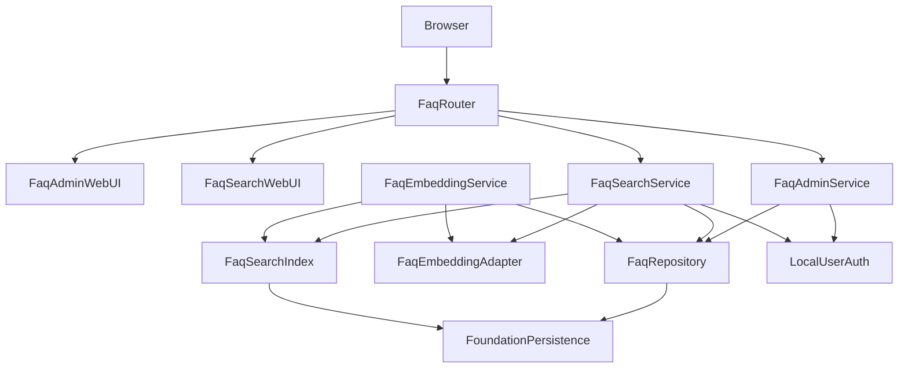
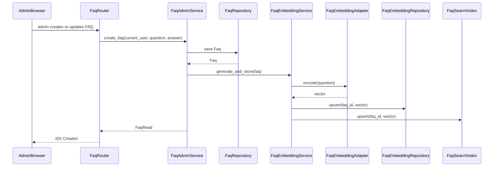
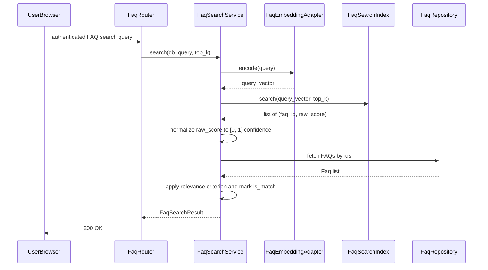

# Design Document

## Overview
faq-management-and-searchは、helpo-foundationおよびlocal-user-authenticationの上に、FAQのCRUD、管理者認可、ローカルCPUのみでの質問文Embedding生成、検索用索引の整合性維持、類似検索、適合判定を提供する。本仕様はFAQデータとそのベクトル表現を所有し、社員が自然な問い合わせから登録済みFAQを探せるインターフェースを提供する。ai-helpdesk-chat等の後続仕様は、本仕様の検索APIと適合判定を消費するが、回答文生成や履歴は本仕様の責任外とする。

### Goals
- 管理者だけがFAQを登録・一覧・更新・削除できる管理機能を提供する。
- local-user-authenticationの`require_admin`を呼び出して管理者認可を適用する。
- FAQ質問文からローカルEmbeddingを生成し、FAQライフサイクルに応じて索引を最新に保つ。
- 認証済み利用者が自然な問い合わせから類似FAQを取得し、実装所有の固定適合基準に基づいて回答提示可否を判定する。
- WindowsのGPUなしPC上で、外部AIサービスへFAQやEmbeddingを送信せずに動作する。

### Non-Goals
- 一般文書の取込み・分割・索引化、PDF/Office RAG。
- LLMによる回答文生成、社員向けチャットUI、質問・回答履歴、利用分析。
- GPU分散推論、大規模ベクトルデータベース、外部ベクトル検索サービス。
- 未検証のEmbeddingモデルの自動選択。モデル選定はライセンス・動作確認後の再検証ポイントとして設計に残す。

## Boundary Commitments

### This Spec Owns
- FAQエンティティ（`faq`テーブル）のライフサイクルとCRUD。
- FAQ作成・更新・削除に対する管理者認可の適用。
- `faq_embedding`テーブルへのベクトル永続化と、FAQ変更に応じた索引更新。
- ローカルCPUで動作するEmbeddingアダプターの接続口。実際のモデルは本仕様が選定せず、再検証ゲートを通す。
- 類似検索サービス、正規化類似度計算、実装所有の固定適合基準による適合判定、検索API。
- FAQ管理画面とFAQ検索画面（foundationの`base.html`を継承）。

### Out of Boundary
- ユーザー、パスワード、セッション、基本ロールの管理（local-user-authentication）。
- アプリケーション起動、SQLiteエンジン、ベースマイグレーション、共通エラー処理、基本画面レイアウト（helpo-foundation）。
- LLM回答生成、チャット履歴、一般文書RAG、分析（ai-helpdesk-chat等）。
- モデルのライセンス確認作業そのもの（運用・法務プロセスとして分離）。

### Allowed Dependencies
- helpo-foundationの`Settings`、`DatabaseEngine.get_session()`、`BaseEntity`、`BaseRepository`、`MigrationRunner`、`ErrorHandler`、`WebLayout`。
- local-user-authenticationの`CurrentUser`、`require_authenticated_user`、`require_admin`、`AuthorizationPolicy`。
- Python 3.10+、FastAPI 0.115+、SQLAlchemy 2.x、Pydantic v2、Jinja2、NumPy。
- Embedding推論ライブラリはライセンス・Windows CPU動作を確認後に採用する候補（例：`sentence-transformers`、`onnxruntime`等）。本設計では未確定とする。

### Revalidation Triggers
- `CurrentUser`、`require_authenticated_user`、`require_admin`の型・ステータス変更。
- foundationの`Settings`、`BaseEntity`、`Session`、`MigrationRunner`、`ErrorHandler`契約変更。
- `faq`または`faq_embedding`テーブル構造・ベクトル保存形式の変更。
- 採用Embeddingモデル・ライブラリ・ライセンスの変更。
- 固定適合基準値または適合判定ロジックの変更。
- 検索APIのレスポンススキーマ変更（ai-helpdesk-chat等の下流に影響）。

## Architecture

### Existing Architecture Analysis
- foundationの単体FastAPI monolith、SQLAlchemy 2.x、SQLite、Pydantic Settings、Jinja2、`base.html`をそのまま利用する。
- local-user-authenticationの`require_admin`依存をFAQ管理エンドポイントに適用し、`require_authenticated_user`を検索エンドポイントに適用する。
- FAQマイグレーションはfoundationの`MigrationRunner`またはAlembicフローで、authマイグレーション`002_local_user_authentication.sql`の後に`003_faq_management_and_search.sql`として追加する。

### Architecture Pattern & Boundary Map



**Architecture Integration**:
- Selected pattern: foundationの層構造を拡張するモノリシ内ドメインパッケージ。FaqRouterがWeb/APIの入り口、Serviceが業務、Repository/Adapter/Indexがデータ/推論と責任を分離する。
- Domain boundaries: FaqAdminServiceはFAQライフサイクル、FaqEmbeddingServiceはベクトル生成/保存、FaqSearchIndexは検索用データ構造、FaqSearchServiceは検索フローと適合判定を所有する。
- Existing patterns preserved: foundationの`BaseEntity`/`BaseRepository`、Pydantic Settings、`get_db` Session注入、エラーハンドラ、`base.html`ブロックを維持する。
- New components rationale: FaqEmbeddingAdapterでモデル依存を隔離し、未検証モデルを自動採用しない。FaqSearchIndexでFAQ件数が少ないMVPではインメモリ全探索を採用し、FAQ変更時の整合性を容易にする。

### Technology Stack

| Layer | Choice / Version | Role in Feature | Notes |
|-------|------------------|-----------------|-------|
| Backend runtime | Python 3.10+ | 実行基盤 | Windows CPUで動作 |
| Web framework | FastAPI 0.115+ | HTTPルーティング・依存注入 | foundationと同一 |
| Data / Storage | SQLAlchemy 2.x + SQLite | FAQ・Embedding永続化 | foundationのEngine/Sessionを共有 |
| Configuration | Pydantic v2 Settings | FAQ固有設定追加 | foundationのSettingsを拡張 |
| Embedding runtime | 未選定（再検証ゲート） | 質問文ベクトル化 | `sentence-transformers`/`onnxruntime`等の候補をライセンス確認後に選定 |
| Vector operations | NumPy 1.24+ | コサイン類似度計算・インメモリ索引 | FAQ件数が少ないMVP向け |
| UI templating | Jinja2 | FAQ管理・検索画面 | foundationの`base.html`を継承 |

## File Structure Plan

### Directory Structure

```text
helpo/
├── app/
│   ├── config.py                         # foundation所有: core設定
│   ├── dependencies.py                   # foundation所有: 共通依存
│   ├── router_registry.py                # foundation所有: ルーター登録拡張
│   ├── faq/                              # faq-management-and-search所有
│   │   ├── __init__.py
│   │   ├── settings.py                   # FaqSettings
│   │   ├── models.py                     # Faq, FaqEmbedding ORMモデル
│   │   ├── schemas.py                    # FaqCreate, FaqUpdate, FaqRead, FaqSearchQuery, FaqCandidate, FaqSearchResult
│   │   ├── repositories.py               # FaqRepository, FaqEmbeddingRepository
│   │   ├── embedding.py                  # FaqEmbeddingAdapter + モデルゲート
│   │   ├── search_index.py               # FaqSearchIndex（インメモリ全探索）
│   │   ├── dependencies.py               # FAQ固有FastAPI依存（SearchIndex生存期間等）
│   │   ├── services.py                   # FaqAdminService, FaqEmbeddingService, FaqSearchService
│   │   └── router.py                     # FaqRouter（API + HTML）
│   └── templates/faq/
│       ├── list.html                     # FAQ管理一覧
│       ├── form.html                     # FAQ作成・編集フォーム
│       └── search.html                   # 検索品質確認用管理者画面
├── migrations/
│   └── 003_faq_management_and_search.sql # FaqMigration
└── tests/
    └── test_faq.py                       # FaqTestSuite（単体/結合）
```

### Modified Files
- `app/faq/settings.py` — feature-local な `FaqSettings` を定義し、foundation の `ConfigManager` 拡張ポイントを通じて読み込み・検証する。
- `app/faq/dependencies.py` — `get_search_index()` 等、FAQ固有の FastAPI 依存を feature-local に定義する。
- `app/faq/router.py` — `FaqRouter` を実装し、foundation の `RouterRegistry` 拡張インターフェースを通じて登録する。
- foundation の `app/router_registry.py` — `FaqRouter` が登録される。
- `app/templates/faq/*.html` — feature-local テンプレート。

## System Flows

### FAQ作成・更新とEmbedding生成



### 類似検索フロー



## Requirements Traceability

| Requirement | Summary | Components | Interfaces | Flows |
|-------------|---------|------------|------------|-------|
| 1.1-1.5 | FAQのCRUD | FaqRepository, FaqAdminService, FaqRouter | Service, API, State | FAQ作成/更新フロー |
| 2.1-2.5 | 管理者認可 | FaqRouter, LocalUserAuth | API | FAQ作成/更新フロー |
| 3.1-3.6 | ローカルEmbeddingと索引整合性 | FaqEmbeddingAdapter, FaqEmbeddingService, FaqSearchIndex, FaqRepository | Service, State | FAQ作成/更新フロー |
| 4.1-4.5 | 類似検索と適合判定 | FaqSearchService, FaqSearchIndex, FaqEmbeddingAdapter, FaqRepository | API, Service | 類似検索フロー |
| 5.1-5.4 | ローカルMVP制約 | FaqSettings, FaqEmbeddingAdapter, FaqSearchService | Service, API | FAQ作成/更新フロー、類似検索フロー |

## Components and Interfaces

| Component | Domain/Layer | Intent | Req Coverage | Key Dependencies | Contracts |
|-----------|--------------|--------|--------------|------------------|-----------|
| FaqSettings | Config | FAQ用設定の追加 | 5.1 | foundation Settings P0 | Service |
| FaqMigration | Persistence | FAQ・Embeddingテーブル追加 | 1.1, 3.1, 3.6, 5.2 | MigrationRunner P0 | Batch, State |
| FaqRepository | Data Access | FAQ永続化 | 1.1-1.5 | foundation Session P0 | Service, State |
| FaqEmbeddingRepository | Data Access | ベクトル永続化 | 3.1, 3.2, 3.3 | foundation Session P0 | Service, State |
| FaqEmbeddingAdapter | AI/Inference | ローカルCPU推論 | 3.1, 3.5, 3.6, 5.1, 5.3 | candidate library P0 | Service |
| FaqEmbeddingService | Domain Service | FAQ変更時のベクトル生成・保存・索引更新 | 3.1, 3.2, 3.3 | FaqEmbeddingAdapter P0, FaqRepository P0, FaqSearchIndex P0 | Service |
| FaqSearchIndex | Search Index | インメモリ類似度探索 | 3.3, 3.4, 4.1, 4.2 | FaqEmbeddingRepository P0 | Service, State |
| FaqSearchService | Domain Service | 検索フロー・適合判定 | 4.1-4.5 | FaqSearchIndex P0, FaqEmbeddingAdapter P0, FaqRepository P0 | Service |
| FaqAdminService | Domain Service | 管理者向けCRUD | 1.1-1.5 | FaqRepository P0 | Service |
| FaqRouter | API | FAQ管理・検索品質確認のHTTP/UI | 1.1-1.5, 2.1-2.5, 4.1-4.5 | FaqAdminService P0, FaqSearchService P0, LocalUserAuth P0 | API, State |
| FaqAdminWebUI | UI | FAQ管理画面 | 1.1-1.5, 2.1-2.5 | WebLayout P0 | State |
| FaqSearchWebUI | UI | 検索品質確認用管理者画面 | 4.1-4.5 | WebLayout P0 | State |

### FaqSettings
- 本仕様は `app/faq/settings.py` に `FaqSettings` を feature-local に定義し、foundation の `ConfigManager` 拡張ポイントを通じて読み込み・検証する。
- `local_embedding_path: str | None` は foundation の `Settings` に既存のため再利用する。新たな Embedding モデル固有設定は、選定後に本コンポーネントへ追加する。
- 適合基準は実装が所有する固定値とし、運用者向けの設定項目としては提供しない。MVPの実用検証で基準値の調整が必要になった場合はコード変更とする。
- foundation の `app/config.py` は直接変更しない。

### FaqMigration
- `migrations/003_faq_management_and_search.sql`で`faq`テーブルと`faq_embedding`テーブルを追加する。
- `faq`テーブルは`id`、`question`（TEXT NOT NULL）、`answer`（TEXT NOT NULL）、`created_at`、`updated_at`を含む。
- `faq_embedding`テーブルは`id`、`faq_id`（FK `faq.id`、UNIQUE、CASCADE DELETE）、`dimension`（INTEGER NOT NULL）、`vector`（BLOB NOT NULL）、`created_at`、`updated_at`を含む。
- `faq_embedding.faq_id`に一意索引を張り、検索用に`faq.id`への外部キーを有効化する。

### FaqRepository

```python
class FaqRepository:
    def create(self, db: Session, question: str, answer: str) -> Faq: ...
    def list_all(self, db: Session) -> list[Faq]: ...
    def get_by_id(self, db: Session, faq_id: int) -> Faq | None: ...
    def update(self, db: Session, faq_id: int, question: str | None, answer: str | None) -> Faq | None: ...
    def delete(self, db: Session, faq_id: int) -> bool: ...
```

- `BaseRepository`または同等の共通トランザクション規約を利用する。Repository内で`commit()`は行わず、呼び出し元のServiceがトランザクション境界を制御する。
- `question`の重複は一意制約ではなくアプリケーション層で検証する（同じ質問文を異なる回答に許容しない）。

### FaqEmbeddingRepository

```python
class FaqEmbeddingRepository:
    def upsert(self, db: Session, faq_id: int, dimension: int, vector: bytes) -> FaqEmbedding: ...
    def delete_by_faq_id(self, db: Session, faq_id: int) -> bool: ...
    def load_all(self, db: Session) -> list[FaqEmbedding]: ...
```

- `vector`は`numpy.float32`配列のバイト列を保存する。`dimension`は再構築時の形状復元に必要。
- `BaseEntity`を継承し、`faq_id`に`faq.id`への外部キーとCASCADEを設定する。

### FaqEmbeddingAdapter

```python
class FaqEmbeddingAdapter:
    def __init__(self, model_path: str | None): ...
    def is_ready(self) -> bool: ...
    def encode(self, text: str) -> np.ndarray: ...
```

- 初期化時に`model_path`が設定されていればロードし、未設定の場合は`is_ready() == False`とする。未検証のモデルを勝手にダウンロード・選択しない。
- `encode`は`numpy.ndarray`（`float32`）を返す。モデル未ロード時は`RuntimeError`（または専用例外）を発生させ、呼び出し元でサービス不可用を表現する。
- Windows CPUで動作し、GPUを要求しない。実際のモデル・ライブラリは選定・ライセンス確認後にアダプターの内部実装へ差し替える。

### FaqEmbeddingService

```python
class FaqEmbeddingService:
    def __init__(self, adapter: FaqEmbeddingAdapter, repo: FaqEmbeddingRepository, index: FaqSearchIndex): ...
    def generate_and_store(self, db: Session, faq: Faq) -> FaqEmbedding | None: ...
    def refresh_for_update(self, db: Session, faq: Faq) -> FaqEmbedding | None: ...
    def remove(self, db: Session, faq_id: int) -> None: ...
```

- FAQ作成/更新時に`adapter.encode(faq.question)`を呼び出し、Repositoryへupsert、SearchIndexへupsertする。
- `adapter.is_ready() == False`の場合、保存処理はベクトルを生成せず、Repositoryには何も書き込まない。ただし`FaqSearchService`はこの状態を検知して検索不可を表現する。
- トランザクションは呼び出し元のService/ルーター境界で制御する。

### FaqSearchIndex

```python
class FaqSearchIndex:
    def build(self, db: Session) -> None: ...
    def upsert(self, faq_id: int, vector: np.ndarray) -> None: ...
    def remove(self, faq_id: int) -> None: ...
    def search(self, query_vector: np.ndarray, top_k: int) -> list[tuple[int, float]]: ...
    def is_consistent_with_db(self, db: Session) -> bool: ...
```

- `FaqSearchIndex` はインメモリデータ構造であり、検索時にDB接続を必要としない。
- 起動時または不整合検知時に `build(db)` で `faq_embedding` から全ベクトルを読み出し、インメモリ索引を構築する。
- `search(query_vector, top_k)` は `numpy` によるコサイン類似度で全件比較し、上位 `top_k` 件の `(faq_id, raw_score)` を返す。`raw_score` は -1 から 1 の範囲の生のコサイン類似度である。
- `is_consistent_with_db()` はDB内のFAQ数と索引エントリ数を比較する。不整合があれば次回検索前に `build()` を呼び出して再構築する。

### FaqSearchService

```python
@dataclass(frozen=True)
class FaqCandidate:
    faq_id: int
    question: str
    answer: str
    confidence: float
    is_match: bool

@dataclass(frozen=True)
class FaqSearchResult:
    query: str
    candidates: list[FaqCandidate]
    has_match: bool

class FaqSearchService:
    def __init__(self, adapter: FaqEmbeddingAdapter, index: FaqSearchIndex, repo: FaqRepository): ...
    def search(self, db: Session, query: str, top_k: int = 5) -> FaqSearchResult: ...
```

- `adapter.is_ready()`がFalseの場合、`FaqEmbeddingError`（または503にマップされる専用例外）を発生させる。
- `index.search` はDBに依存しないインメモリ類似度探索である。`FaqSearchService.search` は `db: Session` を受け、索引から得た `faq_id` に対して `FaqRepository` で現在のFAQレコードを読み出す。
- `index.search` が返す生のコサイン類似度 `raw_score` は、公開・保存前に `confidence = max(0.0, min(1.0, (raw_score + 1.0) / 2.0))` のように 0 から 1 に変換・クランプする。
- 各候補の `confidence` が実装所有の固定適合基準以上であれば `is_match=True` とし、`has_match` は `candidates` 内に `is_match=True` が存在するかで決定する。適合基準は運用者向け設定としては提供せず、MVPでは実装内の定数とする。
- `candidates` には上位 `top_k` 件すべてを含め、`is_match` で適合基準以上かを識別する。適合基準未満の候補は後続のLLM回答文生成には利用できない。

### FaqAdminService

```python
class FaqAdminService:
    def __init__(self, repo: FaqRepository, embedding_service: FaqEmbeddingService): ...
    def create_faq(self, db: Session, question: str, answer: str) -> Faq: ...
    def update_faq(self, db: Session, faq_id: int, question: str | None, answer: str | None) -> Faq: ...
    def delete_faq(self, db: Session, faq_id: int) -> None: ...
```

- 管理者認可は`FaqRouter`の`Depends`で行い、本Serviceはデータ操作のみを担当する。
- 更新で`question`が変わった場合、`FaqEmbeddingService.refresh_for_update`を呼び出してベクトルを更新する。
- `delete_faq` は `Faq` を削除する前に `FaqEmbeddingService.remove` を呼び出してベクトルと索引エントリを破棄する。

### FaqRouter

| Method | Endpoint | Request | Response | Errors |
|--------|----------|---------|----------|--------|
| GET | /api/faqs | - | list[FaqRead] | 401, 403, 500 |
| POST | /api/faqs | FaqCreate | FaqRead | 400, 401, 403, 409, 422, 500 |
| PUT | /api/faqs/{faq_id} | FaqUpdate | FaqRead | 400, 401, 403, 404, 409, 422, 500 |
| DELETE | /api/faqs/{faq_id} | - | 204 | 401, 403, 404, 500 |
| POST | /api/faqs/search | FaqSearchQuery | FaqSearchResult | 400, 401, 422, 503, 500 |
| GET | /faqs | - | HTML list | 401, 403, 500 |
| GET/POST | /faqs/new, /faqs/{id}/edit | form | HTML form | 401, 403, 404, 500 |
| GET | /search | - | 検索品質確認用管理者HTML | 401, 403, 500 |

- `GET /api/faqs`、作成・更新・削除は`require_admin`を`Depends`に指定する。
- `POST /api/faqs/search` は `require_authenticated_user` を指定する（機械向け検証用）。
- `GET /search` は `require_admin` を指定し、管理者が検索品質を確認するための画面である。社員向けメイン検索入口は `/chat`（ai-helpdesk-chat）とする。
- `FaqSearchService`が`FaqEmbeddingError`を送出した場合、HTTP 503（Service Unavailable）として応答する。

### FaqAdminWebUI / FaqSearchWebUI
- `list.html`、`form.html`、`search.html`はfoundationの`base.html`を継承し、`header`/`main`/`footer`/`content`ブロックを維持する。
- `search.html` は管理者向けの検索品質確認画面であり、社員の通常入口ではない。
- テンプレートには`FaqRead`、`FaqSearchResult`のみを渡し、Embeddingバイト列やモデル内部情報を渡さない。
- 管理画面は`current_user.role == "admin"`の条件で編集ボタンを出すが、サーバー側でも`require_admin`を強制する。

## Data Models

### Domain Model
- **Faq**: 下位機能も参照するFAQ集約ルート。`id`、`question`、`answer`、`created_at`、`updated_at`を含む。
- **FaqEmbedding**: Faqに1対1で対応するベクトル表現。生トークンや元モデルパスは含まず、正規化されたベクトルバイト列のみを保持する。
- **FaqCandidate / FaqSearchResult**: 検索APIの読み取り専用DTO。`confidence`は生のコサイン類似度を 0 から 1 に正規化・クランプした値、`is_match`は実装所有の固定適合基準による判定結果を表す。

### Physical Data Model

**faq**

| Column | Type | Constraints |
|--------|------|-------------|
| id | INTEGER | PK、BaseEntity |
| question | TEXT | NOT NULL |
| answer | TEXT | NOT NULL |
| created_at | DATETIME | NOT NULL、BaseEntity |
| updated_at | DATETIME | NOT NULL、BaseEntity |

**faq_embedding**

| Column | Type | Constraints |
|--------|------|-------------|
| id | INTEGER | PK、BaseEntity |
| faq_id | INTEGER | NOT NULL、UNIQUE、FK faq.id ON DELETE CASCADE |
| dimension | INTEGER | NOT NULL |
| vector | BLOB | NOT NULL |
| created_at | DATETIME | NOT NULL、BaseEntity |
| updated_at | DATETIME | NOT NULL、BaseEntity |

- `vector`は`numpy.float32`配列を`tobytes()`で保存する。読み出し時に`dimension`を使って`np.frombuffer(...).reshape(dimension)`する。
- SQLiteの外部キー制約はfoundationのEngine設定で有効にする。

### API Data Transfer

**FaqCreate**
```json
{
  "question": "有給休暇は何日前に申請すればよいですか",
  "answer": "原則として3営業日前までに申請してください。"
}
```

**FaqRead**
```json
{
  "id": 1,
  "question": "有給休暇は何日前に申請すればよいですか",
  "answer": "原則として3営業日前までに申請してください。",
  "created_at": "2026-08-27T12:00:00",
  "updated_at": "2026-08-27T12:00:00"
}
```

**FaqSearchQuery**
```json
{
  "query": "休暇 何日前",
  "top_k": 5
}
```

**FaqSearchResult**
```json
{
  "query": "休暇 何日前",
  "candidates": [
    {
      "faq_id": 1,
      "question": "有給休暇は何日前に申請すればよいですか",
      "answer": "原則として3営業日前までに申請してください。",
      "confidence": 0.82,
      "is_match": true
    }
  ],
  "has_match": true
}
```

- レスポンスにはベクトルバイト列、モデルパス、ライセンス情報は含めない。

## Error Handling

### Error Strategy
- 入力検証エラーはPydanticの422をそのまま利用する。
- 未認証/権限不足はlocal-user-authenticationの401/403応答を利用する。
- FAQ未存在は404を返し、重複質問文は409を返す。
- 未処理の予期せぬ例外はfoundationの`ErrorHandler`へ委譲し、汎用500応答を維持する。
- Embeddingモデル未準備/未ロードの場合は503 Service Unavailableを返し、詳細なモデルパスや内部エラーはログに記録する。

### Error Categories and Responses
- **User Errors (4xx)**: 422入力検証、401未認証、403権限不足、404 FAQ未存在、409 重複質問文。
- **System Errors (5xx)**: 予期せぬ処理失敗はfoundation汎用500応答、Embedding未ロードは503応答。
- **Business Logic Errors (422/409)**: 必須項目欠落、質問文重複。

### Monitoring
- FAQの作成・更新・削除はイベント種別とFAQ IDをログに残す。
- Embeddingモデルのロード失敗、検索実行回数、適合基準未満件数は運用確認用にログに残す。
- ベクトルバイト列やモデルの重みファイルパスはログに出力しない。

## Testing Strategy

### Unit Tests
- FaqRepository: FAQ作成、一覧、取得、更新、削除、トランザクションロールバック（1.1-1.5）。
- FaqEmbeddingRepository: vectorのバイト列保存・読み出し、faq_id一意制約（3.1-3.3）。
- FaqEmbeddingAdapter: モックモデルまたは固定モデルパスでのencodeとis_ready切替、外部送信なし（3.1, 3.5, 3.6）。
- FaqSearchIndex: upsert/remove/build、コサイン類似度順序、不整合再構築（3.3, 3.4, 4.1, 4.2）。
- FaqSearchService: 適合基準以上/未満の`is_match`と`has_match`判定（4.3-4.5）。
- FaqAdminService: 更新時のEmbedding再生成トリガー、削除時のベクトル破棄（1.2, 1.3, 3.2, 3.3）。

### Integration Tests
- 管理者でのFAQ CRUD API（認可、入力エラー、重複、404）（1.1-2.5）。
- FAQ作成/更新後に`faq_embedding`にレコードが作成・更新され、検索結果に反映される（3.1-3.4, 4.1, 4.2）。
- 検索APIで適合判定、`has_match`、適合基準未満の除外を検証（4.3-4.5）。
- Embedding未設定時の検索API 503応答（5.3）。
- Windows CPUローカル環境でpytestを実行可能であること（5.1, 5.2）。

### E2E / UI Tests
- ブラウザまたはHTTPクライアントで`/faqs`にアクセスし、FAQ一覧/作成/編集/削除が管理者で動作する（1.1-2.5）。
- 管理者で`/search`にアクセスし、自然な問い合わせから候補と類似度が表示される（4.1-4.4）。
- 未認証で管理画面/検索画面にアクセスすると認証導線へ誘導される（2.3）。

## Security Considerations
- FAQ管理操作は管理者のみ可能とし、一般利用者の書き換えを防ぐ。
- ベクトルバイト列、Embeddingモデル内部情報、設定ファイルの機密値をAPI/テンプレート/ログに出力しない。
- FAQとEmbeddingを外部サービスへ送信せず、すべて同一PC内で処理する。
- 管理者認可はlocal-user-authenticationの`require_admin`に委ね、再実装しない。
- CSRF対策としてSameSite=Laxを維持し、FAQの作成・更新・削除はPOST/PUT/DELETEに限定する。

## Performance & Scalability
- FAQ件数は研修用MVPで数十〜数百件を想定し、インメモリ全探索を採用する。
- 件数増加で推論・全探索がボトルネックになった場合、ベクトル索引ライブラリの導入を再検証する。
- SQLiteはシングルファイルで、同時書き込みは1接続までを想定する。
- Embedding推論はCPUで実行し、GPUを必須としない。

## Migration Strategy
- foundationベースラインおよび`002_local_user_authentication.sql`の後に`003_faq_management_and_search.sql`を適用する。
- マイグレーションは新規テーブル・索引のみを追加し、既存テーブルを変更しない。
- 適用失敗時はfoundationのfail-fast起動エラー契約に従い、サーバーを起動しない。

## Supporting References（Optional）
- Embeddingモデル選定とライセンス確認は本設計の未確定項目である。モデル候補、ベンチマーク、ライセンス条項を`research.md`または別途管理する課題として残す。未検証のモデルはコード・設定に組み込まない。
