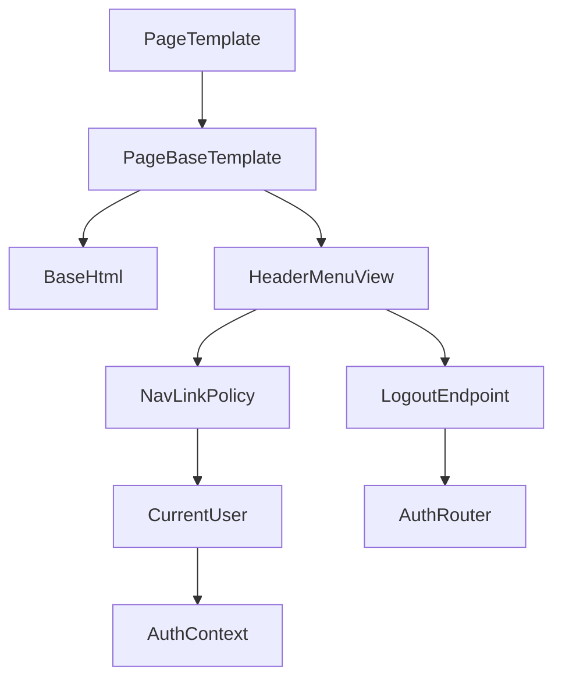
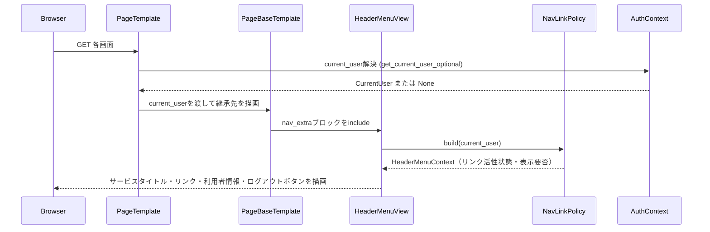

# Design Document

## Overview

header-navigation-menuは、helpo-foundationが提供する`base.html`の拡張ブロックを利用し、全画面共通のヘッダーメニュー（サービスタイトル「HELPO」、質問・履歴・FAQ管理画面への遷移リンク、ログイン中の利用者名・基本ロール表示、ログアウトボタン）を提供する。リンクの活性/非活性はlocal-user-authenticationが解決する現在利用者情報（`CurrentUser | None`）に基づいて判定する。

本仕様はステートレスな表示機能であり、新たな永続データや認証・認可ロジックを持たない。現在利用者・ロールの解決とログアウトの実処理はlocal-user-authenticationに委譲し、質問画面・履歴画面・FAQ管理画面の内容はそれぞれの所有仕様（ai-helpdesk-chat、faq-management-and-search）に委譲する。

### Goals

- 全画面で一貫したヘッダーメニュー（タイトル・3つの機能リンク・利用者情報・ログアウト）を表示する。
- ログイン状態と基本ロール（一般利用者・管理者）に応じてリンクの活性/非活性を切り替える。
- helpo-foundationの`base.html`本体を変更せず、拡張ブロックのみを利用する。
- 各画面所有仕様が最小限の変更（継承先テンプレート名の変更）でヘッダーメニューを組み込めるようにする。

### Non-Goals

- 質問画面・履歴画面・FAQ管理画面自体の内容・業務ロジック
- 現在利用者・基本ロールの解決処理、ログイン・ログアウトの実処理（local-user-authenticationが持つ）
- 認可判定ロジック自体（`require_admin`等の実装）
- ヘッダー以外のレイアウト（フッター等）
- 新規リンクの追加を前提とした汎用プラグイン機構（現時点は3リンク固定。将来の拡張はインタフェース形状で吸収する）

## Boundary Commitments

### This Spec Owns

- ヘッダーメニューの表示内容（サービスタイトル、3つの遷移リンク、利用者名・基本ロール表示、ログアウトボタン）
- 質問画面・履歴画面・FAQ管理画面へのリンクの活性/非活性判定ロジック（`NavLinkPolicy`）
- 各画面がヘッダーメニューを一括で取得するための中間テンプレート契約（`_page_base.html`）
- local-user-authenticationのRequirement 4.2相当（利用者名・ロール・ログアウト操作の共通画面表示）の表示責務。本仕様が引き継ぎ、`_nav.html`相当の表示は本仕様の`_header_menu.html`に一本化する。

### Out of Boundary

- 現在利用者・基本ロールの解決処理（`get_current_user_optional`等）— local-user-authenticationが持つ
- ログアウトの実処理（セッション失効） — local-user-authenticationの`AuthService`/`AuthRouter`（`POST /logout`）が持つ
- 管理者判定・本人所有判定などの認可ロジック自体 — local-user-authenticationが持つ
- 質問画面（`/chat`）・履歴画面（`/chat/history`）・FAQ管理画面（`/faqs/upload`）の内容・業務ロジック — ai-helpdesk-chat、faq-management-and-searchが持つ
- 各画面テンプレートの継承先を`base.html`から`_page_base.html`へ変更する作業自体 — 各画面所有仕様（local-user-authentication、ai-helpdesk-chat、faq-management-and-search）の実装タスクとして行う
- helpo-foundationの`base.html`本体、`nav_extra`/`header_extra`ブロック契約の変更

### Allowed Dependencies

- helpo-foundationの`base.html`、`nav_extra`拡張ブロック、共有`Jinja2Templates`インスタンス
- local-user-authenticationの`CurrentUser`型（`id`・`username`・`role`）、`get_current_user_optional`依存関数、`POST /logout`エンドポイント
- 依存方向: helpo-foundation（WebLayout） → local-user-authentication（CurrentUser） → header-navigation-menu（NavLinkPolicy/HeaderMenuView） → 各画面テンプレート（`_page_base.html`を継承）。逆方向依存は禁止する。

### Revalidation Triggers

- local-user-authenticationの`CurrentUser`型・`role`値・`get_current_user_optional`の失敗時挙動の変更
- local-user-authenticationの`POST /logout`のパス・メソッド・冪等性契約の変更
- helpo-foundationの`base.html`の`nav_extra`ブロック契約、共有`Jinja2Templates`インスタンスの提供方法の変更
- 質問画面・履歴画面・FAQ管理画面以外の新規画面が追加され、ヘッダーメニューへのリンク追加が必要になる場合
- local-user-authenticationのRequirement 4.2（利用者名・ロール・ログアウト表示）が本仕様と重複したまま実装され、責務が二重化する場合（`@kiro-spec-requirements local-user-authentication`による整理を要する）

## Architecture

### Existing Architecture Analysis

- helpo-foundationの単体FastAPI monolith、Jinja2テンプレート構成をそのまま利用する。
- 現時点で`app/`配下の実コードは未実装（`mockup/`の静的HTMLのみ存在）であり、本設計は各仕様の`design.md`で定義済みの契約（`base.html`の拡張ブロック、`CurrentUser`型）を正典として組み立てる。
- 各画面テンプレート（`login.html`、`chat.html`、`history.html`、`detail.html`、`upload.html`）は個別に`base.html`を継承する設計であり、そのままでは`nav_extra`ブロックの上書きが画面ごとに重複する。本設計は中間テンプレート`_page_base.html`でこの重複を解消する。

### Architecture Pattern & Boundary Map



**Architecture Integration**:

- Selected pattern: Jinja2テンプレート継承チェーンによる横断的UI注入。`base.html`（foundation） → `_page_base.html`（本仕様） → 各画面テンプレート（各所有仕様）。
- Domain boundaries: `NavLinkPolicy`はログイン状態・基本ロールからリンク活性/非活性のみを導出する純粋関数。`HeaderMenuView`はその結果を描画するだけで判定ロジックを持たない。
- Existing patterns preserved: foundationの`base.html`拡張ブロック契約、local-user-authenticationの`CurrentUser`型とテンプレートコンテキスト変数`current_user`の命名規約を維持する。
- New components rationale: `_page_base.html`は画面ごとのnav_extra重複記述を避けるために必要。`NavLinkPolicy`は活性/非活性判定を単体テスト可能にするために必要。
- Simplification: 新規リンクの動的登録機構やJSベースのナビゲーション状態管理は導入しない。3リンク固定のテンプレート・ロジックのみとする。

### Technology Stack

| Layer | Choice / Version | Role in Feature | Notes |
|-------|------------------|------------------|-------|
| Backend | Python 3.10+ | `NavLinkPolicy`の型付きロジック | foundation/local-user-authenticationと同一 |
| UI | Jinja2 | `_page_base.html`・`_header_menu.html` | foundationの`base.html`を継承、`nav_extra`ブロックを上書き |

## File Structure Plan

### Directory Structure

```text
helpo/
├── app/
│   ├── navigation/                         # header-navigation-menu所有
│   │   ├── __init__.py
│   │   ├── schemas.py                      # NavLinkState・HeaderMenuContext型定義
│   │   └── policy.py                       # NavLinkPolicy: 活性/非活性判定ロジック
│   └── templates/
│       ├── base.html                       # helpo-foundation所有（変更しない）
│       ├── _page_base.html                 # header-navigation-menu所有: base.htmlを継承しnav_extraを上書きする中間テンプレート
│       └── navigation/
│           └── _header_menu.html           # header-navigation-menu所有: ヘッダーメニュー本体（タイトル・リンク・利用者情報・ログアウト）
└── tests/
    └── test_navigation_unit.py             # NavLinkPolicyの単体テスト
```

### Modified Files

- 各画面所有仕様のテンプレート（local-user-authenticationの`login.html`、ai-helpdesk-chatの`chat.html`/`history.html`/`detail.html`、faq-management-and-searchの`upload.html`） — ``を``へ変更する。この変更は各所有仕様の実装タスク側で行い、本仕様は変更すべきテンプレート名の契約提供のみを行う。
- local-user-authenticationの`app/templates/auth/_nav.html` — 本仕様の`_header_menu.html`に表示責務が一本化されるため、重複回避のためlocal-user-authentication側で撤去または縮小を検討する（本仕様の実装タスクの対象外）。

## System Flows

### ヘッダーメニュー描画



`NavLinkPolicy.build`は`current_user`の値だけから決定的にリンク状態を導出し、DBアクセスや外部呼び出しを行わない。

## Requirements Traceability

| Requirement | Summary | Components | Interfaces | Flows |
|-------------|---------|------------|------------|-------|
| 1.1, 1.3 | サービスタイトル常時表示 | HeaderMenuView | State | ヘッダーメニュー描画 |
| 1.2 | タイトルクリック無反応 | HeaderMenuView | State | - |
| 2.1, 2.2, 2.3, 2.4 | 機能画面への遷移リンク | HeaderMenuView, NavLinkPolicy | Service, State | ヘッダーメニュー描画 |
| 3.1, 3.2 | 未ログイン時のリンク非活性化 | NavLinkPolicy, HeaderMenuView | Service, State | ヘッダーメニュー描画 |
| 4.1, 4.2, 4.3 | 一般利用者へのFAQ管理リンク非活性化 | NavLinkPolicy, HeaderMenuView | Service, State | ヘッダーメニュー描画 |
| 5.1, 5.2, 5.3 | ログイン中の利用者情報表示 | HeaderMenuView | State | ヘッダーメニュー描画 |
| 6.1, 6.2, 6.3 | ログアウトボタン表示・操作起点 | HeaderMenuView | State, API | ヘッダーメニュー描画 |

## Components and Interfaces

| Component | Domain/Layer | Intent | Req Coverage | Key Dependencies | Contracts |
|-----------|--------------|--------|---------------|-------------------|-----------|
| NavLinkPolicy | Domain Policy | ログイン状態・基本ロールからリンク活性/非活性を導出 | 2.1-2.4, 3.1, 3.2, 4.1, 4.2, 4.3 | CurrentUser型 P0 | Service |
| HeaderMenuView | UI | ヘッダーメニュー本体の描画 | 1.1-1.3, 2.1-2.4, 3.1, 3.2, 4.1-4.3, 5.1-5.3, 6.1-6.3 | NavLinkPolicy P0, foundation WebLayout P0, local-user-authentication `/logout` P0 | State, API |
| PageBaseTemplate | UI | 各画面がヘッダーメニューを一括取得するための中間テンプレート契約 | 1.1, 1.3 | foundation `base.html` P0, HeaderMenuView P0 | State |

### NavLinkPolicy

**Responsibilities & Constraints**
- `CurrentUser | None`のみを入力とし、リンクの活性/非活性と利用者情報・ログアウトボタンの表示要否を決定する純粋関数。
- リンクは常に3件（質問・履歴・FAQ管理）を返し、状態に応じて非表示にはしない（`active`フラグのみで制御する）。
- DBアクセス・HTTP呼び出し・副作用を持たない。

**Dependencies**
- Inbound: local-user-authenticationの`CurrentUser`型（P0） — 現在利用者・基本ロールの入力
- Outbound: HeaderMenuView（P0） — 判定結果の描画

**Contracts**: Service [x] / API [ ] / Event [ ] / Batch [ ] / State [ ]

##### Service Interface
```python
Role = Literal["user", "admin"]  # local-user-authenticationのCurrentUser.roleと同一

@dataclass(frozen=True)
class CurrentUser:  # local-user-authenticationが提供する型を参照
    id: int
    username: str
    role: Role

@dataclass(frozen=True)
class NavLinkState:
    key: Literal["question", "history", "faq_admin"]
    href: str
    label: str
    active: bool

@dataclass(frozen=True)
class HeaderMenuContext:
    links: tuple[NavLinkState, NavLinkState, NavLinkState]
    show_user_info: bool
    show_logout: bool
    username: str | None
    role: Role | None

class NavLinkPolicy:
    def build(self, current_user: CurrentUser | None) -> HeaderMenuContext: ...
```
- Preconditions: `current_user`は`None`、または`id`・`username`・`role`(`"user"`または`"admin"`)を持つ有効な`CurrentUser`である。
- Postconditions:
  - `current_user is None`のとき、`question`・`history`・`faq_admin`の全リンクが`active=False`、`show_user_info=False`、`show_logout=False`、`username=None`、`role=None`を返す。
  - `current_user.role == "user"`のとき、`question`・`history`は`active=True`、`faq_admin`は`active=False`、`show_user_info=True`、`show_logout=True`を返す。
  - `current_user.role == "admin"`のとき、`question`・`history`・`faq_admin`すべて`active=True`、`show_user_info=True`、`show_logout=True`を返す。
- Invariants: `links`は常に`question`・`history`・`faq_admin`の3件・固定順で返す（非表示にはしない）。

### HeaderMenuView

| Field | Detail |
|-------|--------|
| Intent | ヘッダーメニュー（タイトル・リンク・利用者情報・ログアウトボタン）を描画する |
| Requirements | 1.1, 1.2, 1.3, 2.1, 2.2, 2.3, 2.4, 3.1, 3.2, 4.1, 4.2, 4.3, 5.1, 5.2, 5.3, 6.1, 6.2, 6.3 |

**Responsibilities & Constraints**
- `app/templates/navigation/_header_menu.html`として実装し、`NavLinkPolicy.build`の出力（`HeaderMenuContext`）のみを描画する。判定ロジックは持たない。
- サービスタイトル「HELPO」は`<a>`要素ではなく非リンク要素（例: `<span>`）として描画し、クリックしても画面遷移や送信を発生させない。
- 非活性リンク（`active=False`）は要素として常に表示するが、遷移不能な形（例: `<span>`または`aria-disabled`属性付きの無効化要素）で描画し、クリックしても`href`遷移を発生させない。
- `show_user_info=False`の場合は利用者名・基本ロール表示要素を描画しない。`show_logout=False`の場合はログアウトボタンを描画しない。
- ログアウトボタンはlocal-user-authenticationの`POST /logout`をフォーム送信先とするが、送信後の処理（セッション失効等）は本コンポーネントが行わない。

**Dependencies**
- Inbound: PageBaseTemplate（P0） — `nav_extra`ブロックからinclude
- Outbound: NavLinkPolicy（P0） — 表示状態の取得; local-user-authenticationの`POST /logout`（P0） — ログアウトボタンの送信先

**Contracts**: Service [ ] / API [ ] / Event [ ] / Batch [ ] / State [x]

##### State Management
- State model: `HeaderMenuContext`（`NavLinkPolicy`が導出した読み取り専用の描画用データ）
- Persistence & consistency: 永続化なし。リクエストごとに`current_user`から再導出する。
- Concurrency strategy: 該当なし（ステートレスな描画のみ）

**Implementation Notes**
- Integration: `_page_base.html`の`nav_extra`ブロックからincludeされ、呼び出し元テンプレートが渡す`current_user`変数を用いて`NavLinkPolicy.build`を呼び出す。
- Validation: `current_user.role`が`"user"`/`"admin"`以外の値を取り得ないことはlocal-user-authentication側の制約に依拠する（本コンポーネントは再検証しない）。
- Risks: local-user-authenticationの`_nav.html`と機能が重複したまま両方が実装されると、利用者名・ログアウトボタンが二重表示される。実装順序としてlocal-user-authentication側の整理を先行または並行して行う必要がある（Revalidation Triggers参照）。

### PageBaseTemplate

| Field | Detail |
|-------|--------|
| Intent | 各画面テンプレートがヘッダーメニューを一括で取得するための中間テンプレート |
| Requirements | 1.1, 1.3 |

**Responsibilities & Constraints**
- `app/templates/_page_base.html`として実装し、``した上で``のみを定義する。
- `content`等の他ブロックは素通しし、画面テンプレート側の責務を変更しない。

**Implementation Notes**
- Integration: 各画面所有仕様は自身のテンプレートの継承先を`base.html`から`_page_base.html`に変更するだけでヘッダーメニューを取得できる（本仕様はこの契約提供のみを担い、変更作業自体は行わない）。

## Data Models

本仕様は永続データを持たない。`CurrentUser`型はlocal-user-authenticationが定義・所有する型をそのまま参照し、本仕様側で再定義しない。`NavLinkState`・`HeaderMenuContext`はリクエストスコープの一時的な値であり、DBやセッションに保存しない。

### API Data Transfer

本仕様は新規APIエンドポイントを持たない。ログアウトボタンはlocal-user-authenticationが定義する`POST /logout`（Cookie削除後`/login`へ303）を利用するのみである。

## Error Handling

### Error Strategy

- `current_user`の解決に失敗した場合（未ログイン・セッション失効等）は、`NavLinkPolicy.build(None)`と同様の未ログイン状態として扱い、全機能リンクを非活性・利用者情報とログアウトボタンを非表示にする（フェイルセーフ）。
- `NavLinkPolicy`・`HeaderMenuView`は例外を発生させる外部呼び出しを行わないため、本仕様固有の4xx/5xxハンドリングは持たない。予期しない例外はfoundationの汎用500応答へ委譲する。

### Monitoring

本仕様は秘密情報を扱わず、認証イベントのログ記録責務も持たない。追加のログ・監視要件はない。

## Testing Strategy

### Unit Tests

- `NavLinkPolicy.build(None)`: 全リンクが非活性、利用者情報・ログアウトボタンが非表示になること（3.1, 3.2, 5.2, 6.2）。
- `NavLinkPolicy.build(CurrentUser(role="user"))`: 質問・履歴リンクが活性、FAQ管理リンクが非活性になること（2.2, 2.3, 4.1）。
- `NavLinkPolicy.build(CurrentUser(role="admin"))`: 質問・履歴・FAQ管理の全リンクが活性になること（2.2, 2.3, 2.4, 4.3）。
- `NavLinkPolicy`の戻り値が常に3件のリンクを固定順で返すこと（非表示にならないこと）（3.1, 4.1）。

### Integration Tests

- `_header_menu.html`を`current_user=None`で描画し、非活性リンクがクリックしても遷移しないマークアップ（`href`なしまたは無効化属性）で出力されること（3.2）。
- `_header_menu.html`を一般利用者・管理者それぞれの`current_user`で描画し、リンクの活性/非活性・利用者名・ロール・ログアウトボタンの表示が要件通りであること（2.1-2.4, 4.1-4.3, 5.1, 6.1）。
- `_page_base.html`を継承したダミー画面テンプレートが、`base.html`の`content`ブロックとヘッダーメニューを両方正しく描画すること（1.1, 1.3）。

### E2E/UI Tests

- サービスタイトルをクリックしても画面遷移が発生しないこと（1.2）。
- ログアウトボタン押下でlocal-user-authenticationの`POST /logout`が呼び出され、ログイン画面へ遷移すること（6.3、local-user-authenticationとの統合確認）。
