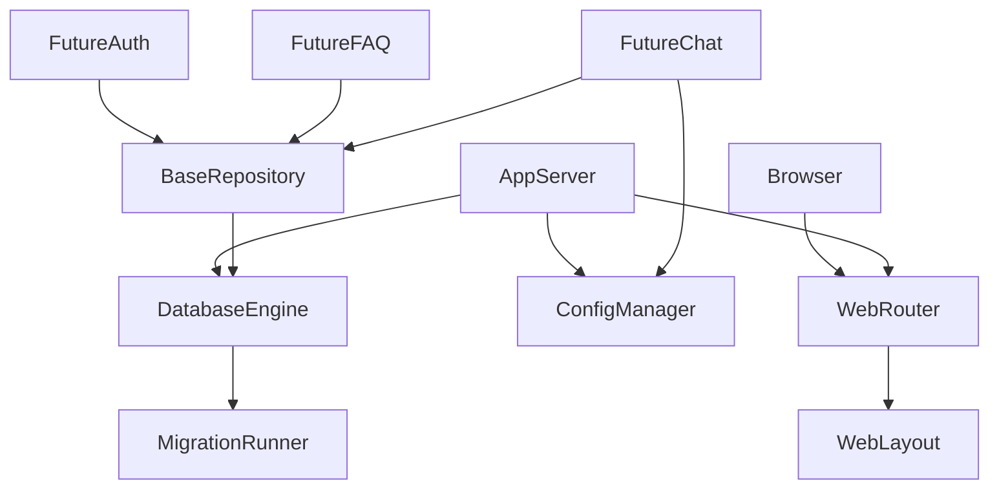
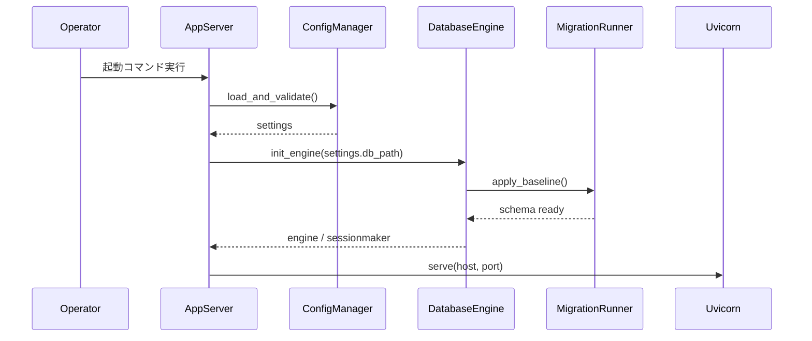

# Design Document

## Overview
HELPO foundationは、社内FAQ向けAIヘルプデスクのコアとなるPython/FastAPI一体型アプリケーション、SQLite永続化、環境設定、共通データアクセス、基本画面レイアウトを提供する。開発者・運用者がWindows PC上でGPU不要かつ外部サービス不要で起動・検証できる出発点となる。

### Goals
- FastAPIアプリケーションを1コマンドで起動できる。
- 設定とSQLite永続化を統一的に扱う。
- 後続の認証、FAQ、AIチャットが乗る共通レイアウトと拡張ポイントを提供する。

### Non-Goals
- ユーザー認証・認可ロジック
- FAQの業務機能・検索アルゴリズム
- Embedding・LLM・チャット
- 本番分散構成・高可用性基盤

## Boundary Commitments

### This Spec Owns
- FastAPIアプリケーション本体、ASGI起動
- SQLite接続、マイグレーション実行、初期スキーマ整備
- 環境設定の読み込みと検証、下位モジュールへの提供
- 共通データアクセス層（セッション管理、トランザクション、基本リポジトリパターン）
- 基本Webレイアウト（ヘッダー・メイン領域・フッター、将来のナビゲーション仮リンク）
- 下位機能が安全に拡張するための拡張ポイント：設定の型安全な拡張、ルーター登録のRouterRegistry、依存注入ヘルパー、テンプレートブロック
- 起動エラー・未処理例外の共通処理とログ

### Out of Boundary
- ユーザー認証・ロール管理（local-user-authentication）
- FAQのCRUD・Embedding・検索（faq-management-and-search）
- AIチャット・履歴（ai-helpdesk-chat）
- 本番向け監視・分散・高可用性基盤

### Allowed Dependencies
- Python 3.10+
- FastAPI + Uvicorn
- Pydantic（設定・リクエスト検証）
- SQLAlchemy 2.x + SQLite driver
- Jinja2 + static file serving for base layout
- python-dotenv or Pydantic Settings for env file support

### Revalidation Triggers
- 設定スキーマの追加・変更
- データベース接続方式またはマイグレーションファイル命名の変更
- 基本レイアウトで提供するブロック名・コンポーネントインターフェースの変更
- 依存方向（Types → Config → Repository → Service → Runtime → UI）の破壊

## Architecture

### Architecture Pattern & Boundary Map



**Architecture Integration**:
- Selected pattern: 単体FastAPI monolith with layered dependency direction
- Domain/feature boundaries: Foundation provides runtime, persistence, and UI shell; downstream specs plug into BaseRepository and ConfigManager contracts
- New components rationale: ConfigManager centralizes settings; DatabaseEngine/MigrationRunner own persistence lifecycle; BaseRepository gives downstream modules a consistent seam
- Steering compliance: 依存方向は Types → Config → Repository → Service → Runtime → UI に従う

### Technology Stack

| Layer | Choice / Version | Role in Feature | Notes |
|-------|------------------|-----------------|-------|
| Backend runtime | Python 3.10+ | 実行基盤 | Windows CPUでも動作 |
| Web framework | FastAPI 0.115+ | HTTPルーティング・バリデーション | ASGI対応 |
| ASGI server | Uvicorn | 開発・実行サーバー | `--reload`対応 |
| Data / Storage | SQLAlchemy 2.x + SQLite | ORM・ファイル永続化 | 追加DBサーバー不要 |
| Configuration | Pydantic v2 Settings | 環境変数・.env読み込み | 型安全な設定検証 |
| Templating | Jinja2 + FastAPI static files | 基本HTMLレイアウト | サーバーサイドレンダリング |
| Migration | Alembic or simple SQL baseline | スキーマ管理 | MVPでは最小構成 |

## File Structure Plan

### Directory Structure

```
helpo/
├── main.py                  # ASGIアプリ作成、起動エントリ
├── app/
│   ├── __init__.py
│   ├── config.py            # 設定読み込みと検証
│   ├── db.py                # SQLiteエンジン・セッション・依存
│   ├── base_models.py       # 共通データモデル・Base
│   ├── base_repository.py   # 基本リポジトリ
│   ├── logging_conf.py      # ログ設定
│   ├── dependencies.py      # 共通依存注入用ユーティリティ
│   ├── router_registry.py   # 下位機能ルーター登録用拡張レジストリ
│   ├── routers/
│   │   ├── __init__.py
│   │   └── pages.py         # 基本ページ・レイアウト
│   ├── templates/
│   │   ├── base.html
│   │   └── index.html
│   └── static/
│       └── css/
│           └── main.css
├── migrations/              # 初期スキーマ or Alembic
│   └── baseline.sql
├── pyproject.toml
├── .env.example
└── tests/
    └── test_foundation.py
```

### Modified Files
- なし（greenfield 新規作成）

## System Flows

### 起動フロー



## Requirements Traceability

| Requirement | Summary | Components | Interfaces | Flows |
|-------------|---------|------------|------------|-------|
| 1 | アプリケーション起動 | AppServer, ConfigManager | Service, API | 起動フロー |
| 2 | 環境設定読み込み | ConfigManager | Service | 起動フロー |
| 3 | ローカル永続化 | DatabaseEngine, MigrationRunner | Service, Batch | 起動フロー |
| 4 | 共通データアクセス | BaseRepository, DatabaseEngine | Service | - |
| 5 | 基本Web画面構成 | WebLayout, WebRouter | State | - |
| 6 | ローカルAI実行設定拡張ポイント | ConfigManager | Service | - |
| 7 | エラー報告とログ | ErrorHandler, AppServer | Service, API | 起動フロー |
| 8 | 研修用MVP軽量性 | AppServer, ConfigManager, DatabaseEngine | Service, API, State | 起動フロー |

## Components and Interfaces

| Component | Domain/Layer | Intent | Req Coverage | Key Dependencies (P0/P1) | Contracts |
|-----------|--------------|--------|--------------|--------------------------|-----------|
| AppServer | Runtime | ASGIアプリ作成と起動統合 | 1, 7, 8 | ConfigManager (P0), DatabaseEngine (P0) | API, Service |
| ConfigManager | Backend/Config | 設定読み込み・検証・提供 | 2, 6, 8 | - | Service |
| DatabaseEngine | Backend/Persistence | SQLiteエンジンとセッション生成 | 3, 4, 8 | - | Service, State |
| MigrationRunner | Backend/Persistence | ベーススキーマ適用 | 3 | DatabaseEngine (P0) | Batch |
| BaseRepository | Backend/Data Access | 共通リポジトリ・トランザクション | 4 | DatabaseEngine (P0) | Service |
| WebLayout | Frontend/UI | 基本HTMLレイアウトと仮ナビ | 5 | - | State |
| ErrorHandler | Backend/Runtime | 例外処理とログ | 7, 1 | AppServer (P1) | Service, API |
| RouterRegistry / ApplicationRouterFactory | Backend/Extension | 下位機能ルーター登録用拡張インターフェース | 1, 5, 8 | AppServer (P0) | Service |

### AppServer

| Field | Detail |
|-------|--------|
| Intent | ASGIアプリケーションを構成し、起動時の初期化を統合する |
| Requirements | 1, 7, 8 |

**Responsibilities & Constraints**
- `create_app()` でFastAPIインスタンスを返す
- 起動時に ConfigManager → DatabaseEngine → MigrationRunner → ルーター登録の順で初期化する
- ルーター登録は `RouterRegistry` を介して行い、下位機能は `app/router_registry.py` 拡張インターフェースを通じて自らのルーターを登録する
- `app/routers/` および `main.py` を下位機能が直接変更しないことを保証する
- 未処理例外は ErrorHandler に委譲する

**Dependencies**
- Inbound: Uvicorn — HTTP server startup (P0)
- Outbound: ConfigManager — settings (P0)
- Outbound: DatabaseEngine — persistence (P0)

**Contracts**
- Service: `create_app() -> FastAPI`
- API: Uvicorn起動可能なASGI callable

### ConfigManager

| Field | Detail |
|-------|--------|
| Intent | 環境変数・.envファイルから設定を読み込み、下位モジュールに提供する |
| Requirements | 2, 6, 8 |

**Responsibilities & Constraints**
- 必須項目が欠けている場合は起動前に `ValueError` 相当のエラーを発生させる
- ローカルAIモデルパス・Embeddingモデルパスは任意設定として保持し、値がなければ `None` を返す
- 設定値はイミュータブルな Pydantic Settings モデルとして公開する
- foundation の `Settings` は core 設定のみを所有し、下位機能の追加設定は `ConfigManager` 拡張ポイントまたは feature-local 設定スキーマを通じて読み込む。下位機能が `app/config.py` を直接変更しない

**Dependencies**
- External: python-dotenv / Pydantic Settings — env file parsing (P1)

**Contracts**
- Service: `Settings.get_database_url() -> str`
- Service: `Settings.get_local_ai_settings() -> LocalAISettings | None`
- Extension: feature settings registration interface

### DatabaseEngine

| Field | Detail |
|-------|--------|
| Intent | SQLiteエンジンとセッションファクトリを提供し、接続ライフサイクルを管理する |
| Requirements | 3, 4, 8 |

**Responsibilities & Constraints**
- `create_engine(settings.database_url)` でSQLAlchemy Engineを作成
- `SessionLocal` セッションメーカーを提供
- FastAPI `Depends` 用の `get_db()` を提供
- 接続先は設定によるファイルパスか in-memory SQLite

**Dependencies**
- Inbound: ConfigManager — database_url (P0)

**Contracts**
- Service: `get_engine() -> Engine`
- Service: `get_session() -> Session`
- State: セッションライフサイクル

### MigrationRunner

| Field | Detail |
|-------|--------|
| Intent | 起動時にベーススキーマを適用する |
| Requirements | 3 |

**Responsibilities & Constraints**
- Alembic使用時は `alembic upgrade head` を起動時に実行するラッパーを提供
- 最小構成では `migrations/baseline.sql` を読み込み、存在しないテーブルのみ作成する
- マイグレーションバージョン管理テーブル（例: `alembic_version`）を保持

**Dependencies**
- Inbound: DatabaseEngine — target connection (P0)

**Contracts**
- Batch: `apply_migrations(engine: Engine) -> None`

### BaseRepository

| Field | Detail |
|-------|--------|
| Intent | 下位モジュールが拡張する共通のデータアクセス抽象 |
| Requirements | 4 |

**Responsibilities & Constraints**
- 汎用 CRUD 操作（get, list, create, update, delete）を提供
- トランザクションは呼び出し元の `Session` に委ね、必要に応じて `commit()` を呼び出す
- 下位モジュールは `BaseEntity` を継承してモデルを定義する

**Dependencies**
- Inbound: DatabaseEngine — Session (P0)

**Contracts**
- Service: `BaseRepository.create(db: Session, obj: BaseEntity) -> BaseEntity`
- Service: `BaseRepository.get(db: Session, id: int) -> BaseEntity | None`
- Service: `BaseRepository.update(db: Session, obj: BaseEntity) -> BaseEntity`
- Service: `BaseRepository.delete(db: Session, id: int) -> None`

### WebLayout

| Field | Detail |
|-------|--------|
| Intent | 全ページで共有可能な基本レイアウトを提供する |
| Requirements | 5 |

**Responsibilities & Constraints**
- `base.html` に `header`, `main`, `footer` および下位機能が拡張可能な `nav_extra`/`header_extra` 等のブロックを定義
- 下位機能は feature-local テンプレートでこれらの拡張ブロックを上書き・補完し、`base.html` 本体は直接変更しない
- トップページ `index.html` は `base.html` を継承し、認証・FAQ・チャットへの仮リンクを表示
- スタイルは `static/css/main.css` に集約

**Dependencies**
- Inbound: WebRouter — route binding (P0)

**Contracts**
- State: HTML template blocks ``, ``

### ErrorHandler

| Field | Detail |
|-------|--------|
| Intent | 起動エラーと未処理例外を統一的に処理する |
| Requirements | 1, 7 |

**Responsibilities & Constraints**
- 起動失敗時は標準エラー出力にメッセージを出力してプロセスを終了する
- 未処理HTTP例外は JSON `{ "detail": "Internal server error" }` として返し、詳細はログに残す
- 開発モード時のみトレースを含むレスポンスを許可する

**Dependencies**
- Inbound: AppServer — exception handler registration (P0)

**Contracts**
- API: `HTTP 500` generic error response
- Service: `log_exception(exc: Exception) -> None`

### RouterRegistry / ApplicationRouterFactory

| Field | Detail |
|-------|--------|
| Intent | 下位機能が foundation のアプリファクトリに直接依存せず、安全に自らのルーターを登録できる拡張インターフェースを提供する |
| Requirements | 1, 5, 8 |

**Responsibilities & Constraints**
- foundation が所有し、`app/router_registry.py` に配置する
- 下位機能は `register_router(router: APIRouter, prefix: str = "", tags: list[str] | None = None)` または同等の拡張メソッドを通じてルーターを登録する
- foundation の `create_app()` は登録済みルーターを FastAPI インスタンスへ include する
- 下位機能が `app/routers/` ディレクトリや `main.py` を直接変更しないことを保証する

**Dependencies**
- Inbound: AppServer — router inclusion (P0)
- Outbound: downstream feature packages — registration calls (P1)

**Contracts**
- Service: `register_router(router: APIRouter, prefix: str = "", tags: list[str] | None = None) -> None`
- Service: `include_registered_routers(app: FastAPI) -> None`

## Data Models

### Domain Model
- **BaseEntity**: 下位モジュールが継承する共通基底エンティティ
  - `id: int` — 主キー（自動採番）
  - `created_at: datetime` — 作成日時
  - `updated_at: datetime` — 更新日時

### Physical Data Model

**alembic_version**（マイグレーション追跡用、Alembic使用時）

| Column | Type | Notes |
|--------|------|-------|
| version_num | VARCHAR(32) PK | 適用済みバージョン |

**foundation_meta**（代替用最小マイグレーショントラッキング）

| Column | Type | Notes |
|--------|------|-------|
| id | INTEGER PK | 常に1レコード |
| schema_version | VARCHAR(64) | 適用済みベースライン名 |
| applied_at | DATETIME | 適用日時 |

### Data Contracts & Integration

**Settings Model**

| Field | Type | Required | Default | Notes |
|-------|------|----------|---------|-------|
| database_url | str | Yes | sqlite:///./helpo.db | 環境変数 `DATABASE_URL` |
| app_host | str | Yes | 127.0.0.1 | `APP_HOST` |
| app_port | int | Yes | 8000 | `APP_PORT` |
| debug | bool | Yes | False | `DEBUG` |
| local_llm_path | str | No | None | `LOCAL_LLM_PATH` |
| local_embedding_path | str | No | None | `LOCAL_EMBEDDING_PATH` |

## Error Handling

### Error Strategy
- 起動時: fail-fast。設定不正またはDB接続不能なら即座に終了する。
- 実行時: catch-all例外ハンドラで汎用メッセージを返し、詳細はサーバーログに記録する。

### Error Categories and Responses
- **User Errors (4xx)**: FastAPI/Pydanticが自動的に `422` または `400` を返す。
- **System Errors (5xx)**: ErrorHandlerが `500` 汎用レスポンスを返す。
- **Business Logic Errors (422)**: 設定検証失敗時は `ValueError` を起動前に発生させる。

### Monitoring
- 標準ログ（`logging` モジュール）で起動・エラーを記録する。

## Testing Strategy

### Unit Tests
- ConfigManager: 正しい値の読み込み、必須項目欠落時の拒否、デフォルト値の適用
- BaseRepository: テストエンティティのCRUDとロールバック
- ErrorHandler: 汎用エラーレスポンスの生成

### Integration Tests
- 起動フロー: `create_app` が設定・DB・マイグレーションを正常初期化
- DBマイグレーション: 空DB起動後にバージョンテーブルが存在

### E2E / UI Tests
- ブラウザまたはHTTPクライアントでルートパスにアクセスし、レイアウトと仮リンクが表示されることを確認
- Windows CPU環境で `uvicorn` 起動スクリプトを実行し、トップページの表示を確認

## Security Considerations
- 設定ファイルに本番機密情報を含めない（研修・ローカル用）。
- 入力検証はPydanticに委ね、不正なリクエストを早期に拒否する。
- 静的ファイルは意図した `app/static` ディレクトリ内のみ配信する。

## Performance & Scalability
- CPU実行・少人数利用を前提とする。
- SQLiteはシングルファイルであり、同時書き込みは1接続までを想定する。
