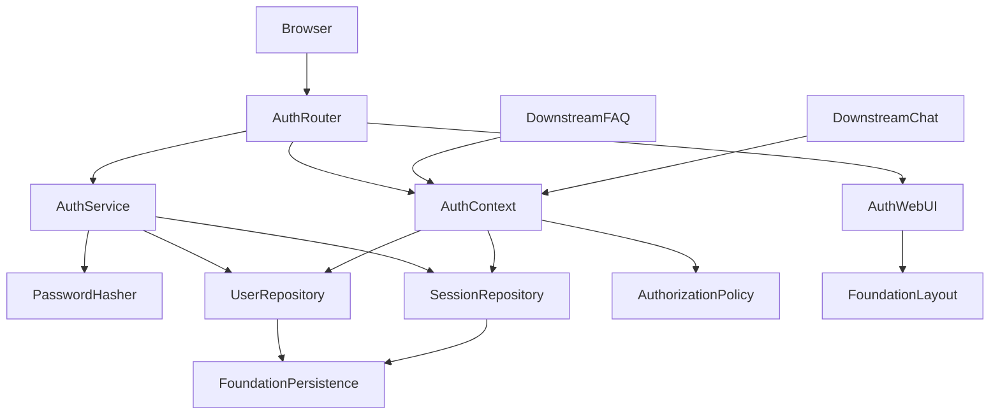
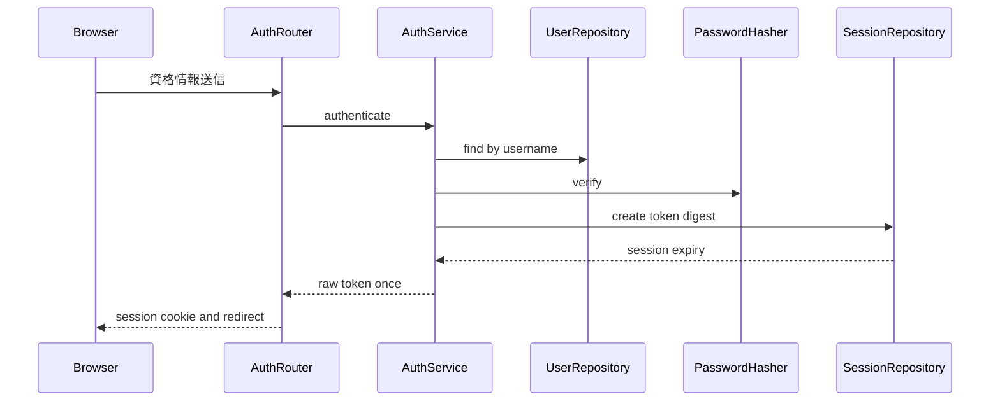
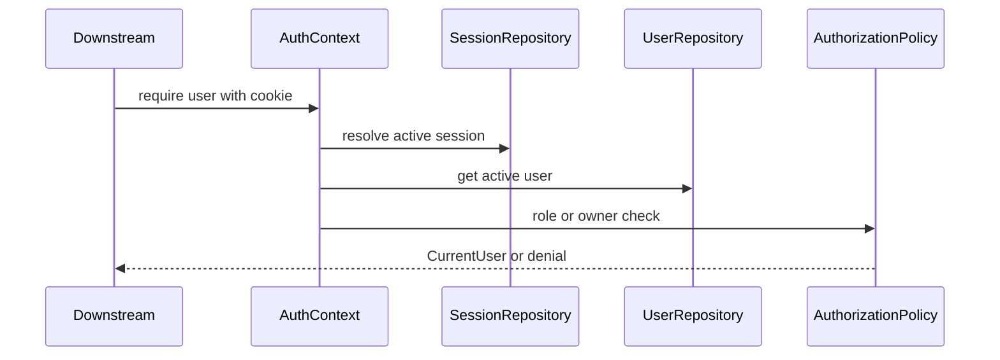

# Design Document

## Overview

local-user-authenticationは、helpo-foundation上にローカル資格情報、永続セッション、現在利用者コンテキスト、および基本認可ポリシーを追加する。登録済み利用者はユーザー名とパスワードでログインし、サーバー管理セッションを介して画面間の認証状態を維持し、明示的にログアウトできる。

本設計はユーザーIDと`user`/`admin`ロールの信頼できる供給元となるが、FAQ操作やチャット履歴への認可適用は行わない。後続仕様は型付き依存関数で現在利用者・管理者・本人所有を判定し、各業務データへのアクセスを自ら制御する。

### Goals

- パスワードを一方向ハッシュで保護し、ローカル利用者を認証する。
- 失効・期限管理可能なサーバー側セッションを提供する。
- 後続仕様へ不変ユーザーID、基本ロール、最小認可ポリシーを提供する。
- foundationの設定・SQLite・エラー・ログ・画面レイアウト契約を変更せず拡張する。

### Non-Goals

- FAQ操作への認可適用（faq-management-and-searchが`require_admin`を呼び出して自ら適用する）
- 履歴の永続化・表示・本人所有強制（ai-helpdesk-chatが`require_owner`を呼び出して自ら適用する）
- 分析、監査証跡、SSO、外部IdP、MFA
- 部署・役職・権限集合を扱う高度なRBAC
- 利用者管理画面、パスワード再設定、任意ロール編集

## Boundary Commitments

### This Spec Owns

- ローカル利用者、パスワードハッシュ、認証セッションのデータとライフサイクル
- 不変ユーザーID、一意なユーザー名、有効状態、`user`/`admin`基本ロール
- ログイン、ログアウト、現在利用者取得のHTTP/UIフロー
- `require_authenticated_user`、`require_admin`、`require_owner`の認証・認可境界

### Out of Boundary

- FAQ操作への認可適用 — faq-management-and-searchが本仕様の`require_admin`を呼び出して自ら制御する
- 履歴の永続化・表示・本人所有強制 — ai-helpdesk-chatが本仕様の`require_owner`を呼び出して自ら制御する
- 分析・監査・外部認証・MFA・高度なRBAC
- 管理者による全社員履歴閲覧・任意権限編集
- foundationが所有するDB接続、トランザクション、共通500応答、ログ基盤、基本テンプレートブロック

### Allowed Dependencies

- helpo-foundationの`Settings`、`DatabaseEngine.get_session()`/`get_db()`、`BaseEntity`、`BaseRepository`、MigrationRunner、ErrorHandler、WebLayout、`RouterRegistry`
- FastAPIのRouter、Depends、Request/Response、Jinja2テンプレート連携
- SQLAlchemy 2.x（foundationと同一Engine/Session）
- Argon2idを提供する`argon2-cffi`（パスワードハッシュ）
- Python標準`secrets`と`hashlib`（セッショントークン生成・保存用ダイジェスト）
- 依存方向: foundation Types/Config/Persistence → auth Models/Repositories → auth Services/Policies → auth Runtime/UI。逆方向依存は禁止する。

### Revalidation Triggers

- foundationの`Settings`、`BaseEntity`、Session、MigrationRunner契約の変更
- `base.html`の`content`ブロックまたはテンプレートコンテキスト規約の変更
- `CurrentUser`、`Role`、認証依存関数の型・失敗ステータス変更
- ユーザーIDの型、基本ロール値、所有者比較規則の変更
- Cookie名・属性、セッション有効期間、保存方式の変更
- 後続仕様が管理者による全履歴閲覧または追加ロールを要求する場合

## Architecture

### Existing Architecture Analysis

- foundationの単体FastAPI monolith、SQLAlchemy 2.x、SQLite、Jinja2構成をそのまま利用する。
- 認証テーブルはfoundationと同じEngineおよびMigrationRunnerで管理し、独自接続や独自commit境界を作らない。
- 認証例外の401/403は機能固有ハンドラで処理し、予期しない例外はfoundation ErrorHandlerの`{"detail":"Internal server error"}`契約へ委譲する。
- 認証画面は`base.html`を継承し、既存の`header`、`main`、`footer`と`content`ブロックおよび拡張ブロックを維持する。

### Architecture Pattern & Boundary Map



**Architecture Integration**:

- Selected pattern: foundationの層構造へ追加するサーバー管理セッション方式。Cookie署名だけに利用者状態を保持せず、失効を即時反映する。
- Domain boundaries: AuthServiceは本人確認とセッション、AuthContextは現在利用者解決、AuthorizationPolicyはロール・所有者ID比較だけを所有する。
- Existing patterns preserved: foundationの設定、Session注入、BaseEntity/BaseRepository、マイグレーション、Jinja2、共通エラー処理を再利用する。
- Build vs adopt: パスワードハッシュは独自実装せずArgon2idを採用する。セッションは小規模ローカルMVPに必要な失効性をSQLiteで最小実装する。
- Simplification: OAuth2/OIDC、JWT、権限テーブル、監査イベント、利用者管理UIは導入しない。

### Technology Stack

| Layer | Choice / Version | Role in Feature | Notes |
|-------|------------------|-----------------|-------|
| Backend | Python 3.10+ / FastAPI 0.115+ | ルーティング、依存注入、Cookie | foundationと同一 |
| Security | argon2-cffi 23.1+ | Argon2idハッシュ・検証 | 平文・復号可能保存は禁止 |
| Data | SQLAlchemy 2.x / SQLite | users・auth_sessions永続化 | foundationのEngine/Sessionを共有 |
| UI | Jinja2 | ログイン画面と認証状態表示 | foundationのbase.htmlを継承 |

## File Structure Plan

### Directory Structure

```text
helpo/
├── app/
│   ├── config.py                       # foundation所有: core設定
│   ├── dependencies.py                 # foundation所有: 共通依存
│   ├── router_registry.py              # foundation所有: 下位機能ルーター登録
│   ├── auth/                           # local-user-authentication所有
│   │   ├── __init__.py
│   │   ├── settings.py                 # AuthSettings
│   │   ├── models.py                   # User・AuthSession ORMモデル
│   │   ├── repository.py               # UserRepository・SessionRepository
│   │   ├── service.py                  # AuthService
│   │   ├── password_hasher.py          # PasswordHasher
│   │   ├── dependencies.py             # 認証・認可用依存関数
│   │   ├── schemas.py                  # Role・CurrentUser・要求応答型
│   │   ├── router.py                   # AuthRouter
│   │   └── cli/
│   │       └── create_user.py          # LocalUserProvisioner
│   └── templates/auth/
│       ├── _nav.html                   # 認証状態ナビ (foundation base.html 拡張ブロック経由)
│       └── login.html                  # AuthWebUIログインフォーム
├── migrations/
│   └── 002_local_user_authentication.sql # AuthMigration
└── tests/
    ├── test_auth_unit.py                # AuthTestSuite
    └── test_auth_integration.py         # AuthIntegrationTestSuite
```

### Modified Files

- `pyproject.toml` — `argon2-cffi`依存を追加する。
- `app/auth/settings.py` — 認証専用設定を feature-local に定義し、foundation の `ConfigManager` 拡張ポイントを通じて検証する。
- `app/auth/dependencies.py` — 認証・認可に必要な FastAPI 依存関数を feature-local に公開する。
- `app/auth/router.py` — `AuthRouter` を実装し、foundation の `RouterRegistry` 拡張インターフェースを通じて登録する。
- `app/templates/auth/_nav.html` — foundation の `base.html` 拡張ブロック（nav/header）を経由して認証状態ナビゲーションを提供する。
- foundation の `app/router_registry.py` — `AuthRouter` が登録される。

## System Flows

### ログインとセッション作成



生トークンはCookie設定時だけ返し、DBにはSHA-256ダイジェストのみ保存する。認証失敗理由は`InvalidCredentials`へ正規化する。

### 保護対象アクセスと認可



AuthContextはFAQ・履歴レコードを取得しない。所有者IDは後続機能が自身のデータから取得して`require_owner`へ渡す。

## Requirements Traceability

| Requirement | Summary | Components | Interfaces | Flows |
|-------------|---------|------------|------------|-------|
| 1.1, 1.3, 1.4 | 利用者ID・名前・基本ロール | UserRepository, AuthMigration | State, Service | - |
| 1.2 | 非可逆資格情報 | PasswordHasher | Service | ログイン |
| 1.5 | ローカル利用者登録 | LocalUserProvisioner, UserRepository, PasswordHasher | Batch, Service | - |
| 2.1, 2.2, 2.3, 2.4 | ログインと拒否 | AuthService, AuthRouter | Service, API | ログイン |
| 3.1, 3.2, 3.3, 3.4 | セッション維持・失効 | SessionRepository, AuthService, AuthRouter | State, Service, API | 両フロー |
| 4.1, 4.3, 4.4 | 安全な現在利用者 | AuthContext | Service | 保護対象アクセス |
| 4.2 | 共通画面の認証表示 | AuthWebUI | State | - |
| 5.1, 5.2, 5.3 | 認証・管理者・本人所有判定 | AuthContext, AuthorizationPolicy | Service | 保護対象アクセス |
| 5.4 | 業務認可の非所有 | AuthorizationPolicy | Service | 保護対象アクセス |
| 6.1, 6.2, 6.3, 6.5 | 401・403・500処理 | AuthRouter, AuthContext | API, Service | 保護対象アクセス |
| 6.4 | 機密情報非露出 | 全認証コンポーネント | Service, API, State | 両フロー |
| 7.1, 7.2, 7.3 | ローカルMVP | AuthSettings, AuthMigration | Service, State | 両フロー |

## Components and Interfaces

| Component | Domain/Layer | Intent | Req Coverage | Key Dependencies | Contracts |
|-----------|--------------|--------|--------------|------------------|-----------|
| AuthSettings | Config | 認証設定の型付き拡張 | 3.1, 6.4, 7.1, 7.2 | foundation Settings P0 | Service |
| AuthMigration | Persistence | 認証スキーマの追加 | 1.1, 1.3, 3.1, 7.2 | MigrationRunner P0 | Batch, State |
| PasswordHasher | Security | パスワードハッシュ・照合 | 1.2, 1.5, 2.2, 6.4 | argon2-cffi P0 | Service |
| LocalUserProvisioner | Operations | 対話的なローカル利用者登録 | 1.3, 1.4, 1.5 | UserRepository P0, PasswordHasher P0 | Batch |
| UserRepository | Data Access | 利用者永続化 | 1.1, 1.3, 1.4, 1.5, 2.3 | foundation Session P0 | Service, State |
| SessionRepository | Data Access | セッション永続化・失効 | 3.1, 3.2, 3.3, 3.4 | foundation Session P0 | Service, State |
| AuthService | Domain Service | 資格情報検証とセッション操作 | 2.1, 2.2, 2.3, 2.4, 3.2, 3.3, 3.4 | repositories P0, PasswordHasher P0 | Service |
| AuthContext | Runtime | Cookieから現在利用者を解決 | 4.1, 4.3, 4.4, 5.1, 6.2 | repositories P0 | Service |
| AuthorizationPolicy | Domain Policy | 管理者・本人所有判定 | 5.2, 5.3, 5.4, 6.3 | AuthContext P0 | Service |
| AuthRouter | API | ログイン・ログアウト・現在利用者HTTP | 2.1, 2.2, 2.3, 2.4, 3.1, 3.2, 3.3, 3.4, 6.1, 6.2, 6.3, 6.4, 6.5 | AuthService P0, ErrorHandler P1 | API |
| AuthWebUI | UI | ログインフォームとナビ表示 | 4.2, 6.1, 6.4 | WebLayout P0 | State |

### AuthSettings

- 本仕様は `app/auth/settings.py` に `AuthSettings` を feature-local に定義し、foundation の `ConfigManager` 拡張ポイントを通じて読み込み・検証する。
- 含める項目：`auth_session_cookie_name: str`、`auth_session_ttl_seconds: int`、`auth_cookie_secure: bool`。
- 既定値はローカルHTTP向けにCookie名`helpo_session`、TTL 8時間、Secure falseとする。HttpOnly=true、SameSite=laxは固定する。
- セッション秘密を設定へ保存しない。ランダムトークンをサーバー側照合するためである。
- foundation の `app/config.py` は直接変更しない。

### PasswordHasher

```python
class PasswordHasher:
    def hash(self, password: str) -> str: ...
    def verify(self, password: str, password_hash: str) -> bool: ...
```

- Argon2idのライブラリ既定安全値を起点とし、ハッシュ文字列にパラメータを保持する。
- 入力・出力をログへ渡さない。照合不一致と不正ハッシュは認証失敗へ変換する。

### LocalUserProvisioner

- ローカル端末から実行する対話型コマンドとし、パスワードは非表示入力で受け取る。コマンドライン引数、環境変数、ログへパスワードを渡さない。
- `user`または`admin`を明示して利用者を作成し、UserRepositoryとPasswordHasherを再利用する。自己登録HTTPエンドポイントは提供しない。
- 重複ユーザー名・不正ロール・空パスワードでは非ゼロ終了し、利用者を作成しない。成功時はユーザーIDとユーザー名だけを表示する。

### UserRepository and SessionRepository

```python
class UserRepository:
    def get_by_id(self, db: Session, user_id: int) -> User | None: ...
    def get_by_username(self, db: Session, normalized_username: str) -> User | None: ...
    def create(self, db: Session, user: User) -> User: ...

class SessionRepository:
    def create(self, db: Session, user_id: int, token_digest: str, expires_at: datetime) -> AuthSession: ...
    def get_active(self, db: Session, token_digest: str, now: datetime) -> AuthSession | None: ...
    def revoke(self, db: Session, token_digest: str, now: datetime) -> bool: ...
```

- foundationのSessionを引数で受け、repository内でcommitしない。トランザクション所有者は呼び出しサービスである。
- ユーザー名は前後空白を除去してcasefoldした`username_normalized`を一意キーとする。表示用`username`は別途保持する。

### AuthService

```python
@dataclass(frozen=True)
class IssuedSession:
    token: str
    expires_at: datetime

class AuthService:
    def login(self, db: Session, username: str, password: str) -> IssuedSession: ...
    def logout(self, db: Session, token: str | None) -> None: ...
```

- 成功時だけトランザクションをcommitする。失敗時はrollbackし、`InvalidCredentials`に統一する。
- `secrets.token_urlsafe(32)`以上でトークンを生成し、DBにはSHA-256ダイジェストだけを保存する。
- logoutはトークンが不明・失効済みでも成功扱いとする冪等操作である。

### AuthContext and AuthorizationPolicy

```python
Role = Literal["user", "admin"]

@dataclass(frozen=True)
class CurrentUser:
    id: int
    username: str
    role: Role

async def get_current_user_optional(request: Request, db: Session) -> CurrentUser | None: ...
async def require_authenticated_user(current: CurrentUser | None) -> CurrentUser: ...
async def require_admin(current: CurrentUser) -> CurrentUser: ...
def require_owner(current: CurrentUser, owner_user_id: int) -> None: ...
```

- `require_owner`はadminバイパスを持たない。管理者による全社員履歴閲覧を誤って許可しないためである。
- 無効化された利用者は既存セッションが残っていても現在利用者として解決しない。
- 後続仕様は所有対象を読み込んだ後、その`owner_user_id`だけを渡す。

### AuthRouter

| Method | Endpoint | Request | Response | Errors |
|--------|----------|---------|----------|--------|
| GET | `/login` | - | HTML | 認証済みは`/`へ303 |
| POST | `/login` | form username, password | Cookie設定後`/`へ303 | 400共通認証失敗, 500汎用 |
| POST | `/logout` | session Cookie | Cookie削除後`/login`へ303 | 500汎用 |
| GET | `/api/auth/me` | session Cookie | `CurrentUser` JSON | 401, 500 |

- CookieはPath=/、HttpOnly、SameSite=Lax、設定駆動Secure、Max-Age=TTLとする。
- 401は`{"detail":"Authentication required"}`、403は`{"detail":"Forbidden"}`とし、対象の存在や失敗理由を公開しない。
- 予期しない例外は独自レスポンスへ変換せずfoundation ErrorHandlerへ委譲する。

### AuthWebUI

- `login.html`はfoundation `base.html`を継承し、ユーザー名・パスワード入力と共通認証失敗だけを表示する。
- `base.html`の既存ブロックを削除・改名せず、`app/templates/auth/_nav.html` で `nav_extra` 等の拡張ブロックを上書きし、`current_user`の有無に応じたナビゲーションを追加する。
- `current_user`は`CurrentUser | None`だけで、ORM UserやSessionをテンプレートへ渡さない。

## Data Models

### Domain Model

- **User**: 認証主体。`id`はfoundation `BaseEntity.id`を継承する不変の整数ID。
- **AuthSession**: 1利用者に複数存在し得るサーバー側セッション。生トークンは所有しない。
- **CurrentUser**: 後続仕様へ渡す読み取り専用値。`id`、`username`、`role`だけを含む。

### Physical Data Model

**users**

| Column | Type | Constraints |
|--------|------|-------------|
| id | INTEGER | PK、BaseEntity |
| username | VARCHAR(128) | NOT NULL |
| username_normalized | VARCHAR(128) | NOT NULL、UNIQUE |
| password_hash | VARCHAR(512) | NOT NULL |
| role | VARCHAR(16) | NOT NULL、CHECK in user/admin |
| is_active | BOOLEAN | NOT NULL、default true |
| created_at | DATETIME | NOT NULL、BaseEntity |
| updated_at | DATETIME | NOT NULL、BaseEntity |

**auth_sessions**

| Column | Type | Constraints |
|--------|------|-------------|
| id | INTEGER | PK、BaseEntity |
| user_id | INTEGER | NOT NULL、FK users.id、index |
| token_digest | CHAR(64) | NOT NULL、UNIQUE |
| expires_at | DATETIME | NOT NULL、index |
| revoked_at | DATETIME | NULL |
| created_at | DATETIME | NOT NULL、BaseEntity |
| updated_at | DATETIME | NOT NULL、BaseEntity |

- 日時はUTCで保存し、比較もUTCで行う。
- 利用者削除は通常運用で行わず無効化する。物理削除時は関連セッションをCASCADE削除する。
- セッション作成・ログアウト失効は単一のfoundation Sessionトランザクションで行う。

### API Data Transfer

```json
{
  "id": 1,
  "username": "employee01",
  "role": "user"
}
```

レスポンスへ`password_hash`、`token_digest`、有効状態、Cookie値を含めない。

## Error Handling

### Error Strategy

- 認証失敗は理由を統合して列挙耐性を確保する。
- 未認証は401、認証済みのロール不足・所有者不一致は403とする。
- HTML保護画面だけは未認証を`/login`へ303誘導する。
- DB・予期しない例外はrollback後に再送出し、foundationの汎用500応答と詳細サーバーログへ委譲する。

### Error Categories and Responses

- **400 Invalid credentials**: ログインフォームに共通メッセージ。ユーザー名の存在・無効状態を区別しない。
- **401 Authentication required**: セッションなし、失効、期限切れ、不明トークン。
- **403 Forbidden**: admin不足、所有者ID不一致。
- **409 Conflict**: ローカル利用者登録処理での重複ユーザー名。利用者管理UIは本仕様外。
- **500 Internal server error**: foundation契約の汎用JSONまたは共通HTML。秘密値をログへ含めない。

### Monitoring

- 成功ログはユーザーIDとイベント種別だけを記録し、ユーザー名の記録は必要最小限とする。
- 失敗ログはイベント種別・時刻・要求パスを記録し、資格情報、ハッシュ、トークン、Cookieを記録しない。
- 監査証跡・分析データの永続化は行わない。

## Testing Strategy

### Unit Tests

- PasswordHasher: 正しい照合、誤照合、不正ハッシュの安全な失敗、および秘密値非ログ化（1.2, 2.2, 6.4）。
- UserRepository: 正規化名の一意性、`user`/`admin`制約、無効利用者（1.1, 1.3, 1.4, 2.3）。
- SessionRepository: 有効、期限切れ、失効、不明トークンと冪等失効（3.1, 3.2, 3.3, 3.4）。
- AuthorizationPolicy: admin判定、厳密な所有者ID一致、adminにもownerバイパスがないこと（5.1, 5.2, 5.3, 5.4, 6.3）。

### Integration Tests

- foundation MigrationRunnerで既存DBへ認証スキーマを適用し、再適用可能であること（7.2）。
- ログイン成功時のCookie属性、`/api/auth/me`、ログアウト後401を同一TestClientで検証する（2.1, 3.1, 3.2, 4.1）。
- 不明ユーザー・誤パスワード・無効ユーザーが同じ応答であること（2.2, 2.3）。
- DB例外時にrollbackされ、foundationの汎用500契約が維持されること（6.5）。

### E2E / UI Tests

- 未認証で保護画面へアクセスするとログインへ誘導される（6.1）。
- 認証済みでユーザー名・ロール・ログアウトがbase layoutに表示される（4.2）。
- 期限切れCookieで保護情報が表示されず、再ログインで異なるセッションが発行される（3.3, 3.4）。
- 外部ネットワーク・外部IdPなしのWindowsローカル構成でログインからログアウトまで完了する（7.1, 7.2, 7.3）。

## Security Considerations

- Argon2idを採用し、平文パスワードと復号可能な資格情報は保存しない。
- セッション固定化を避けるため、ログインごとに新しい暗号学的ランダムトークンを発行する。
- DB漏えい時のセッション悪用を抑えるため、生トークンではなくSHA-256ダイジェストを保存する。
- CookieはHttpOnly・SameSite=Lax・Path=/を必須とし、HTTPS環境では設定でSecureを有効にする。
- ログイン失敗は列挙可能な差異を作らない。機密値はレスポンス、テンプレート、例外文字列、ログから除外する。
- CSRF対策としてSameSite=Laxを最低条件とし、状態変更はPOSTに限定する。将来クロスサイト要件が生じた場合はCSRF token導入を再検証する。

## Performance & Scalability

- 一人または少人数のローカル利用を対象とし、セッション解決は`token_digest`一意索引による単一検索とする。
- Argon2idコストは対象Windows CPUでログイン操作が実用的な範囲か結合テスト時に確認する。
- 期限切れセッションの定期削除ジョブは本MVP外とし、将来レコード増加が問題になった時点で再検証する。

## Migration Strategy

- foundationのベースライン適用後に`002_local_user_authentication.sql`を適用する。
- マイグレーションは新規テーブル・索引のみを追加し、foundation既存テーブルを変更しない。
- 適用失敗時は起動を中止し、foundationのfail-fast起動エラー契約に従う。
